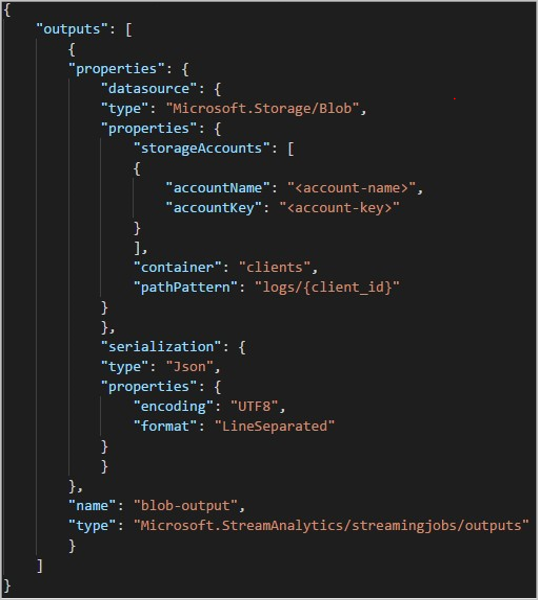
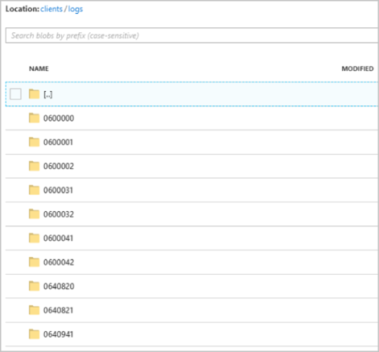
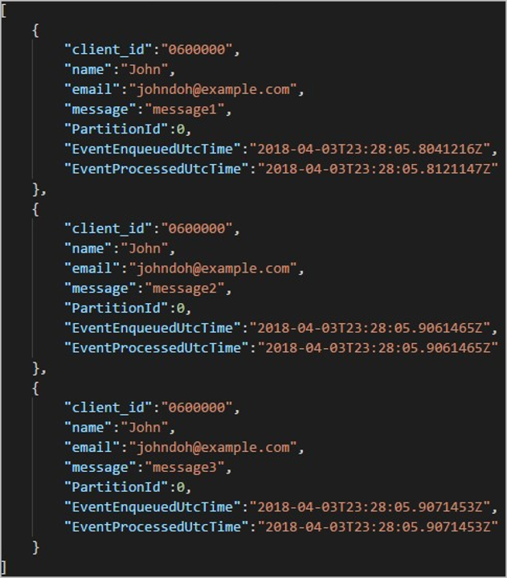
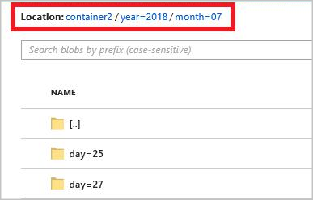

## Blob storage and Azure Data Lake Gen2 output from Azure Stream Analytics

Data Lake Storage Gen2 makes Azure Storage the foundation for building enterprise data lakes on Azure. Designed from the start to service multiple petabytes of information while sustaining hundreds of gigabits of throughput, Data Lake Storage Gen2 allows you to easily manage massive amounts of data.A fundamental part of Data Lake Storage Gen2 is the addition of a hierarchical namespace to Blob storage.

Azure Blob storage offers a cost-effective and scalable solution for storing large amounts of unstructured data in the cloud. For an introduction on Blob storage and its usage, see [Upload, download, and list blobs with the Azure portal](../storage/blobs/storage-quickstart-blobs-portal.md).

The following table lists the property names and their descriptions for creating a blob or ADLS Gen2 output.

| Property name       | Description                                                                      |
| ------------------- | ---------------------------------------------------------------------------------|
| Output alias        | A friendly name used in queries to direct the query output to this blob storage. |
| Storage account     | The name of the storage account where you're sending your output.               |
| Storage account key | The secret key associated with the storage account.                              |
| Storage container   | A logical grouping for blobs stored in the Azure Blob service. When you upload a blob to the Blob service, you must specify a container for that blob. |
| Path pattern | Optional. The file path pattern that's used to write your blobs within the specified container. <br /><br /> In the path pattern, you can choose to use one or more instances of the date and time variables to specify the frequency that blobs are written: <br /> {date}, {time} <br /><br />You can use custom blob partitioning to specify one custom {field} name from your event data to partition blobs. The field name is alphanumeric and can include spaces, hyphens, and underscores. Restrictions on custom fields include the following: <ul><li>Field names aren't case-sensitive. For example, the service can't differentiate between column "ID" and column "id."</li><li>Nested fields are not permitted. Instead, use an alias in the job query to "flatten" the field.</li><li>Expressions can't be used as a field name.</li></ul> <br />This feature enables the use of custom date/time format specifier configurations in the path. Custom date and time formats must be specified one at a time, enclosed by the {datetime:\<specifier>} keyword. Allowable inputs for \<specifier> are yyyy, MM, M, dd, d, HH, H, mm, m, ss, or s. The {datetime:\<specifier>} keyword can be used multiple times in the path to form custom date/time configurations. <br /><br />Examples: <ul><li>Example 1: cluster1/logs/{date}/{time}</li><li>Example 2: cluster1/logs/{date}</li><li>Example 3: cluster1/{client_id}/{date}/{time}</li><li>Example 4: cluster1/{datetime:ss}/{myField} where the query is: SELECT data.myField AS myField FROM Input;</li><li>Example 5: cluster1/year={datetime:yyyy}/month={datetime:MM}/day={datetime:dd}</ul><br />The time stamp of the created folder structure follows UTC and not local time.<br /><br />File naming uses the following convention: <br /><br />{Path Prefix Pattern}/schemaHashcode_Guid_Number.extension<br /><br />Example output files:<ul><li>Myoutput/20170901/00/45434_gguid_1.csv</li>  <li>Myoutput/20170901/01/45434_gguid_1.csv</li></ul> <br />For more information about this feature, see [Azure Stream Analytics custom blob output partitioning](stream-analytics-custom-path-patterns-blob-storage-output.md). |
| Date format | Optional. If the date token is used in the prefix path, you can select the date format in which your files are organized. Example: YYYY/MM/DD |
| Time format | Optional. If the time token is used in the prefix path, specify the time format in which your files are organized. Currently the only supported value is HH. |
| Event serialization format | Serialization format for output data. JSON, CSV, Avro, and Parquet are supported. |
|Minimum  rows |The number of minimum rows per batch. For Parquet, every batch will create a new file. The current default value is 2,000 rows and the allowed maximum is 10,000 rows.|
|Maximum time |The maximum wait time per batch. After this time, the batch will be written to the output even if the minimum rows requirement is not met. The current default value is 1 minute and the allowed maximum is 2 hours. If your blob output has path pattern frequency, the wait time cannot be higher than the partition time range.|
| Encoding    | If you're using CSV or JSON format, an encoding must be specified. UTF-8 is the only supported encoding format at this time. |
| Delimiter   | Applicable only for CSV serialization. Stream Analytics supports a number of common delimiters for serializing CSV data. Supported values are comma, semicolon, space, tab, and vertical bar. |
| Format      | Applicable only for JSON serialization. **Line separated** specifies that the output is formatted by having each JSON object separated by a new line. If you select **Line separated**, the JSON is read one object at a time. The whole content by itself would not be a valid JSON. **Array** specifies that the output is formatted as an array of JSON objects. This array is closed only when the job stops or Stream Analytics has moved on to the next time window. In general, it's preferable to use line-separated JSON, because it doesn't require any special handling while the output file is still being written to. |

When you're using Blob storage as output, a new file is created in the blob in the following cases:

* If the file exceeds the maximum number of allowed blocks (currently 50,000). You might reach the maximum allowed number of blocks without reaching the maximum allowed blob size. For example, if the output rate is high, you can see more bytes per block, and the file size is larger. If the output rate is low, each block has less data, and the file size is smaller.
* If there's a schema change in the output, and the output format requires fixed schema (CSV and Avro).
* If a job is restarted, either externally by a user stopping it and starting it, or internally for system maintenance or error recovery.
* If the query is fully partitioned, and a new file is created for each output partition.
* If the user deletes a file or a container of the storage account.
* If the output is time partitioned by using the path prefix pattern, and a new blob is used when the query moves to the next hour.
* If the output is partitioned by a custom field, and a new blob is created per partition key if it does not exist.
* If the output is partitioned by a custom field where the partition key cardinality exceeds 8,000, and a new blob is created per partition key.

## Partitioning

For parition key, use {date} and {time} tokens from your event fields in the path pattern. Choose the date format, such as YYYY/MM/DD, DD/MM/YYYY, or MM-DD-YYYY. HH is used for the time format. Blob output can be partitioned by a single custom event attribute {fieldname} or {datetime:\<specifier>}. The number of output writers follows the input partitioning for [fully parallelizable queries](stream-analytics-scale-jobs.md).
## Output batch size
| Azure Blob storage | See [Azure Storage limits](../azure-resource-manager/management/azure-subscription-service-limits.md#storage-limits). | The maximum blob block size is 4 MB.<br />The maximum blob bock count is 50,000. |


# Azure Stream Analytics custom blob output partitioning

Azure Stream Analytics supports custom blob output partitioning with custom fields or attributes and custom DateTime path patterns. 

## Custom field or attributes

Custom field or input attributes improve downstream data-processing and reporting workflows by allowing more control over the output.

### Partition key options

The partition key, or column name, used to partition input data may contain alphanumeric characters with hyphens, underscores, and spaces. It is not possible to use nested fields as a partition key unless used in conjunction with aliases. The partition key must be NVARCHAR(MAX).

### Example

Suppose a job takes input data from live user sessions connected to an external video game service where ingested data contains a column **client_id** to identify the sessions. To partition the data by **client_id**, set the Blob Path Pattern field to include a partition token **{client_id}** in blob output properties when creating a job. As data with various **client_id** values flow through the Stream Analytics job, the output data is saved into separate folders based on a single **client_id** value per folder.


Similarly, if the job input was sensor data from millions of sensors where each sensor had a **sensor_id**, the Path Pattern would be **{sensor_id}** to partition each sensor data to different folders.  


Using the REST API, the output section of a JSON file used for that request may look like the following:  



Once the job starts running, the *clients* container may look like the following:  



Each folder may contain multiple blobs where each blob contains one or more records. In the above example, there is a single blob in a folder labelled "06000000" with the following contents:



Notice that each record in the blob has a **client_id** column matching the folder name since the column used to partition the output in the output path was **client_id**.

### Limitations

1. Only one custom partition key is permitted in the Path Pattern blob output property. All of the following Path Patterns are valid:

   * cluster1/{date}/{aFieldInMyData}  
   * cluster1/{time}/{aFieldInMyData}  
   * cluster1/{aFieldInMyData}  
   * cluster1/{date}/{time}/{aFieldInMyData} 
   
2. Partition keys are case insensitive, so partition keys like "John" and "john" are equivalent. Also, expressions cannot be used as partition keys. For example, **{columnA + columnB}** does not work.  

3. When an input stream consists of records with a partition key cardinality under 8000, the records will be appended to existing blobs and only create new blobs when necessary. If the cardinality is over 8000 there is no guarantee existing blobs will be written to and new blobs won't be created for an arbitrary number of records with the same partition key.

## Custom DateTime path patterns

Custom DateTime path patterns allow you to specify an output format that aligns with Hive Streaming conventions, giving Azure Stream Analytics the ability to send data to Azure HDInsight and Azure Databricks for downstream processing. Custom DateTime path patterns are easily implemented using the `datetime` keyword in the Path Prefix field of your blob output, along with the format specifier. For example, `{datetime:yyyy}`.

### Supported tokens

The following format specifier tokens can be used alone or in combination to achieve custom DateTime formats:

|Format specifier   |Description   |Results on example time 2018-01-02T10:06:08|
|----------|-----------|------------|
|{datetime:yyyy}|The year as a four-digit number|2018|
|{datetime:MM}|Month from 01 to 12|01|
|{datetime:M}|Month from 1 to 12|1|
|{datetime:dd}|Day from 01 to 31|02|
|{datetime:d}|Day from 1 to 31|2|
|{datetime:HH}|Hour using the 24-hour format, from 00 to 23|10|
|{datetime:mm}|Minutes from 00 to 60|06|
|{datetime:m}|Minutes from 0 to 60|6|
|{datetime:ss}|Seconds from 00 to 60|08|

If you do not wish to use custom DateTime patterns, you can add the {date} and/or {time} token to the Path Prefix to generate a dropdown with built-in DateTime formats.


### Extensibility and restrictions

You can use as many tokens, `{datetime:<specifier>}`, as you like in the path pattern until you reach the Path Prefix character limit. Format specifiers can't be combined within a single token beyond the combinations already listed by the date and time dropdowns. 

For a path partition of `logs/MM/dd`:

|Valid expression   |Invalid expression   |
|----------|-----------|
|`logs/{datetime:MM}/{datetime:dd}`|`logs/{datetime:MM/dd}`|

You may use the same format specifier multiple times in the Path Prefix. The token must be repeated each time.

### Hive Streaming conventions

Custom path patterns for blob storage can be used with the Hive Streaming convention, which expects folders to be labeled with `column=` in the folder name.

For example, `year={datetime:yyyy}/month={datetime:MM}/day={datetime:dd}/hour={datetime:HH}`.

Custom output eliminates the hassle of altering tables and manually adding partitions to port data between Azure Stream Analytics and Hive. Instead, many folders can be added automatically using:

```SQL
MSCK REPAIR TABLE while hive.exec.dynamic.partition true
```

### Example

Create a storage account, a resource group, a Stream Analytics job, and an input source according to the [Azure Stream Analytics Azure Portal](stream-analytics-quick-create-portal.md) quickstart guide. Use the same sample data used in the quickstart guide, also available on [GitHub](https://raw.githubusercontent.com/Azure/azure-stream-analytics/master/Samples/GettingStarted/HelloWorldASA-InputStream.json).

Create a blob output sink with the following configuration:


The full path pattern is as follows:


`year={datetime:yyyy}/month={datetime:MM}/day={datetime:dd}`


When you start the job, a folder structure based on the path pattern is created in your blob container. You can drill down to the day level.



## Next steps

* [Understand outputs from Azure Stream Analytics](stream-analytics-define-outputs.md)
