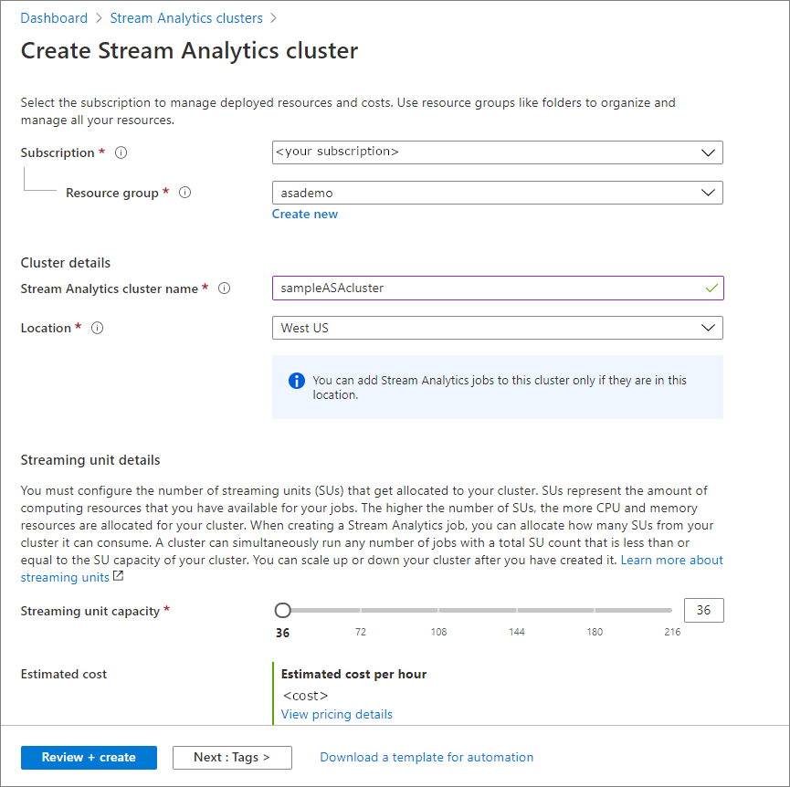

# Quickstart: Create a dedicated Stream Analytics cluster using Azure portal

Use the Azure portal to create an Azure Stream Analytics cluster. A [Stream Analytics cluster](cluster-overview.md) is a single-tenant deployment that can be used for complex and demanding streaming use cases. You can run multiple Stream Analytics jobs on a Stream Analytics cluster.

## Prerequisites

* An Azure account with an active subscription. [Create an account for free](https://azure.microsoft.com/free/?WT.mc_id=A261C142F).
* Completion of [Quickstart: Create a Stream Analytics job by using the Azure portal](stream-analytics-quick-create-portal.md).

## Sign in to Azure portal

Sign in to the Azure portal.

## Create a Stream Analytics cluster

In this section, you create a Stream Analytics cluster resource.

1. In the Azure portal, select **Create a resource**. In the *Search the Marketplace* search box, type and select **Stream Analytics cluster**. Then select **Add**.

   :::image type="content" source="./media/create-cluster/search-result.png" alt-text="Stream Analytics cluster search result.":::

1. On the **Create Stream Analytics cluster** page, enter the basic settings for your new cluster.

   |Setting|Value|Description |
   |---|---|---|
   |Subscription|Subscription name|Select the Azure subscription that you want to use for this Stream Analytics cluster. |
   |Resource Group|Resource group name|Select a resource group, or select **Create new**, then enter a unique name for the new resource group. |
   |Cluster Name|A unique name|Enter a name to identify your Stream Analytics cluster.|
   |Location|The region closest to your data sources and sinks|Select a geographic location to host your Stream Analytics cluster. Use the location that is closest to your data sources and sinks for low latency analytics.|
   |Streaming Unit Capacity|36 through 216 |Determine the size of the cluster by estimating how many Stream Analytics job you plan to run and the total SUs the job will require. You can start with 36 SUs and later scale up or down as required.|

   

1. Select **Review + create**. You can skip the **Tags** sections.

1. Review the cluster settings, and then select **Create**. Cluster creation is a long running operation and can take approximately 60 minutes to complete. Wait for the portal page to display **Your deployment is complete**. In the meantime, you can create and develop [Stream Analytics jobs](stream-analytics-quick-create-portal.md#create-a-stream-analytics-job) that you want to run on this cluster if you haven't already.

1. Select **Go to resource** to go to the Stream Analytics cluster page.

## Delete your cluster

You can delete your Stream Analytics cluster if you don't plan to run any Stream Analytics jobs on it. Delete your cluster by following steps on the Azure portal:

1. Go to **Stream Analytics jobs** under **Settings** and stop all jobs that are running.

1. Go to **Overview** of your cluster. Select **Delete** and follow the instructions to delete your cluster.

## Next steps

In this quickstart, you learned how to create an Azure Stream Analytics cluster. Advance to the next article to learn how to run a Stream Analytics job on your cluster:

> [!div class="nextstepaction"]
> [Manage Stream Analytics jobs in a Stream Analytics cluster](manage-jobs-cluster.md)
