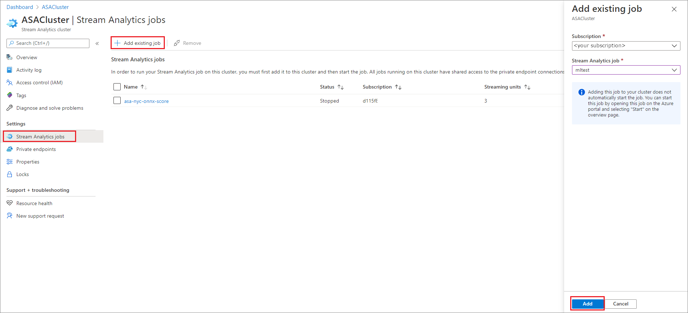

# Manage jobs in Stream Analytics cluster
<Token>**APPLIES TO:** Stream Analytics cluster</Token> 

Once you have created your Stream Analytics cluster, you can make use of it by running Stream Analytics jobs on it. This is a 2-step process:
1. Add your Stream Analytics job to your Stream Analytics cluster.
2. Start the Stream Analytics job

## Add Stream Analytics jobs to a cluster
If you don't already have a Stream Analytics jobs, you can [create one easily](https://docs.microsoft.com/azure/stream-analytics/stream-analytics-quick-create-portal). Once you have a job that you want to add to a cluster, you can:
1. Sign in to the Azure portal.
2. Locate and select your Stream Analytics cluster.
3. Under **Settings**, select **Stream Analytics jobs**. And then select **Add existing job**. 
4. You can then select the subscription and the Stream Analytics job you want to add to this cluster. Only those Stream Analytics that are in the same region as the cluster can be added to the cluster.
    
5. After adding the job to a cluster, you can navigate to the job and [start it](https://docs.microsoft.com/azure/stream-analytics/start-job#azure-portal). The job will then start to run on your cluster.

All other operations such as monitoring, alerting, diagnostic logs continue to be a Stream Analytics job level.

## Remove a Stream Analytics job from a cluster
Stream Analytics jobs must be in a stopped state before it can be removed from the cluster.
1. Sign in to the Azure portal.
2. Locate and select your Stream Analytics cluster.
3. Under **Settings**, select **Stream Analytics jobs**.
4. Select the jobs you want to remove from the cluster and then select **Remove**.
   

When a job is removed from a Stream Analytics cluster, it falls back to the standard multi-tenant environment.

## Next steps

You now know how to add and remove jobs in your Azure Stream Analytics cluster. Next, you can learn how to manage private endpoints and scale your clusters:

* [Scaling Stream Analytics cluster](stream-analytics-scale-cluster.md).
* [Manage private endpoints](stream-analytics-privateendpoints.md).
* [Create a Stream Analytics job](stream-analytics-quick-create-portal.md).