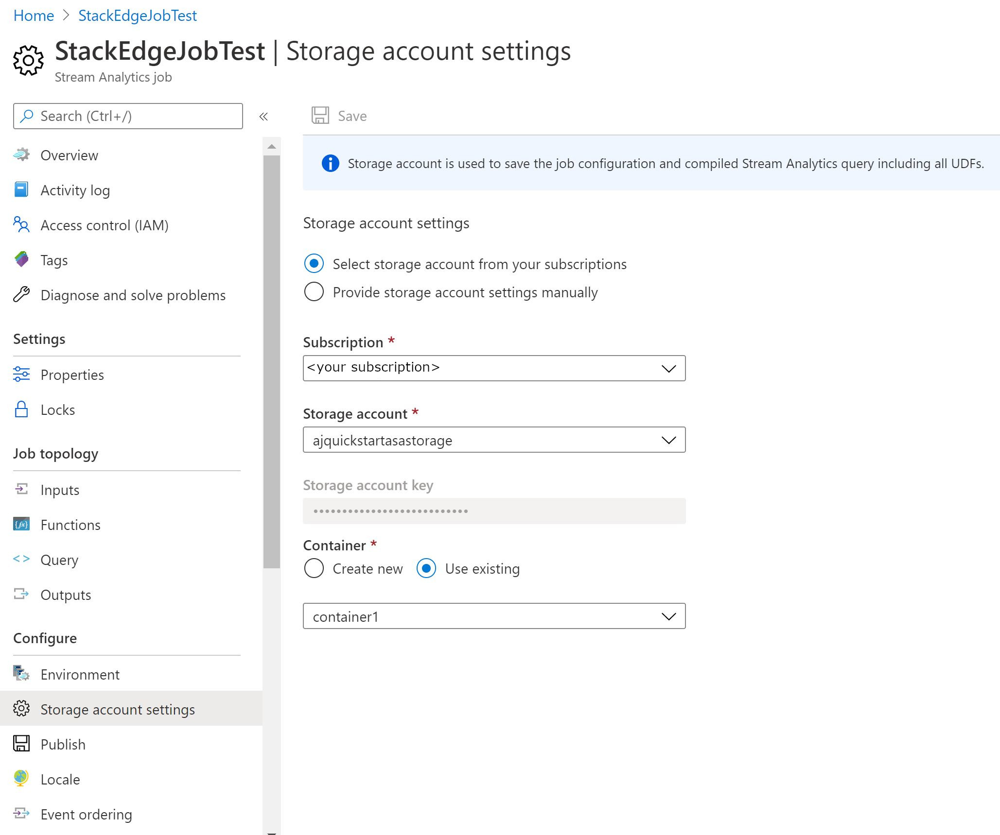
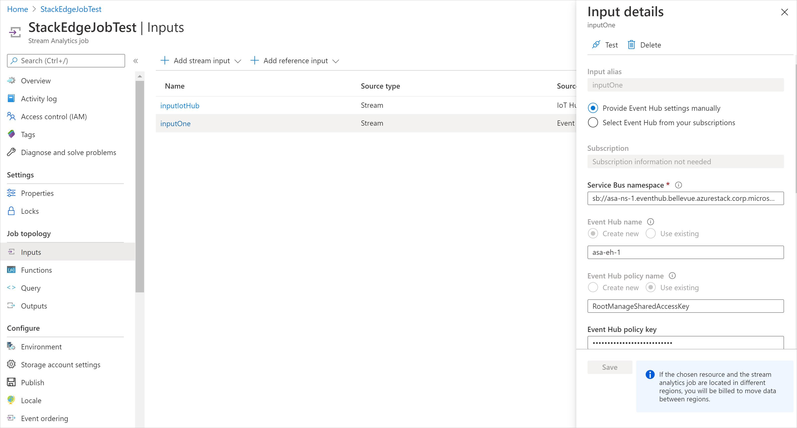
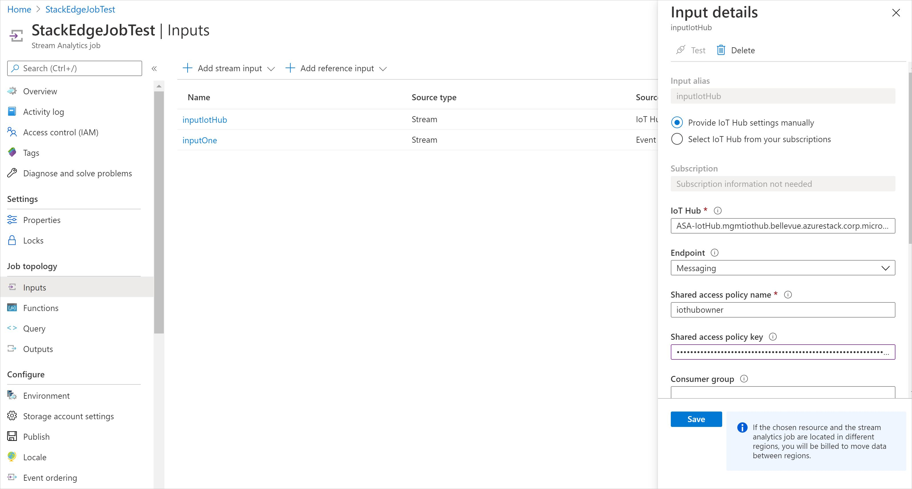
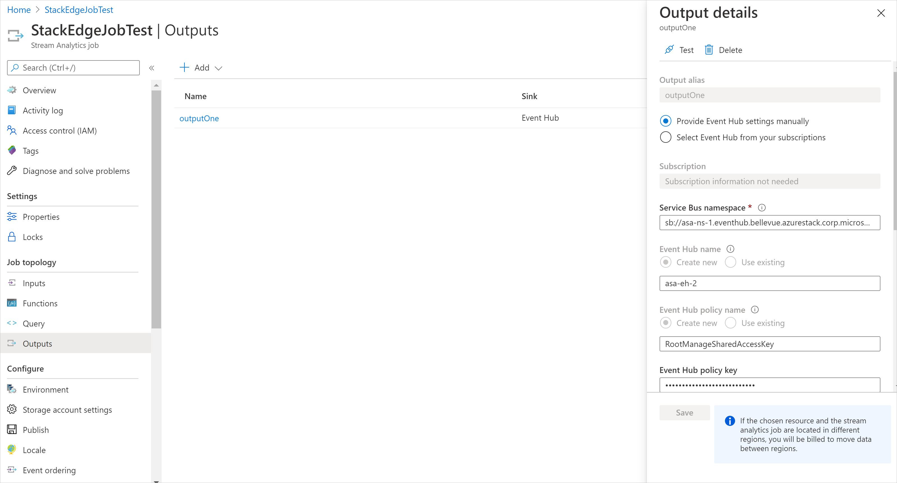
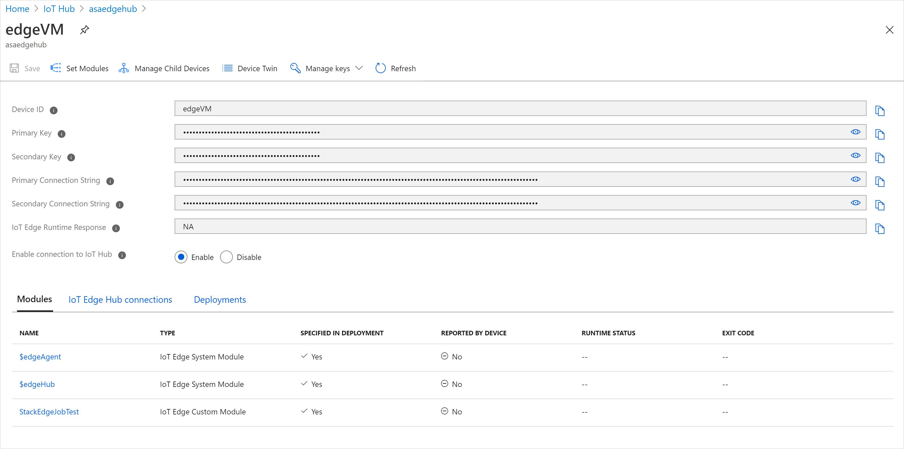
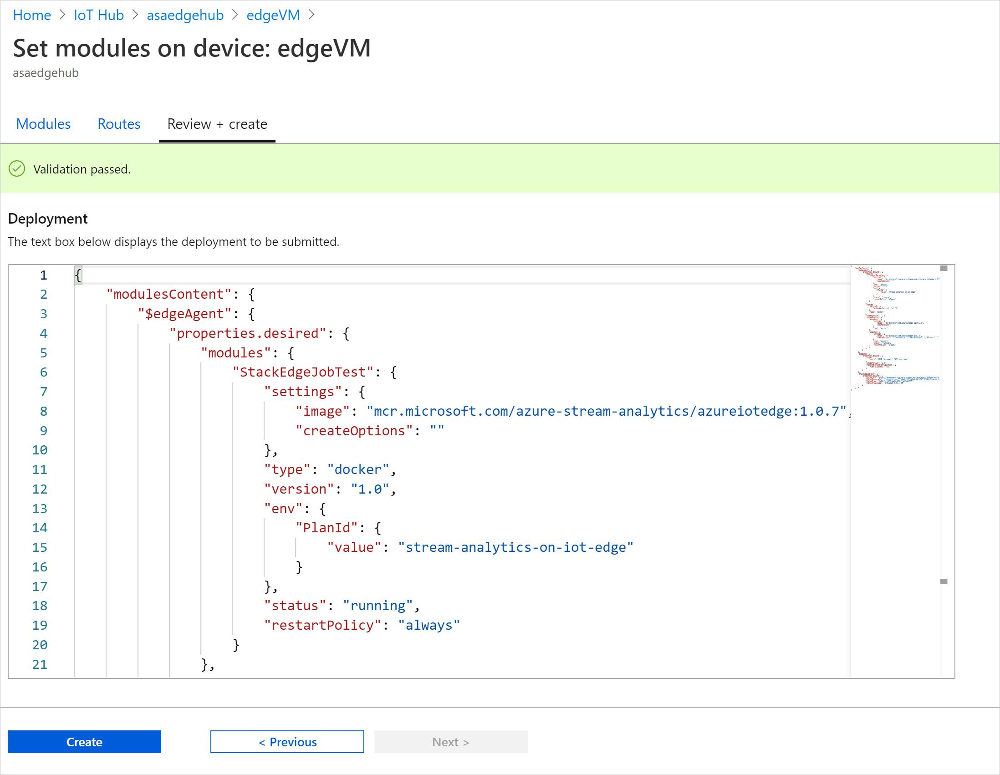
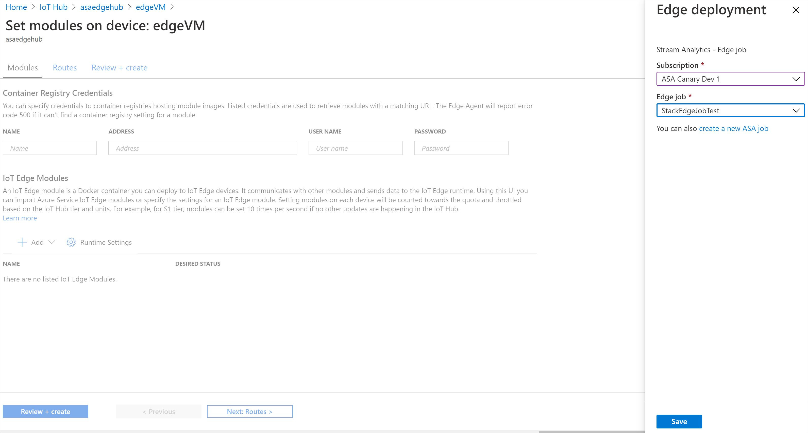

# Azure Stream Analytics on Azure Stack

> [!IMPORTANT]
> This functionality is in preview and is not recommended for use in production.

Azure Stream Analytics (ASA) can be run on Azure Stack Hub as an IoT Edge module. The module has added configuration that allows it to interact with blob storage, Event Hubs, IoT Hubs running in an Azure Stack Hub subscription by allowing custom URLs found in every Azure Stack Hub employment. The feature is currently in public preview.

With this release, Azure Stream Analytics enables customers to build truly hybrid architectures for stream processing in their own private, autonomous cloud – connected or disconnected with cloud-native apps using consistent Azure services on premises. 

This article shows how to stream data from IoT Hub/Event Hub to another Event Hub or Blob Storage in an Azure Stack Hub subscription and process it with Azure Stream Analytics.

## Set Up Environments

### Prepare Azure Stack Hub Environment

If you have an Azure Stack Hub, you will need a subscription. You can find a [tutorial for creating a subscription here.](https://docs.microsoft.com/azure-stack/user/azure-stack-subscribe-services/)

If you would like to evaluate Azure Stack Hub on your own server, you can use the Azure Stack Development Kit (ASDK).  For more information on the ASDK, read the [overview](https://docs.microsoft.com/azure-stack/asdk/) here.

### Install IoT Edge runtime

To run Azure Stream Analytics on Azure Stack Hub, the IoT Edge runtime is required on a device with network connectivity to the Azure Stack Hub or as a VM running on the Azure Stack Hub. The IoT Edge runtime allows ASA Edge jobs to integrate with Azure Storage and Azure Event Hubs which are running on your Azure Stack Hub. More information about [ASA Edge job can be seen here.](https://docs.microsoft.com/azure/stream-analytics/stream-analytics-edge) 

In addition to having network access to the Azure Stack Hub resources, the IoT Edge device (or VM) will need access to Azure IoT Hub in the Azure public cloud to enable configuration of the ASA module. 

These guides show how to set up the IoT Edge Runtime on your device or VM:

1. Windows:
    https://docs.microsoft.com/en-us/azure/iot-edge/how-to-install-iot-edge-windows
2. Linux:
    https://docs.microsoft.com/en-us/azure/iot-edge/how-to-install-iot-edge-linux

## Create an Azure Stream Analytics Edge job

### Create a storage account

When you create an Azure Stream Analytics job to run on an IoT Edge device, it needs to be stored in a way that can be called from the device. You can use an existing Azure storage account or create a new one now.
1. In the Azure portal, go to Create a **resource > Storage > Storage account - blob, file, table, queue.**
2. Provide the following values to create your storage account:

| **Field** | **Value** |
| --- | --- |
| Name | Provide a unique name for your storage account. |
| Location | Choose a location close to you.|
| Subscription | Choose the same subscription as your IoT hub.|
| Resource Group | We recommend that you use the same resource group for all of the test resources that you create during the [IoT Edge quickstarts](https://docs.microsoft.com/azure/iot-edge/quickstart) and tutorials. For example, **IoTEdgeResources**. |

3. Keep the default values for the other fields and select **Create**.

### Create a new job

1. In the Azure portal, go to **Create a resource > Internet of Things > Stream Analytics Job**.
2. Provide the following values to create your storage account:

| **Field** | **Value** |
| --- | --- |
| Job Name | Provide a name for your job. For example, **IoTEdgeJob** |
| Subscription | Choose the same subscription as your IoT hub.|
| Resource Group | We recommend that you use the same resource group for all of the test resources that you create during the [IoT Edge quickstarts](https://docs.microsoft.com/azure/iot-edge/quickstart) and tutorials. For example, **IoTEdgeResources**. |
| Location | Choose a location close to you. |
| Hosting Environment | Select **Edge**. |

3. Select **Create**.

### Configure your job

Once your Stream Analytics job is created in the Azure portal, you can configure it with an input, an output, and a query to run on the data that passes through.  **This preview allows you to manually specify inputs from an IoT Hub or Event Hub in an Azure Stack Hub subscription. Likewise, an Event Hub or Storage Account in an Azure Stack Hub subscription can be used as an output which you manually specify.**

Using the three elements of input, output, and query, to configure a job.
1. Navigate to your Stream Analytics job in the Azure portal.
2. Under **Configure**, select **Storage account settings** and choose the right storage account set up in the previous step.

3. Under **Job Topology**, select **Inputs** then **Add stream input.**
4. Choose **IoT Hub/Event Hub/Edge Hub** from the drop-down list. 
5. If the input is an Event Hub or IoT Hub in an Azure Stack Hub subscription, please provide information manually as shown below.

Event Hub:
- Input alias
- Service Bus namespace (Example: *sb://<Event Hub Name>.eventhub.shanghai.azurestack.corp.microsoft.com*) 
- Event Hub name
- Event Hub policy name
- Event Hub policy key
- Event Hub consumer group(optional)
- Partition count

IoT Hub:
- Input alias
- IoT Hub (Example:*<IoT Hub Name>.shanghai.azurestack.corp.microsoft.com*)
- Shared access policy name
- Shared access policy key
- Consumer group (optional)
- Partition count

6. Keep the default values for the other fields, and select Save.
7. Under Job Topology, open Outputs then select Add.
8. Choose Blob Storage/Event Hub/Edge Hub from the drop-down list.
9. If the output is an Event Hub or Blob Storage in an Azure Stack Hub subscription, please provide information manually as shown below.

Event Hub:
- Output alias
- Service Bus namespace (Example: *sb://<Event Hub Name>.eventhub.shanghai.azurestack.corp.microsoft.com*) 
- Event Hub name
- Event Hub policy name
- Event Hub policy key

Blob Storage: 
- Output alias
- Storage account (Example: *<Storage Account Name>.blob.shanghai.azurestack.corp.microsoft.com*)
- Storage account key

Note: Parquet format hasn't been supported yet for edge jobs on Azure Stack Hub. For Minimum rows and Maximum time, please use 0 or leave it blank.

## Deploy ASA on your VM or Device which is connected to your Azure Stack

1. In the Azure portal, open IoT Hub, navigate to **IoT Edge** and click on the device (VM) you want to target for this deployment.
2. Select **Set modules**, then select **+ Add** and choose **Azure Stream Analytics Module**. 
3. Select the subscription and the ASA Edge job that you created. Click **Save** and select **Next:Routes**.

4. Click **Review+create >**
5. In the **Review + create** step, select **Create**. 

6. Confirm that the module is added to the list.

## Next steps
- [Azure Stream Analytics on IoT Edge](https://docs.microsoft.com/azure/stream-analytics/stream-analytics-edge)
- [Develop Stream Analytics Edge jobs](https://docs.microsoft.com/stream-analytics-query/stream-analytics-query-language-reference)
