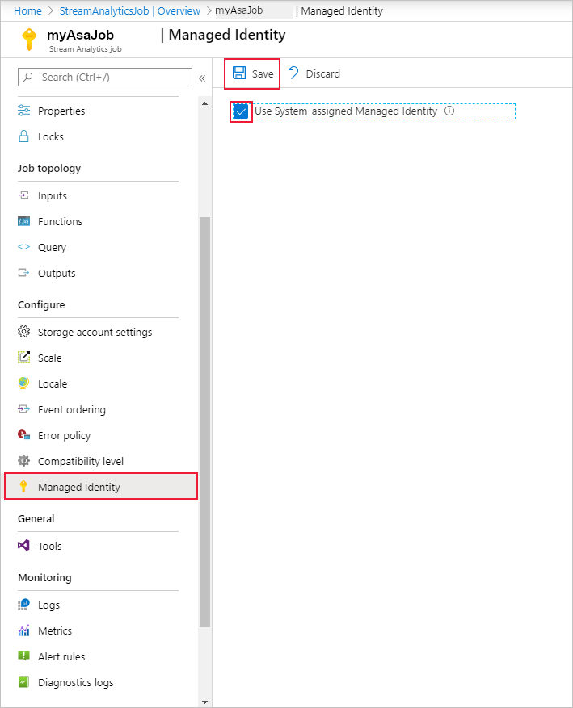
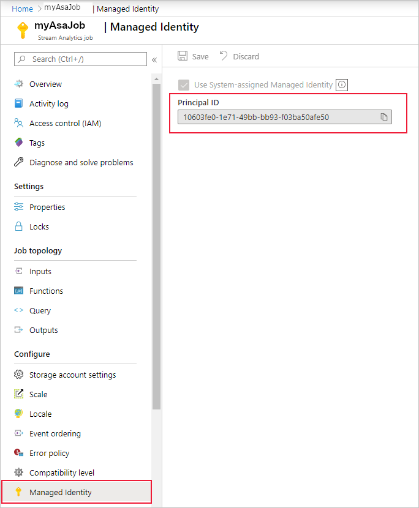
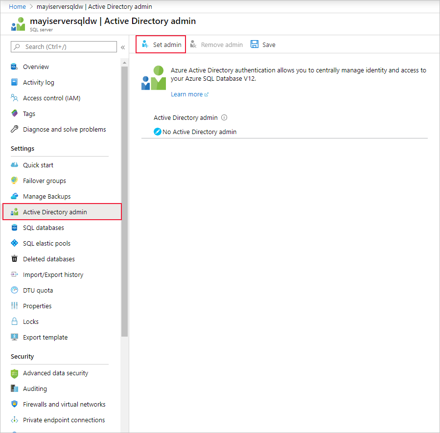
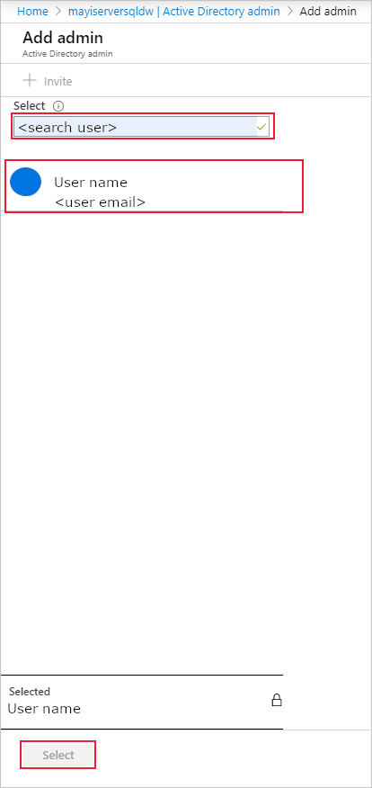
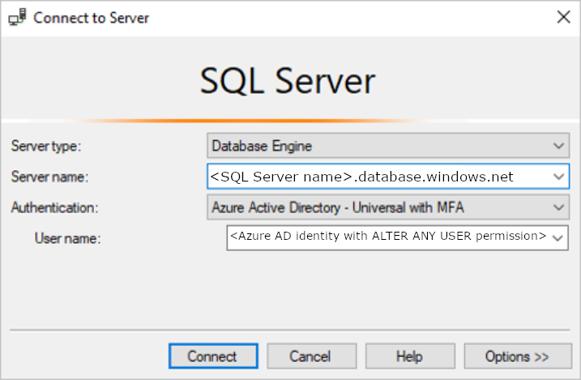
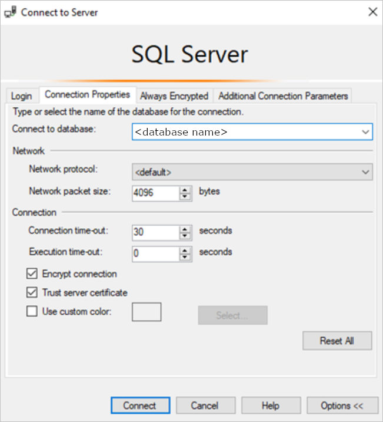
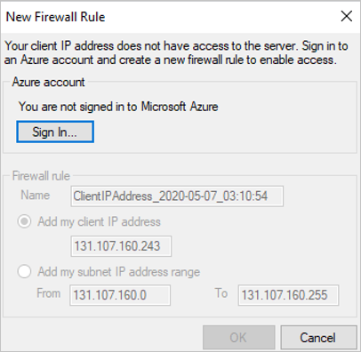
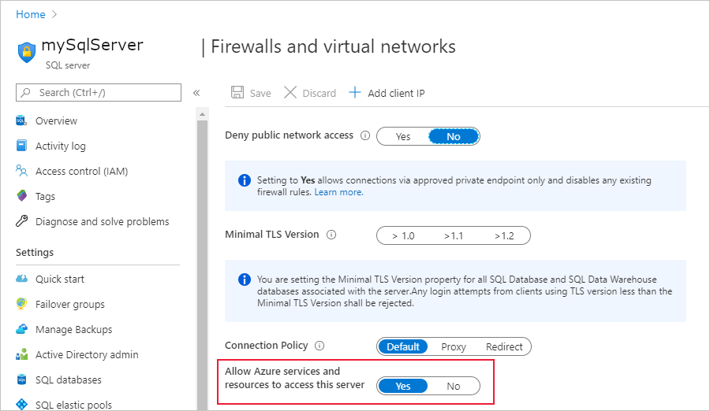

# Use managed identities to access Azure SQL Database or Azure Synapse Analytics from an Azure Stream Analytics job (Preview)

Azure Stream Analytics supports [Managed Identity authentication](../active-directory/managed-identities-azure-resources/overview.md) for Azure SQL Database and Azure Synapse Analyticsoutput sinks. Managed identities eliminate the limitations of user-based authentication methods, like the need to reauthenticate due to password changes or user token expirations that occur every 90 days. When you remove the need to manually authenticate, your Stream Analytics deployments can be fully automated.

A managed identity is a managed application registered in Azure Active Directory that represents a given Stream Analytics job. The managed application is used to authenticate to a targeted resource. This article shows you how to enable Managed Identity for an Azure SQL Database or an Azure Synapse Analytics output(s) of a Stream Analytics job through the Azure portal.

## Prerequisites

#### [Azure SQL Database](#tab/azure-sql)

The following are required to use this feature:

- An Azure Stream Analytics job.

- An Azure SQL Database resource.

#### [Azure Synapse Analytics](#tab/azure-synapse)

The following are required to use this feature:

- An Azure Stream Analytics job.

- An Azure Synapse Analytics SQL pool

--- 

## Create a managed identity

First, you create a managed identity for your Azure Stream Analytics job.

1. In the [Azure portal](https://portal.azure.com), open your Azure Stream Analytics job.

1. From the left navigation menu, select **Managed Identity** located under **Configure**. Then, check the box next to **Use System-assigned Managed Identity** and select **Save**.

   

   A service principal for the Stream Analytics job's identity is created in Azure Active Directory. The life cycle of the newly created identity is managed by Azure. When the Stream Analytics job is deleted, the associated identity (that is, the service principal) is automatically deleted by Azure.

1. When you save the configuration, the Object ID (OID) of the service principal is listed as the Principal ID as shown below: 

   

   The service principal has the same name as the Stream Analytics job. For example, if the name of your job is *MyASAJob*, the name of the service principal is also *MyASAJob*.

## Select an Active Directory admin

After you've created a managed identity, you select an Active Directory admin.

1. Navigate to your Azure SQL Database or Azure Synapse Analytics resource and select the SQL Server that the database is under. You can find the SQL Server name next to *Server name* on the resource overview page.

1. Select **Active Directory Admin** under **Settings**. Then, select **Set admin**.

   

1. On the Active Directory admin page, search for a user or group to be an administrator for the SQL Server and click **Select**.

   

   The Active Directory admin page shows all members and groups of your Active Directory. Users or groups that are grayed out can't be selected because they're not supported as Azure AD administrators. See the list of supported admins in the **Azure AD Features and Limitations** section of [Use Azure Active Directory Authentication for authentication with SQL Database or Azure Synapse](../sql-database/sql-database-aad-authentication.md#azure-ad-features-and-limitations). Role-based access control (RBAC) applies only to the portal and is not propagated to SQL Server. Also, the selected user or group is the user who will be able to create the **Contained Database User** in the next section.

1. Select **Save** on the **Active Directory admin** page. The process for changing admin takes a few minutes.

   When you set up the Azure AD admin, the new admin name (user or group) can't be present in the virtual master database as a SQL Server authentication user. If present, the Azure AD admin setup will fail and roll back its creation, indicating that an admin (name) already exists. Since the SQL Server authentication user is not part of Azure AD, any effort to connect to the server using Azure AD authentication as that user fails. 

## Create a contained database user

Next, you create a contained database user in your Azure SQL or Azure Synapse database that is mapped to the Azure Active Directory identity. The contained database user doesn't have a login for the master database, but it maps to an identity in the directory that is associated with the database. The Azure Active Directory identity can be an individual user account or a group. In this case, you want to create a contained database user for your Stream Analytics job. 

1. Connect to your Azure SQL or Azure Synapse database using SQL Server Management Studio. The **User name** is an Azure Active Directory user with the **ALTER ANY USER** permission. The admin you set on the SQL Server is an example. Use **Azure Active Directory – Universal with MFA** authentication. 

   

   The server name `<SQL Server name>.database.windows.net` may be different in different regions. For example, the China region should use `<SQL Server name>.database.chinacloudapi.cn`.
 
   You can specify a specific Azure SQL or Azure Synapse database by going to **Options > Connection Properties > Connect to Database**.  

   

1. When you connect for the first time, you may encounter the following window:

   

   1. If so, go to your SQL Server resource on the Azure portal. Under the **Security** section, open the **Firewalls and virtual network** page. 
   1. Add a new rule with any rule name.
   1. Use the *From* IP address from the **New Firewall Rule** window for the *Start IP*.
   1. Use the *To* IP address from the **New Firewall Rule** window for *End IP*. 
   1. Select **Save** and attempt to connect from SQL Server Management Studio again. 

1. Once you are connected, create the contained database user. The following SQL command creates a contained database user that has the same name as your Stream Analytics job. Be sure to include the brackets around the *ASA_JOB_NAME*. Use the following T-SQL syntax and run the query. 

   ```sql
   CREATE USER [ASA_JOB_NAME] FROM EXTERNAL PROVIDER; 
   ```

1. For Microsoft's Azure Active Directory to verify if the Stream Analytics job has access to the SQL Database, we need to give Azure Active Directory permission to communicate with the database. To do this, go to the "Firewalls and virtual network" page in Azure portal again, and enable "Allow Azure services and resources to access this server." 

   

## Grant Stream Analytics job permissions

Once you've created a contained database user and given access to Azure services in the portal as described in the previous section, your Stream Analytics job has permission from Managed Identity to **CONNECT** to your Azure SQL or Azure Synapse database resource via managed identity. We recommend that you grant the SELECT and INSERT permissions to the Stream Analytics job as those will be needed later in the Stream Analytics workflow. The **SELECT** permission allows the job to test its connection to the table in the Azure SQL or Azure Synapse database. The **INSERT** permission allows testing end-to-end Stream Analytics queries once you have configured an input and the Azure SQL or Azure Synapse database output.You can grant those permissions to the Stream Analytics job using SQL Server Management Studio. For more information, see the GRANT (Transact-SQL)reference.

To only grant permission to a certain table or object in the database, use the following T-SQL syntax and run the query. 

```sql
GRANT SELECT, INSERT ON OBJECT::TABLE_NAME TO ASA_JOB_NAME; 
```

Alternatively, you can right-click on your Azure SQL or Azure Synapse database in SQL Server Management Studio and select **Properties > Permissions**. From the permissions menu, you can see the Stream Analytics job you added previously, and you can manually grant or deny permissions as you see fit.

## Create an Azure SQL Database or Azure Synapse output

Now that your managed identity is configured, you're ready to add an Azure SQL Database or Azure Synapse output to your Stream Analytics job.

#### [Azure SQL Database](#tab/azure-sql)

Ensure you have created a table in your SQL Database with the appropriate output schema. The name of this table is one of the required properties that has to be filled out when you add the SQL Database output to the Stream Analytics job. Also, ensure that the job has **SELECT** and **INSERT** permissions to test the connection and run Stream Analytics queries. Refer to the [Grant Stream Analytics job permissions](#grant-stream-analytics-job-permissions) section if you haven't already done so. 

1. Go back to your Stream Analytics job, and navigate to the **Outputs** page under **Job Topology**. 

1. Select **Add > SQL Database**. In the output properties window of the SQL Database output sink, select **Managed Identity** from the Authentication mode drop-down.

1. Fill out the rest of the properties. To learn more about creating an SQL Database output, see [Create a SQL Database output with Stream Analytics](sql-database-output.md). When you are finished, select **Save**.

#### [Azure Synapse Analytics](#tab/azure-synapse)

Ensure you have created a table in your Azure Synapse database with the appropriate output schema. The name of this table is one of the required properties that has to be filled out when you add the Azure Synapse output to the Stream Analytics job. Also, ensure that the job has **SELECT** and **INSERT** permissions to test the connection and run Stream Analytics queries. Refer to the [Grant Stream Analytics job permissions](#grant-stream-analytics-job-permissions) section if you haven't already done so.

1. Go back to your Stream Analytics job, and navigate to the **Outputs** page under **Job Topology**.

1. Select **Add > Azure Synapse Analytics**. In the output properties window of the SQL Database output sink, select **Managed Identity** from the Authentication mode drop-down.

1. Fill out the rest of the properties. To learn more about creating an Azure Synapse output, see [Azure Synapse Analytics output from Azure Stream Analytics](synapse-analytics-output.md). When you are finished, select **Save**.

---

## Next steps

* [Understand outputs from Azure Stream Analytics](stream-analytics-define-outputs.md)
* [Azure Stream Analytics output to Azure SQL Database](stream-analytics-sql-output-perf.md)
* [Azure Synapse Analytics output from Azure Stream Analytics](synapse-analytics-output.md)