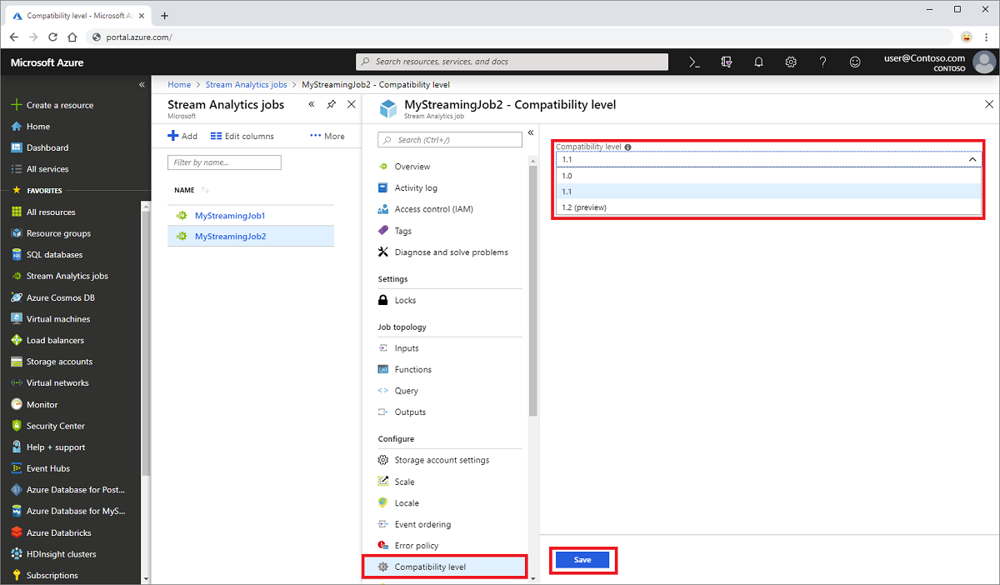

# Compatibility level for Azure Stream Analytics jobs

Compatibility level refers to the release-specific behaviors of an Azure Stream Analytics service. Azure Stream Analytics is a managed service, with regular feature updates, and performance improvements. Usually updates are automatically made available to end users. However, some new features may introduce major changes such as- change in the behavior of an existing job, change in the processes consuming data from these jobs etc. A compatibility level is used to represent a major change introduced in Stream Analytics. Major changes are always introduced with a new compatibility level.

Compatibility level makes sure existing jobs run without any failure. When you create a new Stream Analytics job, it's a best practice to create it by using the latest compatibility level.

## Set a compatibility level

Compatibility level controls the runtime behavior of a stream analytics job. You can set the compatibility level for a Stream Analytics job by using portal or by using the [create job REST API call](https://docs.microsoft.com/rest/api/streamanalytics/stream-analytics-job).

Azure Stream Analytics currently supports three compatibility levels:

* 1.2 (preview)
* 1.1
* 1.0 (default)

The original compatibility level 1.0 was introduced during general availability of Azure Stream Analytics several years ago.

To update the **Compatibility level** of your job:

1. Use the [Azure portal](https://portal.azure.com) to locate to your Stream Analytics job.
2. Stop the job before updating the compatibility level. You can’t update the compatibility level if your job is in a running state.
3. Under the **Configure** heading, select **Compatibility level**.
4. Choose the compatibility level value that you want.
5. Select **Save** at the bottom of the page.

When you update the compatibility level, the T-SQL compiler validates the job with the syntax that corresponds to the selected compatibility level.

## Major changes in the latest compatibility level (1.2)

The following major changes are introduced in compatibility level 1.2:

### Geospatial functions

**previous levels:** Azure Stream Analytics used Geography calculations.

**1.2 level:** Azure Stream Analytics allows you to compute Geometric projected geo coordinates. There's no change in the signature of the geospatial functions. However, their semantics is slightly different, allowing more precise computation than before.

Azure Stream Analytics supports geospatial reference data indexing. Reference Data containing geospatial elements can be indexed for a faster join computation.

The updated geospatial functions bring the full expressiveness of Well Known Text (WKT) geospatial format. You can specify other geospatial components that weren't previously supported with GeoJson.

For more information, see [Updates to geospatial features in Azure Stream Analytics – Cloud and IoT Edge](https://azure.microsoft.com/blog/updates-to-geospatial-functions-in-azure-stream-analytics-cloud-and-iot-edge/).

### Parallel query execution for input sources with multiple partitions

**previous levels:** Azure Stream Analytics queries required the use of PARTITION BY clause to parallelize query processing across input source partitions.

**1.2 level:** If query logic can be parallelized across input source partitions, Azure Stream Analytics creates separate query instances and runs computations in parallel.

### Native Bulk API integration with CosmosDB output

**previous levels:** The upsert behavior was *insert or merge*.

**1.2 level:** Native Bulk API integration with CosmosDB output maximizes throughput and efficiently handles throttling requests.

The upsert behavior is *insert or replace*.

### DateTimeOffset when writing to SQL output

**previous levels:** [DateTimeOffset](https://docs.microsoft.com/sql/t-sql/data-types/datetimeoffset-transact-sql?view=sql-server-2017) types were adjusted to UTC.

**1.2 level:** DateTimeOffset is no longer adjusted.

### Strict validation of prefix of functions

**previous levels:** There was no strict validation of function prefixes.

**1.2 level:** Azure Stream Analytics has a strict validation of function prefixes. Adding a prefix to a built-in function causes an error. For example,`myprefix.ABS(…)` isn't supported.

Adding a prefix to built-in aggregates also results in error. For example, `myprefix.SUM(…)` isn't supported.

Using the prefix "system" for any user-defined functions results in error.

### Disallow Array and Object as key properties in Cosmos DB output adapter

**previous levels:** Array and Object types were supported as a key property.

**1.2 level:** Array and Object types are no longer supported as a key property.

## Major changes in compatibility level (1.1)

The following major changes are introduced in compatibility level 1.1:

### Service Bus XML format

**1.0 level:** Azure Stream Analytics used DataContractSerializer, so the message content included XML tags. For example:

`@\u0006string\b3http://schemas.microsoft.com/2003/10/Serialization/\u0001{ "SensorId":"1", "Temperature":64\}\u0001`

**1.1 level:** The message content contains the stream directly with no additional tags. For example:
`{ "SensorId":"1", "Temperature":64}`

### Persisting case-sensitivity for field names

**1.0 level:** Field names were changed to lower case when processed by the Azure Stream Analytics engine.

**1.1 level:** case-sensitivity is persisted for field names when they are processed by the Azure Stream Analytics engine.

> [!NOTE]
> Persisting case-sensitivity isn't yet available for Stream Analytic jobs hosted by using Edge environment. As a result, all field names are converted to lowercase if your job is hosted on Edge.

### FloatNaNDeserializationDisabled

**1.0 level:** CREATE TABLE command did not filter events with NaN (Not-a-Number. For example, Infinity, -Infinity) in a FLOAT column type because they are out of the documented range for these numbers.

**1.1 level:** CREATE TABLE allows you to specify a strong schema. The Stream Analytics engine validates that the data conforms to this schema. With this model, the command can filter events with NaN values.

### Disable automatic upcast for datetime strings in JSON

**1.0 level:** The JSON parser would automatically upcast string values with date/time/zone information to DateTime type and then convert it to UTC. This behavior resulted in losing the timezone information.

**1.1 level:** There is no more automatically upcast of string values with date/time/zone information to DateTime type. As a result, timezone information is kept.

## Next steps

* [Troubleshoot Azure Stream Analytics inputs](stream-analytics-troubleshoot-input.md)
* [Stream Analytics Resource health](stream-analytics-resource-health.md)
