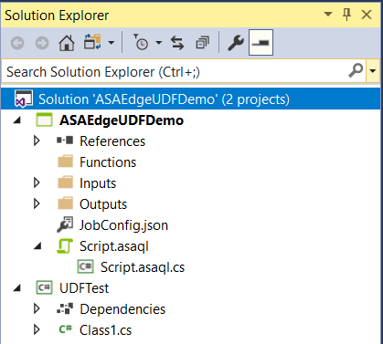
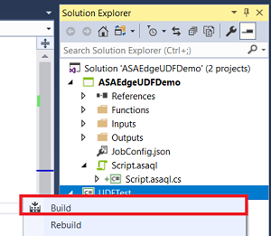
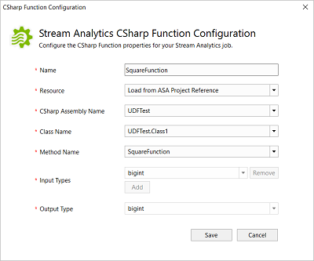

# Develop C# user-defined functions for Azure Stream Analytics Edge jobs (Preview)
With C# user-defined functions (UDF), you can use your own functions to extend the Azure Stream Analytics query language. UDFs allow you to reuse existing code, implement custom logic to manipulate complex strings, and run mathematical or complex logic. 

## Overview
Visual Studio tools for Azure Stream Analytics make it easy for you to write C# UDFs, test your jobs locally (even offline), and publish your Stream Analytics job to Azure. Once published to Azure, you can deploy your job to IoT devices using IoT Hub.

There are three ways to implement UDFs:

* CodeBehind files in an ASA project
* UDF from a local C# project
* An existing package from an Azure storage account

## CodeBehind
You can write user-defined functions in the **Script.asql** CodeBehind. Visual Studio tools will automatically compile the CodeBehind file into an assembly file. The assemblies are packaged as a zip file and uploaded to your storage account when you submit your job to Azure. You can learn how to write a C# UDF using CodeBehind by following [this tutorial](stream-analytics-edge-csharp-udf.md). 

## Local C# project
User-defined functions can be written in a C# assembly that is later referenced in an Azure Stream Analytics query. This is the recommended option for complex functions that require the full power of C# beyond its expression language, such as procedural logic or recursion. UDFs from a local C# project might also be used when you need to share the function logic across several Azure Stream Analytics queries.

To reference a local C# project:

1.	Create a new C# class library in your solution.
2.	Write the code in your class. Remember that the classes must be defined as *public* and objects must be defined as *static public*. 
3.	Build your project.
4.	Reference the new class in your Azure Stream Analytics project.
5.	Add a new function in your Azure Stream Analytics project.

### Example

In this example, **UDFTest** is a C# class library project and **ASAEdgeUDFDemo** is the Azure Stream Analytics Edge project, which will reference **UDFTest**.

1. Build your C# project, which will enable you to add a reference to your C# UDF from the Azure Stream Analytics query.
    
   

2. Add the reference to the C# project in the ASA edge project. Right-click the References node and choose Add Reference.

   

3. Choose the C# project name from the list. 
    
   

4. You should see the **UDFTest** listed under **References** in **Solution Explorer**.

   

5. Right click on the **Functions** folder and choose **New Item**.

   

6. Add a C# function **SquareFunction.json** to your Azure Stream Analytics project.

   

7. Double-click the function in **Solution Explorer** to open the configuration dialog.

   

8. In the C# function configuration, choose **Load from ASA Project Reference** and the related assembly, class, and method names from the dropdown list. To refer to the methods, types, and functions in the Edge query, the classes must be defined as *public* and the objects must be defined as *static public*.

   

## Existing packages
Once assembly zip packages have been uploaded to your storage account, you can use the functions in Azure Stream Analytics queries. All you need to do is include the storage information in the Edge job configuration. You can't test the function locally with this option because Visual Studio tools will not download your package. The package path is parsed directly to the service. 

### Package format

The format of the package has the path `/UserCustomCode/CLR/*`. User DLLs and resources are copied under the `/UserCustomCode/CLR/*` folder, which helps isolate user DLLs from system and Azure Stream Analytics DLLs. 

## Supported types and mapping

 |**UDF type (C#)**  |**Azure Stream Analytics type**  |
 |---------|---------|
 |Bool  |  bigint   |
 |int32  |  bigint   |
 |int64  |  bigint   |
 |float  |  double   |
 |double  |  double   |
 |string  |  nvarchar(max)   |
 |dateTime  |  dateTime   |
 |struct  |  IRecord   |
 |object  |  IRecord   |
 |Array  |  IArray   |
 |dictionary<string, object>  |  IRecord   |

## Limitations
The UDF preview currently has the following limitations:

* C# can only be used for Azure Stream Analytics on IoT Edge. For cloud jobs, you can write JavaScript user-defined functions. To learn more, visit the [Azure Stream Analytics JavaScript UDF](stream-analytics-javascript-user-defined-functions.md) tutorial.

* West Central US is the only enabled region for deployment of the ASA job. Your IoT Hub can be in any region.

* The Azure portal query editor shows an error when using UDF C# functions in the portal. 

* Because the custom code shares context with Azure Stream Analytics engine, custom code can't reference anything that has a conflicting namespace/dll_name with Azure Stream Analytics code. For example, you can't reference *Newtonsoft Json*.

## Next steps

* [Tutorial: Write a C# user-defined function for an Azure Stream Analytics Edge job (Preview)](stream-analytics-edge-csharp-udf.md)
* [Tutorial: Azure Stream Analytics JavaScript user-defined functions](stream-analytics-javascript-user-defined-functions.md)
* [Use Visual Studio to view Azure Stream Analytics jobs](stream-analytics-vs-tools.md)
