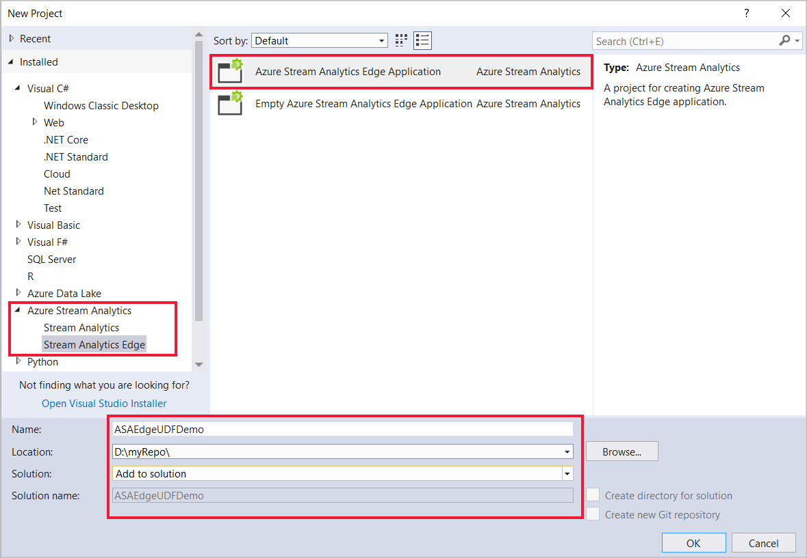
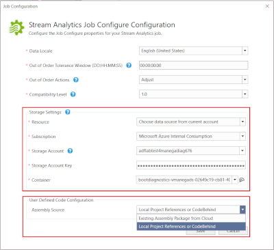
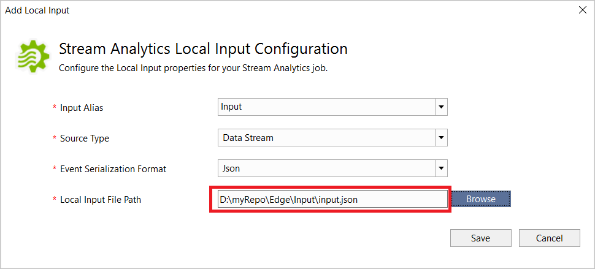
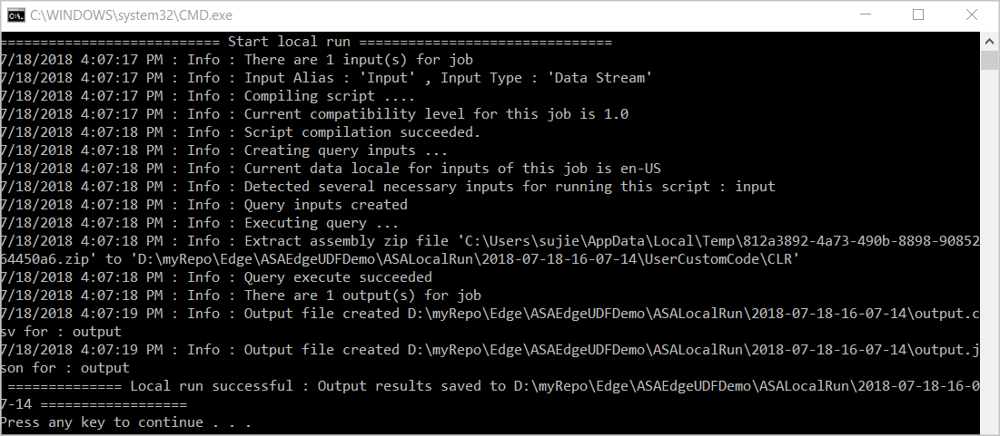
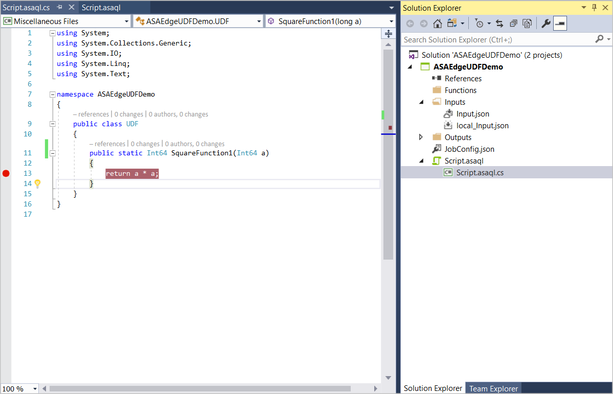
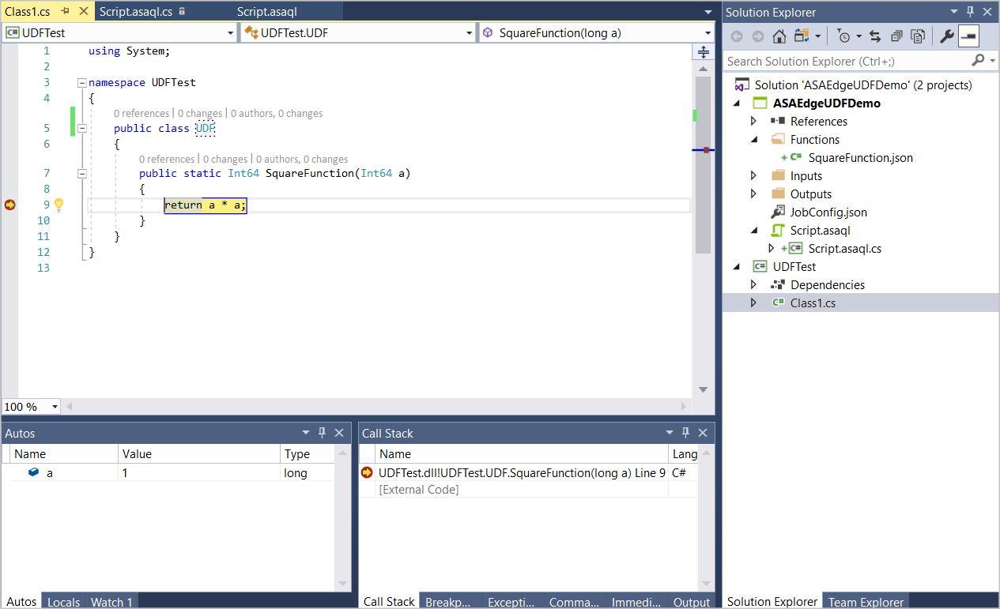

# Write C# user defined functions for Azure Stream Analytics Edge jobs

C# user defined functions (UDF) allow you to extend Azure Stream Analytics query language with your own functions. With UDF, you can reuse existing code (including DLLs), implement custom logic to manipulate complex strings, and run mathematical or complex logic. UDF can be implemented in three different ways: code-behind files in an ASA project, UDF from a local C# project, or an existing package from a storage account. This this tutorial demonstrates how to use a basic C# function written in code-behind. 

In this tutorial, you learn how to:

> [!div class="checklist"]
> * 

## Prerequisites

Before you start, make sure you have the following:

* If you don't have an Azure subscription, create a [free account](https://azure.microsoft.com/free/?WT.mc_id=A261C142F).
* Install [Visual Studio](stream-analytics-tools-for-visual-studio-install.md) and the **Azure development** or **Data Storage and Processing** workloads.
* Become familiar with the existing [Stream Analytics edge development guide]().
* Create a storage container.
* Install Docker and the IoT Edge runtime on your IoT Edge devices.

## Create an Edge project in Visual Studio

1. Start Visual Studio.

2. Select **File > New > Project**.

3. In the templates list on the left, select **Stream Analytics**, and then select **Azure Stream Analytics Edge Application**.

4.  Input the project **Name**, **Location**, and **Solution name**, and select **OK**.

   

## Configure assembly package path

1. Open Visual Studio and navigate to the **Solution Explorer**.

2. Double click the job configuration file, `EdgeJobConfig.json`.

3. Expand the **User Defined Code Configuration** section, and fill out the configuration with the following:

    |**Setting**  |**Suggested value**  |
    |---------|---------|
    |Assembly Source  |  Local Project Reference or CodeBehind   |
    |Resource  |  Choose data from current account   |
    |Subscription  |  Choose your subscription.   |
    |Storage Account  |  Choose your storage account.   |
    |Container  |  Choose the container you created in your storage account.   |
    |Assembly Package Destination  |  udf.zip   |

   


## Write a C# UDF with CodeBehind
A code-behind file is a C# file associated with a single ASA Edge query script. Visual Studio tools will automatically zip the code-behind file and upload it to the storage account upon submission. All classes must be defined as *public* and all objects must be defined as *static public*.

1. In **Solution Explorer**, expand **Script.asql** to find the **Script.asaql.cs** code-behind file.

2. Replace the code with the following:

```csharp
    using System; 
    using System.Collections.Generic; 
    using System.IO; 
    using System.Linq; 
    using System.Text; 

    namespace ASAEdgeUDFDemo 
    { 
        public class Class1 
        { 
            // Public static function 
            public static Int64 SquareFunction(Int64 a) 
            { 
                return a * a; 
            } 
        } 
    } 
```

## Implement the UDF

1. In **Solution Explorer**, open the **Script.asaql** file.

2. Replace the existing query with the following:

```sql
    SELECT machine.temperature, udf.ASAEdgeUDFDemo_Class1_SquareFunction(try_cast(machine.temperature as bigint))
    INTO Output
    FROM Input 
```

## Local testing

1. Download the Edge temperature simulator sample data file.

2. In **Solution Explorer**, expand **Inputs**, right-click **Input.json**, and select **Add Local Input**.

   

3. Specify the local input file path for the sample data you just downloaded and **Save**.

   

4. Click **Run Locally** in the script editor. Once the local run has successfully saved the output results, press any key to see the results in table format. 

   

5. You can also select **Open Results Folder** to see the raw files in JSON and CSV format.

   

## Debug UDF
You can debug your C# UDF locally the same way you debug standard C# code. 

1. Add breakpoints in your C# function.

   

2. Press **F5** to start debugging. The program will stop at your breakpoints as expected.

   

## Publish your job to Azure
Once you have tested your query locally, select **Submit to Azure** in the script editor to publish the job to Azure. Ensure **Location** is set to **West Centeral US**.

   

## Deploy to IoT Edge devices

Follow the IoT Edge Quickstart.


## Next steps

In this tutorial, you have created a simple C# user defined function using code-behind, published your job to Azure, and deployed the job to IoT Edge devices using the IoT Hub portal. 

To learn more about the different ways to use C# user defined functions for Stream Analytics Edge jobs, continue to this article:

> [!div class="nextstepaction"]
> [Write C# user defined functions for Azure Stream Analytics]()