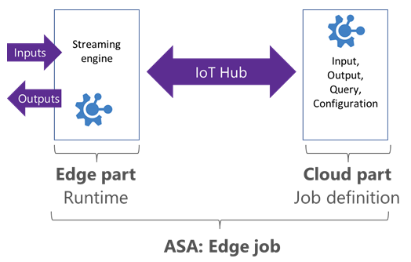
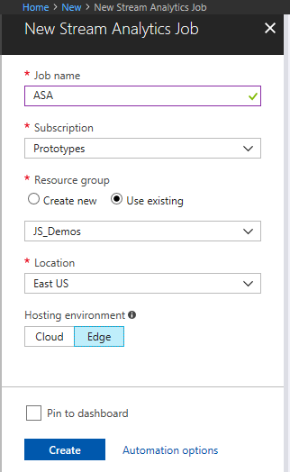
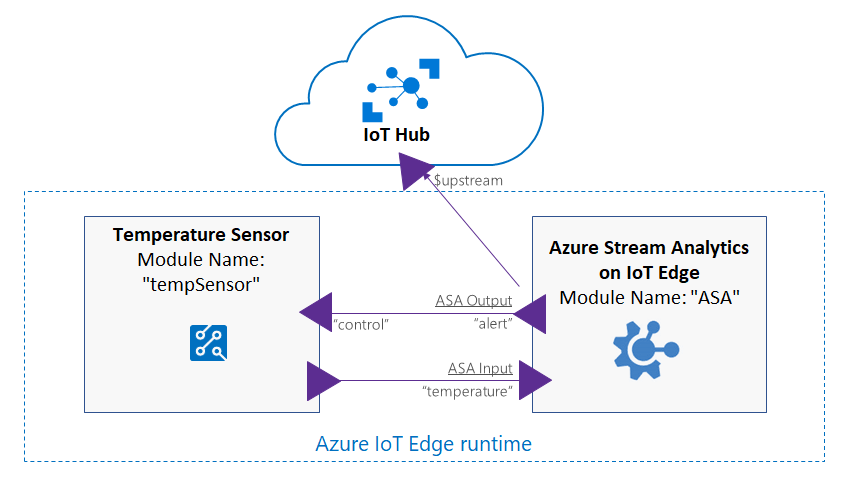

> [!IMPORTANT]
> This functionality is in preview. We do not recommend use in production.
> 

# What is Azure Stream Analytics on IoT Edge
## Principles
Azure Stream Analytics (ASA) on IoT Edge empowers developers to deploy near-real-time analytical intelligence closer to IoT devices so that they can unlock the full value of device-generated data. Designed for customers requiring low latency, resiliency, efficient use of bandwidth and compliance, enterprises can now deploy control logic close to the industrial operations and complement Big Data analytics done in the cloud.  
Azure Stream Analytics on IoT Edge runs within the [Azure IoT Edge](https://azure.microsoft.com/en-us/campaigns/iot-edge/) framework, and deployment and management of ASA jobs can be done using IoT Hub once the job is created in ASA.
This feature is in preview, if you have any question or feedback you can use [this survey](https://forms.office.com/Pages/ResponsePage.aspx?id=v4j5cvGGr0GRqy180BHbR2czagZ-i_9Cg6NhAZlH9ypUMjNEM0RDVU9CVTBQWDdYTlk0UDNTTFdUTC4u) to contact the product team.


## Scenarios

Here's few typical scenarios for which running ASA on the edge is particularly interesting:
* **Low-latency command and control**: For example, manufacturing safety systems are required to respond to operational data with ultra-low latency. With ASA on IoT Edge, you can analyze sensor data in near real time and issue commands when you detect anomalies to stop a machine or trigger alerts.
*	**Limited connectivity to the cloud**: Mission critical systems, such as remote mining equipment, connected vessels or offshore drilling, need to analyze and react to data even when cloud connectivity is intermittent. With ASA, your streaming logic runs independently of the network connectivity and you can choose what you send to the cloud for further processing or storage.
* **Limited bandwidth**: The volume of data produced by jet engines or connected cars can be so large that data must be filtered or pre-processed before sending it to the cloud. Using ASA, you can filter or aggregate the data that need to be sent to the cloud.
* **Compliance**: Regulatory compliance may require some data to be locally anonymized or aggregated before being sent to the cloud. With ASA, you 

# Edge jobs in Azure Stream Analytics
## What is an "edge" job?

ASA Edge jobs run as modules within [Azure IoT Edge runtime](https://docs.microsoft.com/en-us/azure/iot-edge/how-iot-edge-works). They are composed of two parts:
1.	A cloud part that is responsible for job definition: users define inputs, output, query and other settings (out of order events, etc.) in the cloud.
2.	The ASA on IoT Edge module that runs locally. It contains the ASA Complex Event Processing engine and receives the job definition from the cloud. 

ASA uses IoT Hub to deploy edge jobs to device(s). More information about [IoT Edge deployment can be seen here](https://docs.microsoft.com/en-us/azure/iot-edge/module-deployment-monitoring).




## Installation instructions
The high-level steps are described in the following table. More details are given in the following sections.
|      |Step   | Place     | Notes   |
| ---   | ---   | ---       |  ---      |
| 1   | **Create an ASA edge job**   | Azure portal      |  Create a new job, select **Edge** as **hosting environment**. <br> These jobs are created/managed from the cloud, and run on your own IoT Edge devices.     |
| 2   | **Create a storage container**   | Azure portal       | Storage containers are used to save your job definition where they can be accessed by your IoT devices. <br>  You can reuse any existing storage container.     |
| 3   | **Set up your IoT Edge environment on your device(s)**   | Device(s)      | Instructions for [Windows](https://docs.microsoft.com/en-us/azure/iot-edge/quickstart) or [Linux](https://docs.microsoft.com/en-us/azure/iot-edge/quickstart-linux).          |
| 4   | **Deploy ASA on your IoT Edge device(s)**   | Azure portal      |  ASA job definition is exported to the storage container created earlier.       |
You can follow [this step-by-step tutorial](https://docs.microsoft.com/en-us/azure/iot-edge/tutorial-deploy-stream-analytics) to deploy your first ASA job on IoT Edge.

### Create an ASA Edge job
1. From the Azure portal, create a new "Stream Analytics job". [Direct link to create a new ASA job here](https://ms.portal.azure.com/#create/Microsoft.StreamAnalyticsJob).
2. In the creation screen, select **Edge** as **hosting environment** (see the following picture)

3. Job Definition
    1. **Define Input Stream(s)**. Define one or several input streams for your job.
    2. Define Reference data (optional).
    3. **Define Output Stream(s)**. Define one or several outputs streams for your job. 
    4. **Define query**. Define the ASA query in the cloud using the inline editor. The compiler automatically checks the syntax enabled for ASA edge. You can also test your query by uploading sample data. 
4. Set optional settings
    1. **Event ordering**. You can configure out-of-order policy in the portal. Documentation is available [here](https://msdn.microsoft.com/en-US/library/azure/mt674682.aspx?f=255&MSPPError=-2147217396).
    2. **Locale**. Set the internalization format.


### Create a storage container
A storage container is required in order to export the ASA compiled query and the job configuration. It is used to configure the ASA Docker image with your specific query. 
1. Follow [these instructions](https://docs.microsoft.com/en-us/azure/storage/common/storage-create-storage-account) to create a storage account from the Azure portal. You can keep all default options to use this account with ASA.
2. In the newly created storage account, create a blob storage container:
    1. Click on "Blobs" , then "+ Container". 
    2. Enter a name and keep the container as "Private"


> [!Note]
> When a deployment is created, ASA exports the job definition to a storage container. This job definition remain the same during the duration of a deployment. 
> As a consequence, if you want to update a job running on the edge, you need to edit the job in ASA, and then create a new deployment in IoT Hub.


### Set up your IoT Edge environment on your device(s)
Edge jobs can be deployed on devices running Azure IoT Edge.
For this, you need to follow these steps:
- Create an Iot Hub;
- Install Docker and IoT Edge runtime on your edge devices;
- Set your devices as "IoT Edge devices" in IoT Hub.

These steps are described in the IoT Edge documentation for [Windows](https://docs.microsoft.com/en-us/azure/iot-edge/quickstart) or [Linux](https://docs.microsoft.com/en-us/azure/iot-edge/quickstart-linux).  


###  Deployment ASA on your IoT Edge device(s)
#### Add ASA to your deployment
- In the Azure portal, open IoT Hub, navigate to IoT Edge Explorer and open your device blade.
- Select **Set modules**, then select **Import Azure Service IoT Edge Module**.
- Select the subscription and the ASA Edge job that you created. Then select your storage account. Click Save.


> [!Note]
> During this step, ASA requests access to the selected storage container, and then creates a folder named "EdgeJobs". For each  deployment, a new subfolder is created in the "EdgeJobs" folder.
> In order to deploy your job to edge devices, ASA creates a shared access signature (SAS) for the job definition file. The SAS key is securely transmitted to the IoT Edge devices using device twin. The expiration of this key is three years from the day of its creation.


For more details about IoT Edge deployments, see to [this page](https://docs.microsoft.com/en-us/azure/iot-edge/module-deployment-monitoring).


#### Configure routes
IoT Edge provides a way to declaratively route messages between modules, and between modules and IoT Hub. The full syntax is described [here](https://docs.microsoft.com/en-us/azure/iot-edge/module-composition).
Names of the inputs and outputs created in the ASA job can be used as endpoints for routing.  

##### Example
```
{
"routes": {                                              
    "sensorToAsa":   "FROM /messages/modules/tempSensor/* INTO BrokeredEndpoint(\"/modules/ASA/inputs/temperature\")",
    "alertsToCloud": "FROM /messages/modules/ASA/* INTO $upstream", 
    "alertsToReset": "FROM /messages/modules/ASA/* INTO BrokeredEndpoint(\"/modules/tempSensor/inputs/control\")" 
}
}   

```
This example  shows the routes for the scenario described in the following picture. It contains an edge job called "**ASA**", with an input named "**temperature**" and an output named "**alert**".


This example defines the following routes:
- Every message from the **tempSensor** is sent to the module named **ASA** to the input named **temperature**,
- All outputs of **ASA** module are sent to the IoT Hub linked to this device ($upstream),
- All outputs of **ASA** module are sent to the **control** endpoint of the **tempSensor**.


# Technical documentation
## Current limitations for edge jobs compared to cloud jobs
The goal is to have parity between edge jobs and cloud jobs. Most of the features of our SQL query language are already supported.
However the following features are not yet supported for edge jobs:
* User-defined functions (UDF) and user-defined aggregates (UDA).
* Azure ML functions.
* Using more than 14 aggregates in a single step.
* AVRO format for input/output. At this time only CSV and JSON are supported.
* Compression of JSON input.
* The following  SQL operators:
    * AnomalyDetection
    * Geospatial operators:
        * CreatePoint
        * CreatePolygon
        * CreateLineString
        * ST_DISTANCE
        * ST_WITHIN
        * ST_OVERLAPS
        * ST_INTERSECTS
    * PARTITION BY
    * GetMetadataPropertyValue


## Runtime and hardware requirements
In order to run ASA on IoT Edge, you need devices that can run [Azure IoT Edge](https://azure.microsoft.com/en-us/campaigns/iot-edge/). 

ASA and Azure IoT Edge use **Docker** containers to provide a portable solution that runs on multiple host OS (Windows, Linux).

ASA on IoT Edge is made available as Windows and Linux images, running on both x86-64 or ARM architectures. 


## Input and output
### Input and Output Streams
ASA Edge jobs can get inputs and outputs from other modules running on IoT Edge devices. To connect from and to specific modules, you can set the routing configuration at deployment time. More information is described on [the IoT Edge module composition documentation].(https://docs.microsoft.com/en-us/azure/iot-edge/module-composition).

For both inputs and outputs, CSV and JSON formats are supported.

For each input and output stream you create in your ASA job, a corresponding endpoint is created on your deployed module. These endpoints can be used in the routes of your deployment.


#### Reference data
Reference data (also known as a lookup table) is a finite data set that is static or slowing changing in nature. It is used to perform a lookup or to correlate with your data stream. To make use of reference data in your Azure Stream Analytics job, you will generally use a [Reference Data Join](https://msdn.microsoft.com/library/azure/dn949258.aspx) in your Query. For more information, see the [ASA documentation about reference data](https://docs.microsoft.com/en-us/azure/stream-analytics/stream-analytics-use-reference-data).

In order to use reference data for ASA on Iot Edge, you need to follow these steps: 
1. Create a new input for your job
1.1. Choose **Reference data** as the **Source Type**.
1.2 Set the file path. The file path should be an **absolute** file path on the device


2. Enable **Shared Drives** in your Docker configuration, and make sure the drive is enabled before starting your deployment.
2.1. See more information in [Docker documentation for Windows here](https://docs.docker.com/docker-for-windows/#shared-drives).

> [!Note]
> At the moment only local reference data is supported.


# License and third-party notices
* [Azure Stream Analytics on IoT Edge preview license](media/stream-analytics-edge/ASAEdgeLicense.pdf). 
* [Third-party notice for Azure Stream Analytics on IoT Edge preview](media/stream-analytics-edge/ASAEdgeTPN.pdf).

## Get help
For further assistance, try the [Azure Stream Analytics forum](https://social.msdn.microsoft.com/Forums/en-US/home?forum=AzureStreamAnalytics).


## Next steps

* [More information on Azure Iot Edge](https://docs.microsoft.com/en-us/azure/iot-edge/how-iot-edge-works)
* [ASA on IoT Edge tutorial](https://docs.microsoft.com/en-us/azure/iot-edge/tutorial-deploy-stream-analytics)
* [Send feedback to the team using this survey](https://forms.office.com/Pages/ResponsePage.aspx?id=v4j5cvGGr0GRqy180BHbR2czagZ-i_9Cg6NhAZlH9ypUMjNEM0RDVU9CVTBQWDdYTlk0UDNTTFdUTC4u) 

<!--Link references-->
[stream.analytics.developer.guide]: ../stream-analytics-developer-guide.md
[stream.analytics.scale.jobs]: stream-analytics-scale-jobs.md
[stream.analytics.introduction]: stream-analytics-introduction.md
[stream.analytics.get.started]: stream-analytics-real-time-fraud-detection.md
[stream.analytics.query.language.reference]: http://go.microsoft.com/fwlink/?LinkID=513299
[stream.analytics.rest.api.reference]: http://go.microsoft.com/fwlink/?LinkId=517301
