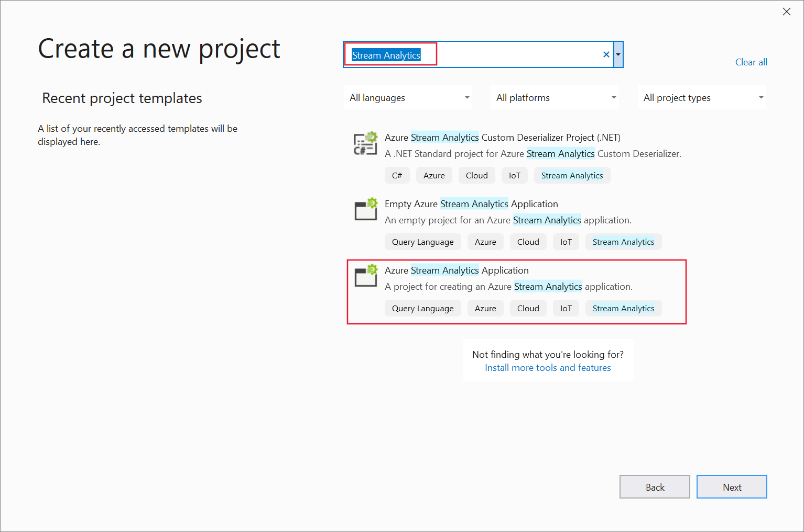
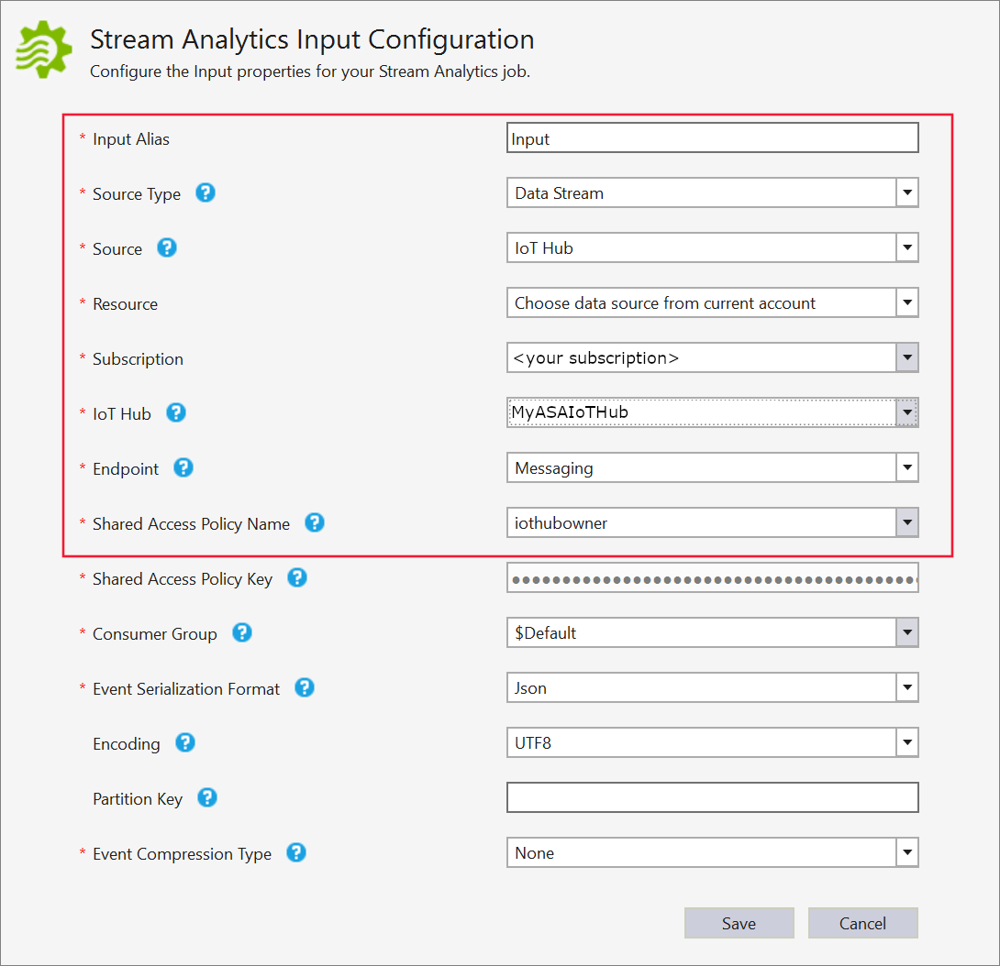
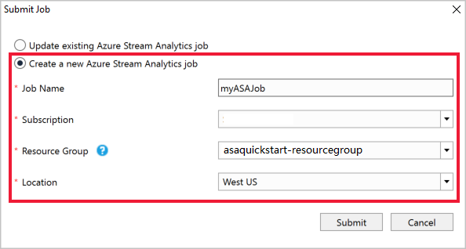
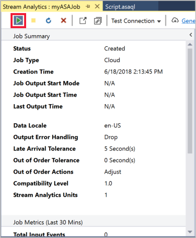

# Quickstart: Create a Stream Analytics job by using the Azure Stream Analytics tools for Visual Studio

This quickstart shows you how to create and run a Stream Analytics job using Azure Stream Analytics tools for Visual Studio. The example job reads streaming data from a blob in Azure blob storage. The input data file used in this quickstart contains static data for illustrative purposes only. In a real world scenario, you use streaming input data for a Stream Analytics job. The job calculates the average temperature when over 100° and writes the resulting output events to a new file.

## Before you begin

* If you don't have an Azure subscription, create a [free account](https://azure.microsoft.com/free/).

* Sign in to the [Azure portal](https://portal.azure.com/).

* Install Visual Studio 2017, Visual Studio 2015, or Visual Studio 2013 Update 4. Enterprise (Ultimate/Premium), Professional, and Community editions are supported. Express edition is not supported.

* Follow the  [installation instructions](https://docs.microsoft.com/azure/stream-analytics/stream-analytics-tools-for-visual-studio-install) to install Stream Analytics tools for Visual Studio.

## Prepare the input data

Before defining the Stream Analytics job, you should prepare the data, which is configured as input to the job. To prepare the input data required by the job, run the following steps:

1. Download the [sample sensor data](https://raw.githubusercontent.com/Azure/azure-stream-analytics/master/Samples/GettingStarted/HelloWorldASA-InputStream.json) from GitHub. The sample data contains sensor information in the following JSON format:  

   ```json
   {
     "time": "2018-01-26T21:18:52.0000000",
     "dspl": "sensorC",
     "temp": 87,
     "hmdt": 44
   }
   ```
2. Sign in to the Azure portal.  

3. From the upper left-hand corner of the Azure portal, select **Create a resource** > **Storage** > **Storage account**. Fill out the Storage account job page with **Name** set to "asaquickstartstorage", **Location** set to "West US", **Resource group** set to "asaquickstart-resourcegroup" (host the storage account in the same resource group as the Streaming job for increased performance). The remaining settings can be left to their default values.  

   

4. From **All resources** page, find the storage account you created in the previous step. Open the **Overview** page, and then the **Blobs** tile.  

5. From the **Blob Service** page, select **Container**, provide a **Name** for your container, such as *container1* > select **OK**.  

   

6. Go to the container you created in the previous step. Select **Upload** and upload the sensor data that you got from the first step.  

   

## Create a Stream Analytics project

1. Start Visual Studio.

2. Select **File > New Project**.  

3. In the templates list on the left, select **Stream Analytics**, and then select **Azure Stream Analytics Application**.  

4. Input the project **Name**, **Location**, and **Solution name**.

   

## Choose the correct subscription

1. In Visual Studio, on the **View** menu, select **Server Explorer**.

2. Log in with your Azure account.

## Define input

1. In **Solution Explorer**, expand the **Inputs** node and double-click **Input.json**.

2. Fill out the **Stream Analytics Input Configuration** with the following values:

   |**Setting**  |**Suggested value**  |**Description**   |
   |---------|---------|---------|
   |Input Alias  |  Input   |  Enter a name to identify the job’s input.   |
   |Source Type   |  Data Stream |  Choose the appropriate input source: Data Stream or Reference Data.   |
   |Source  |  Blob Storage |  Choose the appropriate input source.   |
   |Resource  | Choose data source from current account | Choose to enter data manually or select an existing account.   |
   |Subscription  |  \<Your subscription\>   | Select the Azure subscription that has the storage account you created. The storage account can be in the same or in a different subscription. This example assumes that you have created storage account in the same subscription.   |
   |Storage Account  |  asaquickstartstorage   |  Choose or enter the name of the storage account. Storage account names are automatically detected if they are created in the same subscription.   |
   |Container  |  container1   |  Select the existing container that you created in your storage account.   |
   
3. Leave other options to default values and select **Save** to save the settings.  

   

## Define output

1. In **Solution Explorer**, expand the **Outputs** node and double-click **Output.json**.

2. Fill out the **Stream Analytics Output Configuration** with the following values:

   |**Setting**  |**Suggested value**  |**Description**   |
   |---------|---------|---------|
   |Output Alias  |  Output   |  Enter a name to identify the job’s output.   |
   |Sink   |  Blob Storage |  Choose the appropriate sink.    |
   |Resource  |  Provide data source settings manually |  Choose to enter data manually or select an existing account.   |
   |Subscription  |  \<Your subscription\>   | Select the Azure subscription that has the storage account you created. The storage account can be in the same or in a different subscription. This example assumes that you have created storage account in the same subscription.   |
   |Storage Account  |  asaquickstartstorage   |  Choose or enter the name of the storage account. Storage account names are automatically detected if they are created in the same subscription.   |
   |Container  |  container1   |  Select the existing container that you created in your storage account.   |
   |Path Pattern  |  output   |  Enter the name of a file path to be created within the container.   |
   
3. Leave other options to default values and select **Save** to save the settings.  

   

## Define the transformation query

1. Open **Script.asaql** from **Solution Explorer** in Visual Studio.

2. Add the following query:

   ```sql
   SELECT 
   System.Timestamp AS OutputTime,
   dspl AS SensorName,
   Avg(temp) AS AvgTemperature
   INTO
     Output
   FROM
     Input TIMESTAMP BY time
   GROUP BY TumblingWindow(second,30),dspl
   HAVING Avg(temp)>100
   ```

## Submit a Stream Analytics query to Azure

1. In the **Query Editor**, select **Submit To Azure** in the script editor.

2. Select **Create a New Azure Stream Analytics job** and enter a **Job Name**. Choose the **Subscription**, **Resource Group**, and **Location** you used at the beginning of the Quickstart.

   

## Start the Stream Analytics job and check output

1. When your job is created, the job view opens automatically. Select the green arrow button to start the job,

   

2. Change the date **Custom Time** to `2018-01-01` and select **Start**.

   

3. Note the job status has changed to **Running**, and there are input/output events. This may take a few minutes.

   

4. To view results, on the **View** menu, select **Cloud Explorer**, and navigate to the storage account in your resource group. Under **Blob Containers**, double-click **container1**, and then the **output** file path.

   
