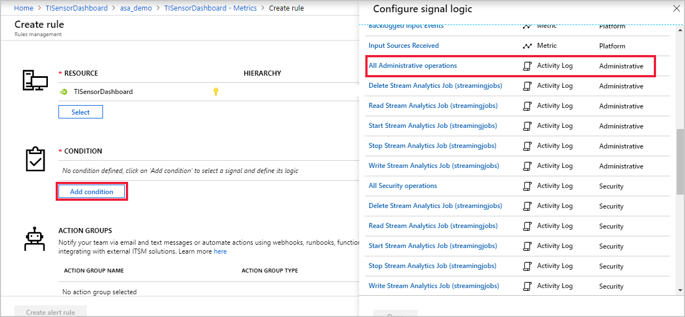
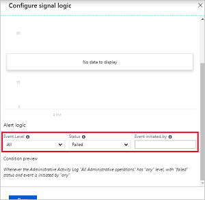

# Set up alerts for Azure Stream Analytics jobs

It's important to monitor your Azure Stream Analytics job to ensure the job is running continuously without any problems. This article describes how to set up alerts for common scenarios that should be monitored. 

Rules can be set up on metrics through the portal and can be configured [programmatically](https://code.msdn.microsoft.com/windowsazure/Receive-Email-Notifications-199e2c9a) over Operation Logs data.

## Set up alerts in the Azure portal

1. In the Azure portal, open the Stream Analytics job you want to create an alert for.

2. On the **Job** page, navigate to the **Monitoring** section.  

3. Select **Metrics**, and then click **New alert rule**.

     

4. Your Stream Analytics job name should automatically appear under **RESOURCE**. Click **Add condition**, and select **All Administrative operations** under **Configure signal logic**.

     

5. Under **Configure signal logic**, change **Event Level** to **All** and change **Status** to **Failed**. Leave **Event initiated by** blank and click **Done**.

    

6. Select an existing action group or create a new group. In this example, a new action group called **TIDashboardGroupActions** was created with an **Emails** action that sends an email to users with the **Owner** Azure Resource Manager Role.

   

7. The **RESOURCE**, **CONDITION**, and **ACTION GROUPS** should each have an entry.

   

   Add an **Alert rule name**, **Description**, and your **Resource Group** to the **ALERT DETAILS** and click **Create alert rule** to create the rule for your Stream Analytics job.

   

## Scenarios to monitor

The following alerts are recommended for monitoring the performance of your Stream Analytics job. These metrics should be evaluated every minute over the last 5-minute period. If your job suffers from performance issues, you can use query parallelization to make it more optimal and try increasing the number of streaming units.

|Metric|Condition|Time Aggregation|Threshold|Corrective Actions|
|-|-|-|-|-|
|SU% Utilization|Greater than|Maximum|80|There are multiple factors that increase SU% Utilization. You can scale with query parallelization or increase the number of streaming units.|
|Runtime errors|Greater than|Total|0|Examine the activity or diagnostic logs and make appropriate changes to the inputs, query, or outputs.|
|Watermark delay|Greater than|Maximum|When average value of this metric over the last 15 minutes is greater than late arrival tolerance (in seconds). If you have not modified the late arrival tolerance, the default is set to 5 seconds.|Try increasing the number of SUs or parallelizing your query.|
|Input deserialization errors|Greater than|Total|0|Examine the activity or diagnostic logs and make appropriate changes to the input.|

## Get help

For more detail on configuring alerts in the Azure portal, see [Receive alert notifications](../monitoring-and-diagnostics/insights-receive-alert-notifications.md).  

For further assistance, try our [Azure Stream Analytics forum](https://social.msdn.microsoft.com/Forums/azure/home?forum=AzureStreamAnalytics).

## Next steps
* [Introduction to Azure Stream Analytics](stream-analytics-introduction.md)
* [Get started using Azure Stream Analytics](stream-analytics-get-started.md)
* [Scale Azure Stream Analytics jobs](stream-analytics-scale-jobs.md)
* [Azure Stream Analytics Query Language Reference](https://msdn.microsoft.com/library/azure/dn834998.aspx)
* [Azure Stream Analytics Management REST API Reference](https://msdn.microsoft.com/library/azure/dn835031.aspx)

