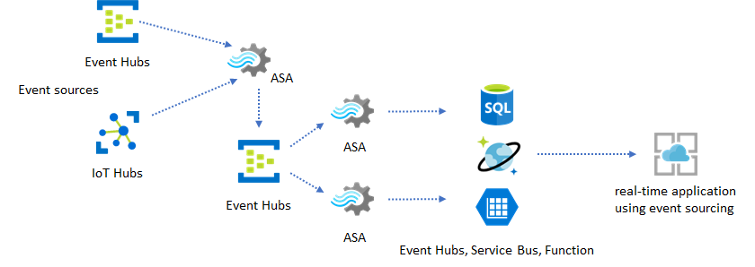
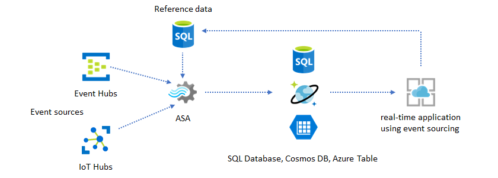
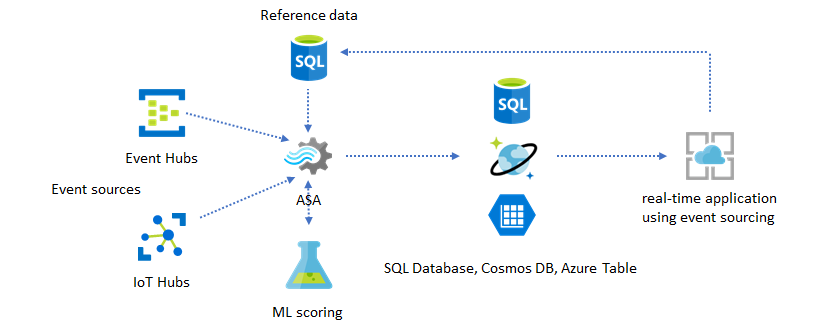
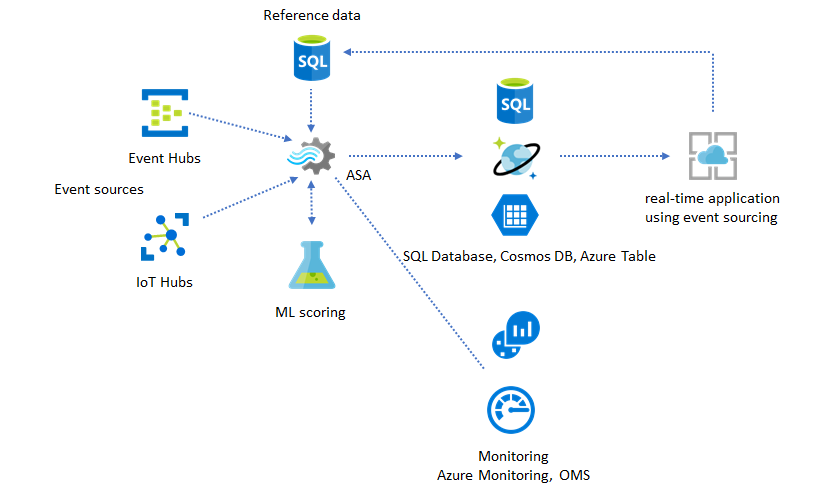
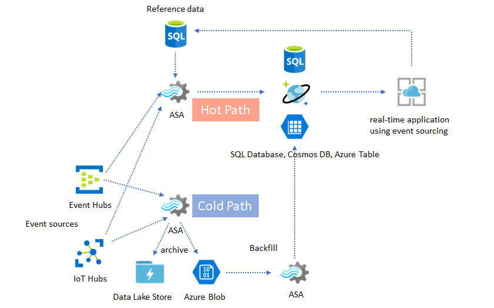

# Azure Stream Analytics end to end solution patterns

Like many other services in Azure, ASA is often composed with other services to create a larger end to end solution. In this article, we start with the simplest ASA solutions, and enumerate various architecture patterns that can be further composed into even more complex solutions. The patterns described in this page are not scenario specific, so they can be used in a wide variety of scenarios. Example of scenario-specific patterns are available on [azure architecture](https://azure.microsoft.com/solutions/architecture/?product=stream-analytics).

## Create the first ASA job for real-time dashboard
ASA is designed for ease of use, so you can stand up real-time dashboard and alert solutions very quickly. The simplest solution ingests events from Event Hubs or IoT Hub, and [feeds the PowerBI dashboard using streaming dataset](service-real-time-streaming.md). The detailed step by step tutorial can be found [here](stream-analytics-manage-job.md).

With ASA, a user can stand up such a solution in just a few minutes from Azure portal. No extensive coding is involved. SQL language is used to express the business logic.

This real time dashboard solution pattern offers the lowest latency from events entering event sources to reaching PowerBI dashboard in a browser, and ASA is the only Azure service with such builtin capability.

## Use of SQL for dashboard
PowerBI streaming dataset powered dashboard has the lowest latency, but it cannot be used to produce full fledged PowerBI reports. The common pattern to serve a PowerBI report is to output to a SQL database first, then use PowerBI’s SQL connector to query SQL for the latest data.

This solution pattern trades off flexibility with increased latency. If the latency requirement is not as stringent as under a second (e.g. on the order of a few seconds or even a minute), the solution still works well, while maximizing PowerBI’s utility to further slice/dice the data in the reporting user experience. Using SQL database, you also gain the flexibility of using other dashboarding solutions such as Tableau, if desirable.

Just note, the maximum throughput to a SQL database from ASA is 24MB/s. SQL is inherently not a high throughput data store, if the event sources in your solution produces data at a higher rate, you will need to use processing logic in ASA to reduce the output rate to SQL, using techniques such as filtering, windowed aggregates, pattern matching with temporal joins and analytic functions. Output rate to SQL can be further optimized using techniques described [here](stream-analytics-sql-output-perf.md).

## Incorporate real time insights into your application with event messaging
The second most popular use of ASA is to generate real time alerts. In this solution pattern, business logic in ASA can be used to detect certain [temporal and spatial patterns](stream-analytics-geospatial-functions.md) and even [anomalies](stream-analytics-machine-learning-anomaly-detection.md), then produce alerting signals. However, unlike the dashboarding solution, where ASA has a preferred endpoint (PowerBI), a number of intermediate data sinks can be used, such as Event Hubs, Service Bus, and Function. You, as the application builder, need to decide which data sink works best for your application to realize the end to end scenario. Downstream event consumer logic has to be implemented to generate the real alert in your existing business workflow. Because you can implement custom logic in Azure Function, Function is the fastest way you can perform such integration. A tutorial for using Azure Function as ASA’s output can be found [here](stream-analytics-with-azure-functions.md). Azure Function also supports various types of notifications or output such as text or email. The full list is available here. Logic App may also be used for such integration through the use of Event Hubs between ASA and Logic App.

Event Hubs, on the other hand, offers the most flexible integration point, as many other services can consume events from Event Hubs, for example, Azure Data Explorer, and Time Series Insight. They can be connected directly to the Event Hubs sink from ASA to complete the solution. Event Hubs is also the highest throughput messaging broker you have on Azure for such integration scenarios.

## Dynamic applications and websites
You can create custom real-time visualization such as dashboard or map visualization using Azure Stream Analytics and Azure SignalR Service. Using SignalR, web clients can be updated in real-time and show dynamic content.

## Incorporate real-time insights into your application through data stores
Most web services and web applications today use request/response pattern to serve the presentation layer. The request/response pattern is simple to build, and can be easily scaled with low response time using stateless frontend and scalable stores such as Cosmos DB.

On the other hand, high data volume often creates performance bottlenecks in a CRUD based system, in addition to other problems. [Event sourcing solution pattern](https://docs.microsoft.com/en-us/azure/architecture/patterns/event-sourcing) is used to address this problem . Furthermore, temporal patterns and insights are difficult and inefficient to extract from a traditional data store. Modern high-volume data driven applications often adopt a dataflow based architecture. ASA as the compute engine for data in motion is a linchpin in such an architecture.

In this solution pattern, events are processed and consolidated into data stores by ASA. The application layer again interacts with data stores using the traditional request/response pattern. Because ASA’s ability to process large amount of events in real time efficiently, the application is highly scalable without the need to bulk up the data store layer. The data store layer is essentially a materialized view in the system. [This article](stream-analytics-documentdb-output.md) describes how Cosmos DB is used as an ASA output.

In real applications where processing logic is complex and there is the need to upgrade certain parts of the logic independently, multiple ASA jobs can be composed together with Event Hubs as the intermediary event broker.

This pattern improves the resiliency and manageability of the system. One thing to note though, even though ASA guarantees exactly once processing, there is a small chance that duplicate events may land in the intermediary Event Hubs. It’s important for the downstream ASA job to perform dedupe logic using logic keys in a lookback window. You can find more details [here](https://docs.microsoft.com/en-us/stream-analytics-query/event-delivery-guarantees-azure-stream-analytics).

## Use reference data for application customization
Many of ASA’s customers are ISVs who build SaaS solutions for their customers. End user customization is often a requirement (e.g. alerting threshold, processing rules, [geofences](geospatial-scenarios.md), etc.) ASA’s reference data feature is designed specifically for this use case. The application layer can accept parameter changes and store them in a SQL database. The ASA job periodically queries for changes from the database and makes the customization parameters accessible through reference data join. More information on how to use reference data for application customization purpose can be found for [SQL reference data](sql-reference-data.md), and [reference data join](https://docs.microsoft.com/en-us/stream-analytics-query/reference-data-join-azure-stream-analytics).

This pattern can also be used to implement a rule engine, where the threshold of the rules are defined from reference data. More info on the page: [Process configurable threshold-based rules in Azure Stream Analytics](stream-analytics-threshold-based-rules.md).

## Adding ML to your real time insights
ASA’s built-in [Anomaly Detection model](stream-analytics-machine-learning-anomaly-detection.md) is a convenient way to introduce Machine Learning magic to your real time application. For a wider range of ML needs, ASA integrates with Azure Machine Learning’s scoring service by [calling into their endpoints for scoring from within the streaming application](stream-analytics-machine-learning-integration-tutorial.md). However, at this moment because of the interaction between ASA and certain design choices of AML, the throughput for such scoring can be limited. We are investigating how ASA can call into a model scoring endpoint hosted in AKS/ACI while removing the throughput limitation. Regardless, this pattern gives you instant Machine Learning power in your ASA job, and turn your analytics from reactive to predictive.
For the more advanced customers of ASA, who wants to incorporate online training and scoring into the same stream analytics pipeline, [here](stream-analytics-high-frequency-trading.md) is an example of how to do that with linear regression. Unfortunately, there is no built-in support for online training at this time.

## Near real time data warehousing
Another application pattern ASA customers use, after dashboarding and alerting, is near real-time data warehousing also called streaming data warehouse. In addition to events arriving at Event Hubs and IoT Hub from user’s application, [ASA running on IoT Edge](stream-analytics/stream-analytics-edg.md) can be used to fulfill data cleansing, data reduction, and data store and forward needs in order to gracefully handle bandwidth limitation and connectivity issues in the system. ASA’s SQL output adapter can be used to output to SQL DW. However, the maximum throughput is only limited to 10MB/s.

One way to improve the throughput with some latency tradeoff is to archive the events into Azure Blob, and the [import them into SQL DW with Polybase](../sql-data-warehouse/load-data-from-azure-blob-storage-using-polybase.md). Today, the user has to manually stitch together output from ASA to blob and input from blob to SQL DW, by [archiving the data by timestamp](stream-analytics-custom-path-patterns-blob-storage-output.md), and perform imports periodically. We are looking into how to automatically trigger the import when new data arrive.
In this usage pattern, ASA is used as a near real time ETL engine. Newly arriving events are continuously transformed and stored for downstream analytics service consumption.

## Archiving real time data for analytics
Today, most of data science and analytics activities still happen offline. Data archived by ASA serves this needs well. During Build, we will announce the support of ADLS gen 2 output, and Parquet output format. These capabilities remove the friction to feed data directly into ADLA, Azure Databricks, and Azure HDInsight. Again, ASA is used as a near real time ETL engine in this solution. Customers can then explore archived data in Data Lake using various compute engines.

## Use reference data for enrichment
Data enrichment is often a requirement for ETL engines. ASA supports data enrichment with [reference data](stream-analytics-use-reference-data.md) from both SQL database and Azure blob. This can be done for both data landing in the Data Lake or data going into SQL DW.

## Operationalize insights from archived data in real time application
Now, if we combine the offline analytics pattern with the near real time application pattern, you can create a feedback loop, and let the application automatically adjust for changing patterns in the data. This can be as simple as changing threshold value for alerting, or as complex as retraining ML models. The same solution architecture can be applied to both ASA jobs running in the cloud, or ASA jobs running on IoT Edge.

## How to monitor ASA jobs
An ASA job runs 24/7 to process incoming events continuously in real time. Its uptime guarantee is crucial to the health of the end to end application. While ASA is the only stream analytics service in the industry that offers [99.9% availability guarantee]( https://azure.microsoft.com/en-us/support/legal/sla/stream-analytics/v1_0/), you may still incur some level of down time. Over the years, ASA has introduced metrics, logs and job states to reflect the health of the jobs. All of them are surfaced through Azure Monitor service, and can be further exported to OMS. More details can be found [here](stream-analytics-monitoring.md).

There are two key things to monitor
1.	[Job failed state](job-states.md)

    First and foremost, you need to make sure the job is running. Without the job in the running state, no new metrics and log is generated. Jobs can get into failed state for various reasons, including high SU utilization level (running out of resources).

2.	[Watermark delay metrics](https://azure.microsoft.com/en-us/blog/new-metric-in-azure-stream-analytics-tracks-latency-of-your-streaming-pipeline/)

    This metric reflects how far behind your processing pipeline is in wall clock time (seconds). Some of the delay is attributed to the inherent processing logic, so monitoring the increasing trend is much more important than monitoring the absolute value. The steady state delay should be addressed by your application design, not by monitoring/alert.

Upon failure, activity logs and [diagnostics logs](stream-analytics-job-diagnostic-logs.md) are the best places to start look for errors.

## Build resilient and mission critical applications
Regardless of ASA’s SLA guarantee and how careful you run your end to end application, outage happens. You need to be prepared for such outage to recover gracefully, if your application is mission critical.

For alerting applications, the most important thing is to detect the next alert, so you may choose to restart the ASA job from current time when recovering, ignoring past alerts. Because ASA’s job start time semantics is by the first output time, not the first input time, the input is rewind backwards appropriate amount of time to guarantee the first output at the specified time is complete and correct. You won’t get partial aggregates and trigger alerts unexpectedly as a result.

You may also choose to start output from some amount of time in the past, since both Event Hubs and IoT Hub’s retention policy holds reasonable amount of data to allow processing from the past. The tradeoff is how fast you can catch up to current time and start to generate timely new alerts. As we know data lose their value rapidly over time, it’s important to catch up to the current time quickly. There are two ways to do that.
1.	Provision more resources (SU) when catching up.
2.	Restart from current time.

Restarting from current time is simple to do, with the tradeoff of leaving a gap during processing. This might be OK for alerting scenarios, but can be problematic for dashboarding scenario, and a non-starter for archiving or data warehousing scenarios.
Provision more resources can speed up catchup, but the effect of having a processing rate surge is complex.
1.	You need to test your ASA job is scalable to a larger number of SUs. Not all ASA queries are scalable. You need to make sure your query is [parallelized](stream-analytics-parallelization.md).
2.	You need to make sure there is enough number of partitions in the upstream Event Hubs or IoT Hub that you can add more Throughput Units (TUs) to scale the input throughput. Remember, each Event Hub TU max out at 2MB/s output rate.
3.	You need to make sure you have provisioned enough resource in the output sinks (e.g. SQL Database, Cosmos DB), so they don’t throttle the surge in output, which can sometimes cause the system to be totally locked up.

The most important thing to do is for you to anticipate the processing rate change, test these scenarios before going into production, and be ready to scale the processing accordingly during failure recovery time.

In the extreme scenario that incoming events are completely delayed, because of the application of late arriving window in an ASA job, [it’s possible all the delayed events are dropped](stream-analytics-time-handling.md). This may appear to be a mysterious behavior at the beginning. However, considering ASA is a real time processing engine, it’s not to difficult to understand it expects incoming events to be close to the wall clock time. It has to drop events that violates these constraints.

### Backfilling process
Fortunately, the aforementioned data archiving pattern can be used to process these late events gracefully. The idea is the archiving job processes incoming events in arrival time, and archives events into the right time bucket in Azure Blob or ADLS with their event time. It doesn’t matter how late an event arrives, it will never be dropped, and will always land in the right time bucket. During recovery, it’s now possible to reprocess the archived events and backfill the results to the store of choice.

Today, the backfill process has to be done with an offline batch processing system, that most likely has a different programming model from ASA, which means you have to reimplement the entire processing logic. It’s conceivable that we enable running an ASA query in offline mode, so backfill can take place with the same query on the archived data.

For backfilling, it’s still important to at least temporarily provision more resource to the output sinks to handle higher throughput than the steady state processing needs.

|Scenarios	|Restart from now only	|Restart from last stopped time	|Restart from now + backfill with archived events|
|---------|---------|---------|---------|
|**Dashboarding**	|Creates gap	|OK for short outage	|Use for long outage |
|**Alerting**	|Acceptable	|OK for short outage	|Not necessary |
|**Event sourcing app**	|Acceptable	|OK for short outage	|Use for long outage |
|**Data warehousing**	|Data loss	|Acceptable	|Not necessary |
|**Offline analytics**	|Data loss	|Acceptable	|Not necessary|

## Putting it all together
It’s not hard to imagine that all the solution patterns mentioned above, including dashboarding, alerting, event sourcing application, data warehousing, and offline analytics application can be combined together in a single end to end system, which can be very complex.

The key is to design your system in composable patterns, so each sub-system can be built, tested, upgraded, and recover independently. Hope this article gives you some insights into how to reason about the composable parts, and use ASA effectively in your next project.
