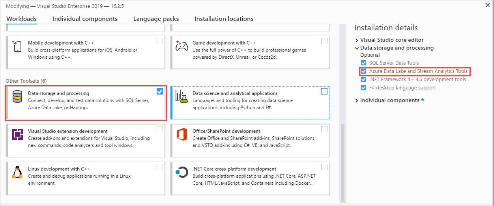
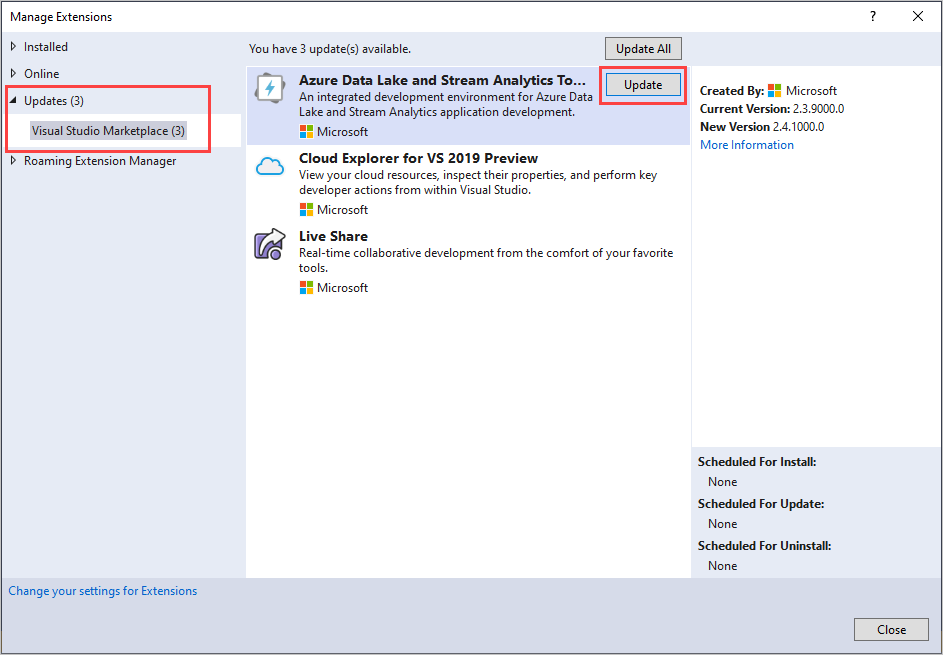

# Install Azure Stream Analytics tools for Visual Studio

Visual Studio versions 2019, 2017, 2015, and 2013 support Azure Data Lake and Stream Analytics Tools. This article describes how to install and uninstall the tools.

For more information on using the tools, see [Quickstart: Create an Azure Stream Analytics job by using Visual Studio](stream-analytics-quick-create-vs.md).

## Install

We recommend Visual Studio 2019 or Visual Studio 2017.

### Install for Visual Studio 2019 and 2017

* Download [Visual Studio 2019 (Preview 2 or above) or Visual Studio 2017 (15.3 or above)](https://www.visualstudio.com/). Enterprise (Ultimate/Premium), Professional, and Community editions are supported. Express edition isn't supported. Visual Studio 2017 on Mac isn't supported.
* Azure Data Lake and Stream Analytics Tools are part of the **Azure development** and **Data storage and processing** workloads. Enable either one of these two workloads.

You can enable workloads during Visual Studio installation. If Visual Studio is already installed, select Tools > Get Tools and Features to select workloads.

Enable the **Data storage and processing** workload as shown:

Enable the **Azure development** workload as shown:

After you add the workload, update the tools:

1. Select **Extensions** > **Manage Extensions**.

1. In **Manage Extensions**, select **Updates** and choose **Azure Data Lake and Stream Analytics Tools**. Select **Update** to install the latest extension.

### Install for Visual Studio 2015 and 2013

* Install Visual Studio 2015 or Visual Studio 2013 Update 4. Enterprise (Ultimate/Premium), Professional, and Community editions are supported. Express edition is not supported.
* Install the Microsoft Azure SDK for .NET version 2.7.1 or above by using the [Web platform installer](https://www.microsoft.com/web/downloads/platform.aspx).
* Install [Microsoft Azure Data Lake and Stream Analytics Tools for Visual Studio](https://www.microsoft.com/en-us/download/details.aspx?id=49504).

## Update

For Visual Studio 2019 and Visual Studio 2017, a new version reminder shows up as a Visual Studio notification.

For Visual Studio 2015 and Visual Studio 2013, the installed Azure Data Lake and Stream Analytics Tools checks for new versions automatically. Follow the instructions to install the latest version.

## Uninstall

To uninstall Azure Data Lake and Stream Analytics Tools from Visual Studio 2019 or Visual Studio 2017, select **Tools** > **Get Tools and Features**. In **Modifying**, clear the **Azure Data Lake and Stream Analytics Tools** check box from either the **Data storage and processing** workload or the **Azure development** workload.

To uninstall from Visual Studio 2015 or and Visual Studio 2013, go to **Control Panel**. Uninstall **Microsoft Azure Data Lake and Stream Analytics Tools for Visual Studio**.
