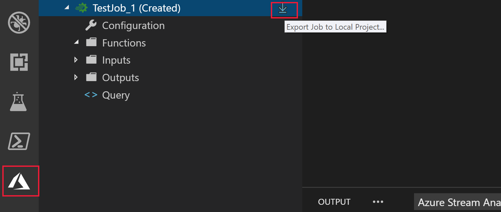

# Explore Azure Stream Analytics with Visual Studio Code (Preview)

The Azure Stream Analytics for Visual Studio Code extension gives developers a lightweight experience for managing their Stream Analytics jobs. With Azure Stream Analytics extension, you can:

- [Create](quick-create-vs-code.md), start, and stop jobs
- Export existing jobs to a local project
- Run queries locally
- Set up a CI/CD pipeline

## Export a job to a local project

To export a job to a local project, locate the job you wish to export in the **Stream Analytics Explorer** in Visual Studio code. Then select a folder for your project.



## Run queries locally

You can use the Azure Stream Analytics extension for Visual Studio Code to test your Stream Analytics jobs locally with sample data.

1. Once you've created your Stream Analytics job, use  **Ctrl+Shift+P** to open the command pallet. Then type **ASA: Add Input**.

    

2. Select **Local Input**.

    

3. Select **+ New Local Input**.

    

4. Enter the same input alias that you used in your query.

    

5. In the **LocalInput_DefaultLocalStream.json** file, enter the file path where your local data file is located.

    

6. Return to your query editor, and select **Run locally**.

    

## Setup a CI/CD pipeline

You can enable continuous integration and deployment for Azure Stream Analytics jobs using the **asa-cicd tools** NPM package. The NPM package provides the tools for the auto deployment of Stream Analytics Visual Studio Code projects. It can be used on Windows, macOS, and Linux without installing Visual Studio Code.

Once you have downloaded the package, use the following command to output the Azure Resource Manager templates. If the **outputPath** is not specified, the templates will be placed in the **Deploy** folder under the project's **bin** folder.

```powershell
asa-cicd build -scriptPath <scriptFullPath> -outputPath <outputPath>
```

## Next steps

* [Create an Azure Stream Analytics cloud job in Visual Studio Code (Preview)](quick-create-vs-code.md)