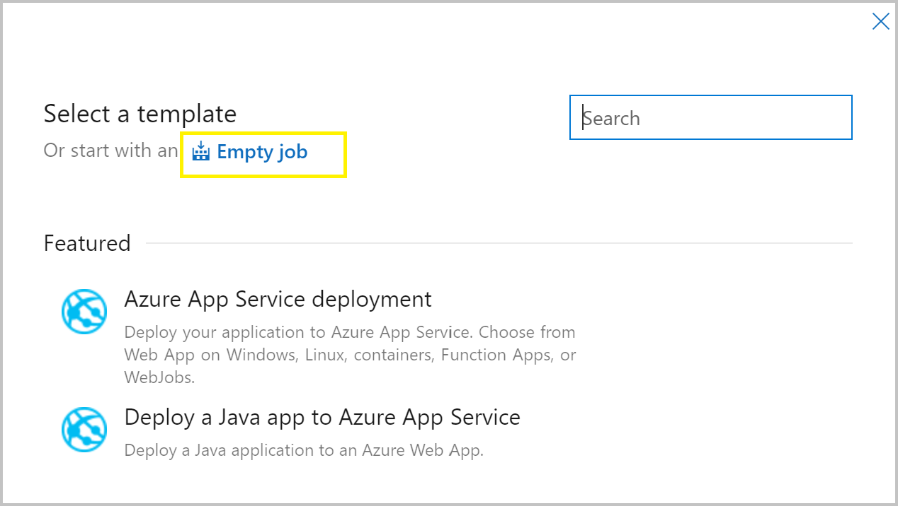
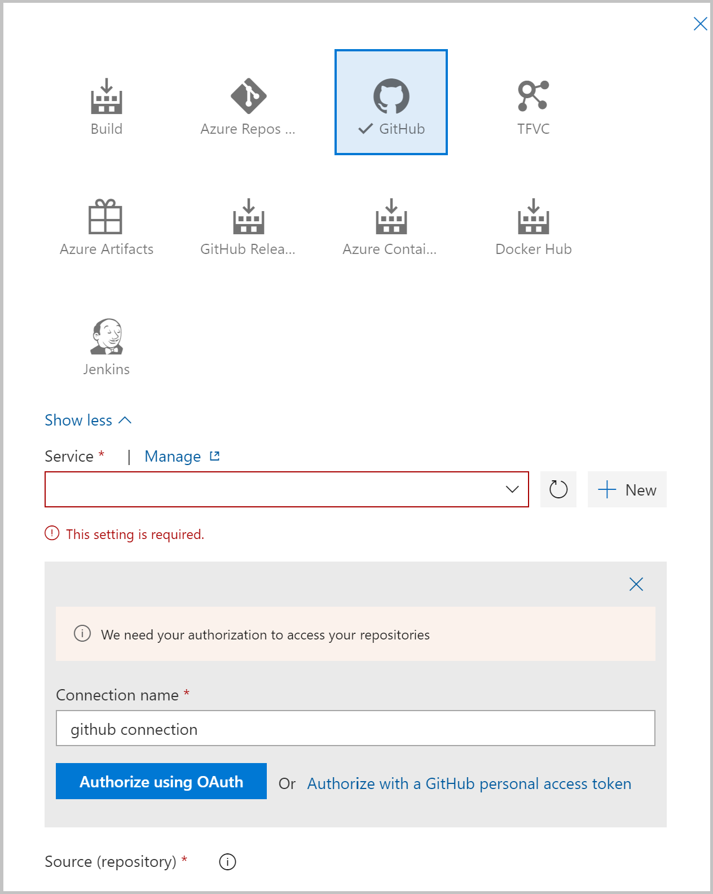
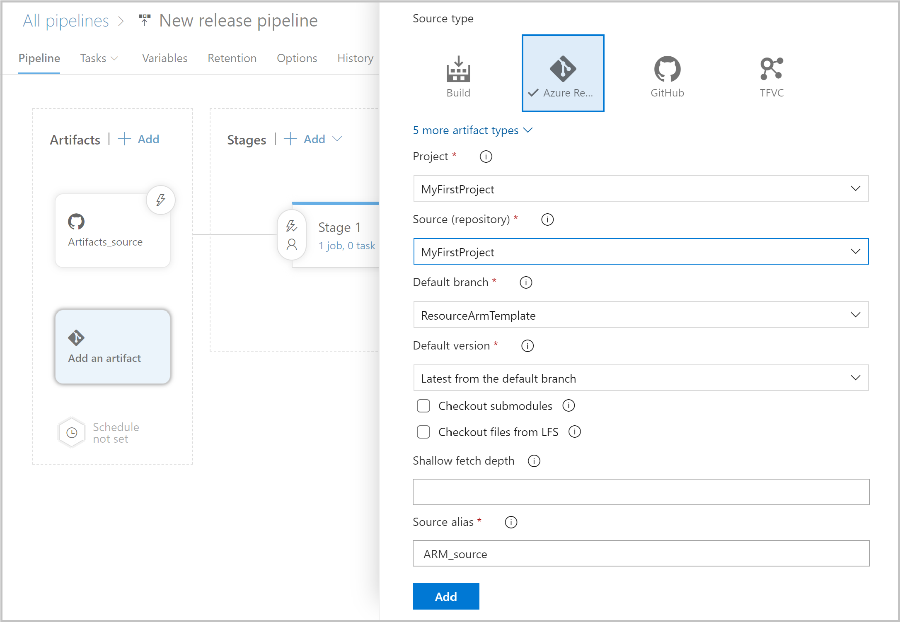
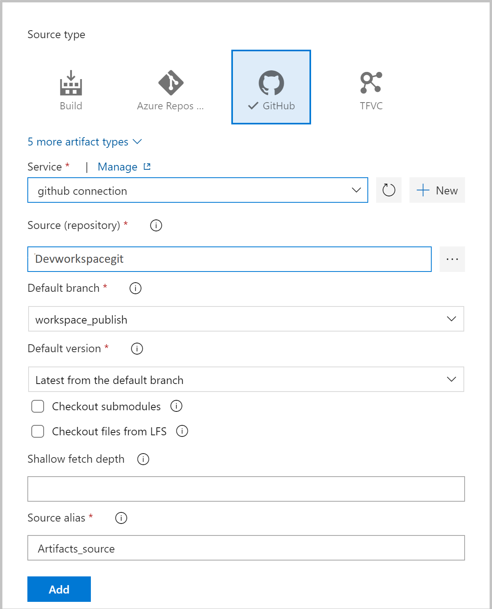
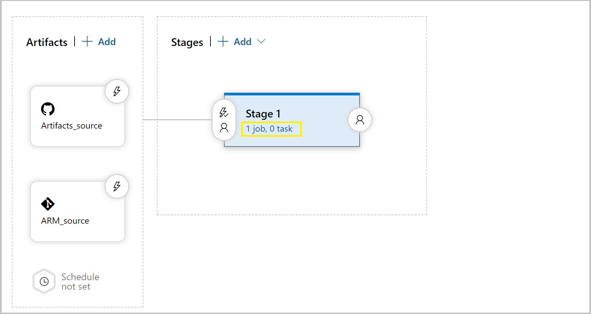
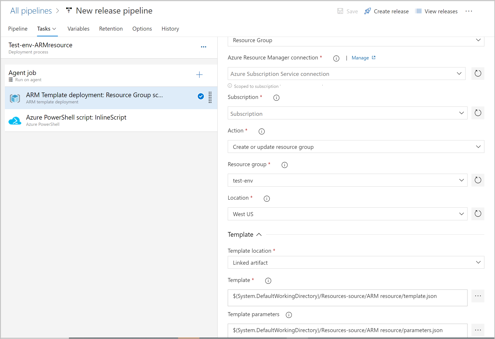
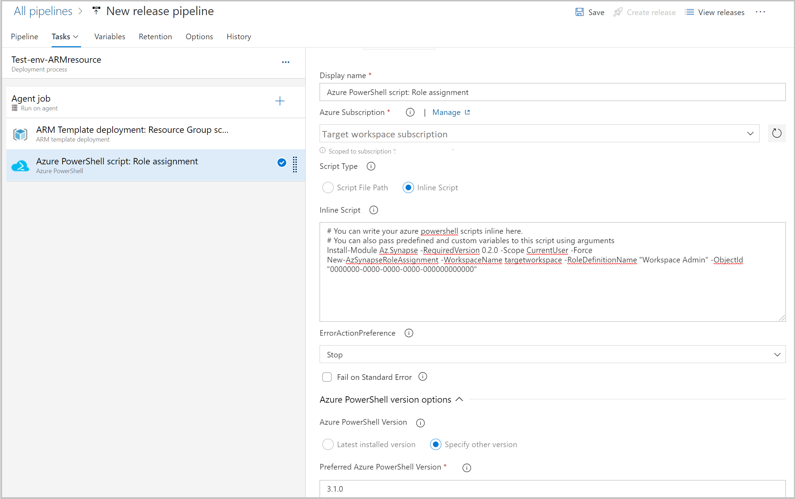

# Continuous integration and delivery for Azure Synapse workspace

## Overview

Continuous Integration (CI) is the process of automating the build and testing of code every time a team member commits changes to version control. Continuous Deployment (CD) is the process to build, test, configure, and deploy from multiple testing or staging environments to a production environment.

For Azure Synapse workspace, continuous integration and delivery (CI/CD) move all entities from one environment (development, test, production) to another. To promote your workspace to another workspace, there are two parts: use [Azure Resource Manager templates](https://docs.microsoft.com/azure/azure-resource-manager/templates/overview) to create or update workspace resources (pools and workspace); migrate artifacts (SQL scripts, notebook, Spark job definition, pipelines, datasets, data flows, and so on) with Synapse CI/CD tools in Azure DevOps. 

This article will outline using Azure release pipeline to automate the deployment of a Synapse workspace to multiple environments.

## Pre-requirements

-   The workspace used for development has been configured with a Git repository in Studio, see [Source control in Synapse Studio](source-control.md).
-   An Azure DevOps project has been prepared for running release pipeline.

## Set up a Release Pipelines

1.  In [Azure DevOps](https://dev.azure.com/), open the project created for the release.

1.  On the left side of the page, select **Pipelines**, and then select **Releases**.

    

1.  Select **New pipeline**, or, if you have existing pipelines, select **New** and then **New release pipeline**.

1.  Select the **Empty job** template.

    

1.  In the **Stage name** box, enter the name of your environment.

1.  Select **Add artifact**, and then select the git repository configured with your development Synapse Studio. Select the git repository you used for managing ARM template of pools and workspace. If you use GitHub as the source, you need to create a service connection for your GitHub account and pull repositories. For more information about [service connection](https://docs.microsoft.com/azure/devops/pipelines/library/service-endpoints) 

    

1.  Select the branch of ARM template for resources update. For the **Default version**, select **Latest from default branch**.

    

1.  Select the [publish branch](source-control.md#configure-publishing-settings) of the repository for the **Default branch**. By default, this publish branch is `workspace_publish`. For the **Default version**, select **Latest from default branch**.

    

## Set up a stage task for ARM resource create and update 

Add an Azure Resource Manager Deployment task to create or update resources, including workspace, and pools:

1. In the stage view, select **View stage tasks**.

    

1. Create a new task. Search for **ARM Template Deployment**, and then select **Add**.

1. In the Deployment task, select the subscription, resource group, and location for the target workspace. Provide credentials if necessary.

1. In the **Action** list, select **Create or update resource group**.

1. Select the ellipsis button (**…**) next to the **Template** box. Browse for the Azure Resource Manager template of your target workspace

1. Select **…** next to the **Template parameters** box to choose the parameters file.

1. Select **…** next to the **Override template parameters** box, and enter the desired parameter values for the target workspace. 

1. Select **Incremental** for the **Deployment mode**.
    
    

1. (Optional) Add **Azure PowerShell** for the grant and update workspace role assignment. If you use release pipeline to create a Synapse workspace, the pipeline’s service principal is required to be added as default workspace admin. You can run PowerShell to grant other accounts access to the workspace. 
    
    

 > [!WARNING]
> In Complete deployment mode, resources that exist in the resource group but aren't specified in the new Resource Manager template will be **deleted**. For more information, please refer to [Azure Resource Manager Deployment Modes](https://docs.microsoft.com/azure/azure-resource-manager/templates/deployment-modes)

## Set up a stage task for artifacts deployment 

Use [Synapse workspaces Build & Release](https://marketplace.visualstudio.com/items?itemName=PraveenMathamsetty.synapsecicd-deploy) task to deploy other items in Synapse workspace, like dataset, SQL script, notebook, spark job definition, dataflow, pipeline,linked service, credentials and IR (Integration Runtime).  

1. Make sure Azure DevOps pipeline’s service principle has been granted the permission of subscription and also assigned as workspace admin for target workspace. 

1. Create a new task. Search for **Synapse workspaces Build & Release**, and then select **Add**.

1.  In the task, provide related git repository information of **workspace_publish** , and select resource group, region, name, and Cloud environment for the target workspace. Provide parameters and values if you need.

    

> [!IMPORTANT]
> In CI/CD scenarios, the integration runtime (IR) type in different environments must be the same. For example, if you have a self-hosted IR in the development environment, the same IR must also be of type self-hosted in other environments, such as test and production. Similarly, if you're sharing integration runtimes across multiple stages, you have to configure the integration runtimes as linked self-hosted in all environments, such as development, test, and production.

## Create release for deployment 

After saving all changes, you can select **Create release** to manually create a release. To automate the creation of releases, see [Azure DevOps release triggers](https://docs.microsoft.com/azure/devops/pipelines/release/triggers)

   

## Best practices for CI/CD

If you're using Git integration with your Synapse workspace and have a CI/CD pipeline that moves your changes from development into test and then to production, we recommend these best practices:

-   **Git integration**. Configure only your development Synapse workspace with Git integration. Changes to test and production workspaces are deployed via CI/CD and don't need Git integration.
-   **Prepare pools before artifacts migration**. If you attach pools to your SQL script or notebook in the development workspace, the same name of pools in different environments are expected. 
-   **Others**. See [Other best practices](/azure/data-factory/continuous-integration-deployment#best-practices-for-cicd)

## Unsupported features

- Synapse Studio doesn't allow cherry-picking of commits or selective publishing of resources. 
- Synapse Studio doesn't support customize commit message.
- By design, delete action will be committed to git directly

