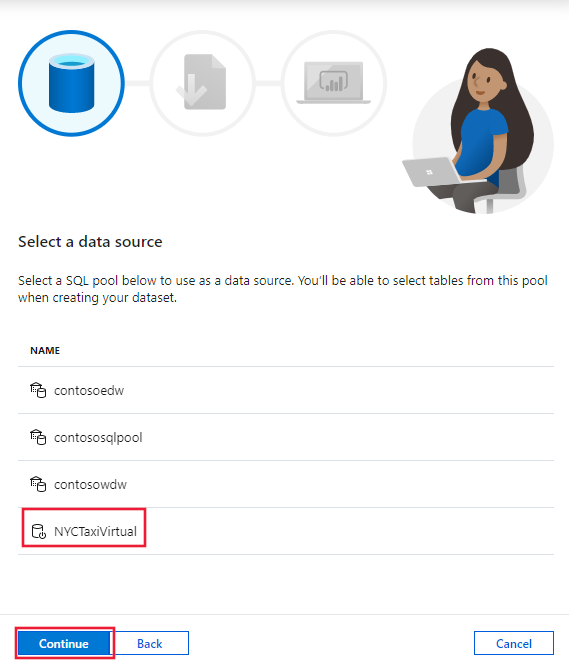
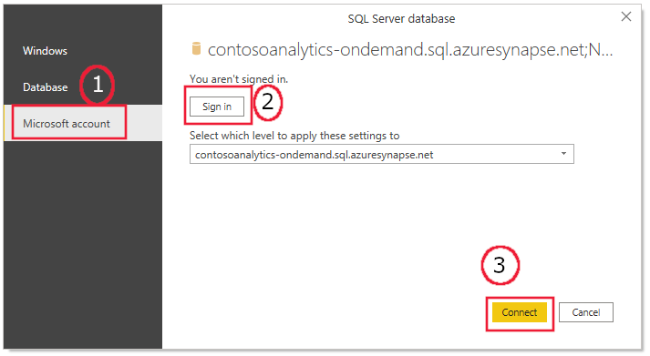
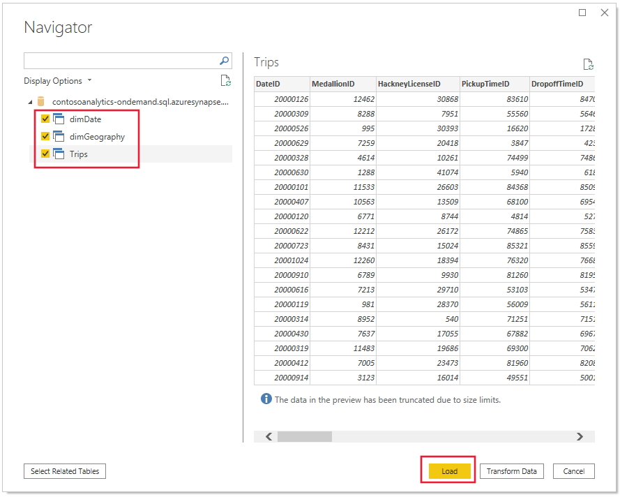
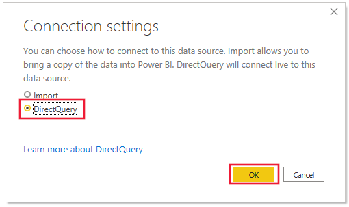
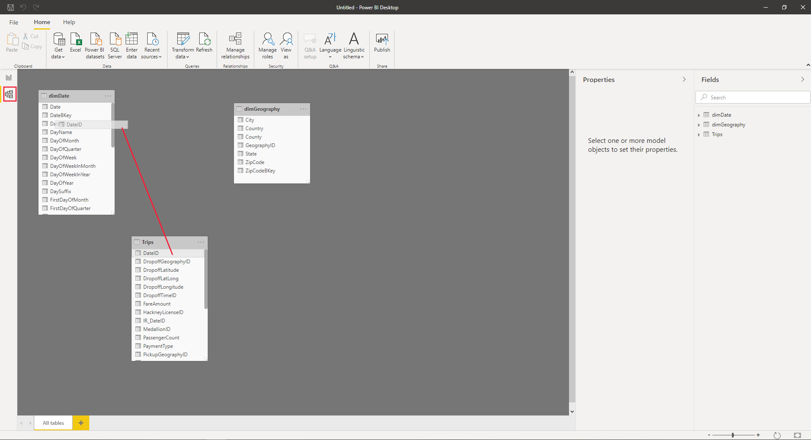
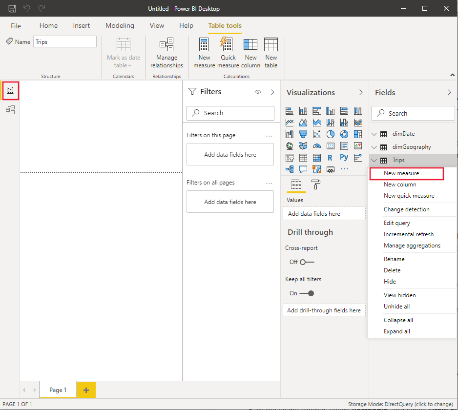
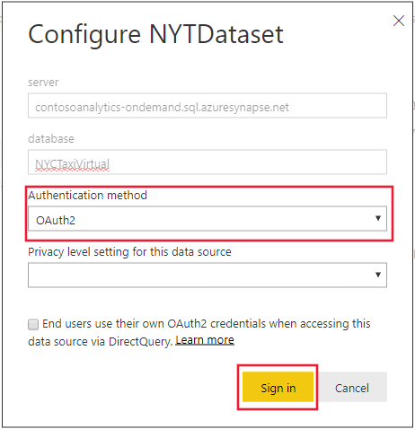
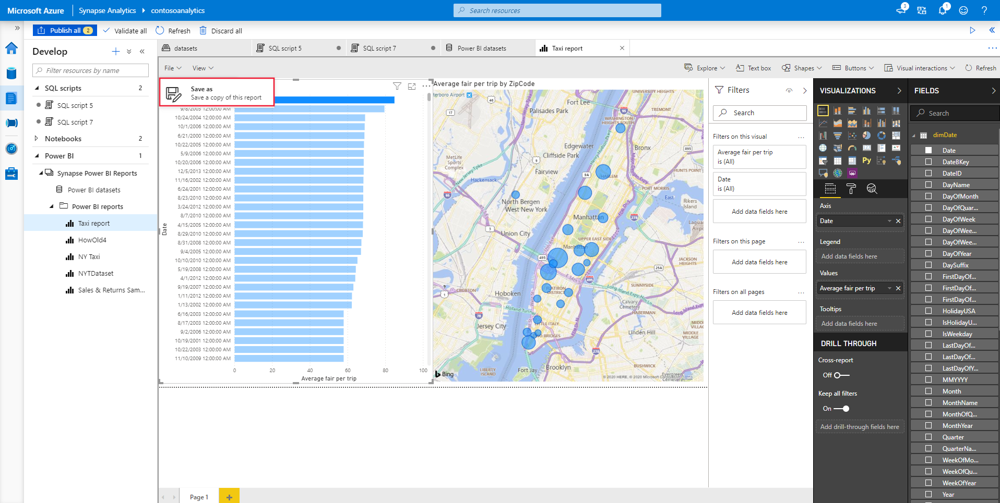

# Getting Started with Azure Synapse Analytics
This tutorial guides leads developers through all the basic steps to needed to use Azure Synapse Analytics.

## Create a Synapse workspace
First, you need a Synapse workspace. Follow the steps in [Quickstart: Creating a new Synapse workspace](quickstart-create-workspace.md) to create a workspace.

## Launch Synapse Studio
Once your workspace is created, you can use Synapse Studio with it one of two ways:
* Open your Synapse workspace in the [Azure portal](https://portal.azure.com) and at the top of the Overview section click
* Go to https://web.azuresynapse.net and login to your workspace

## Create a SQL pool

* In Synapse Studio, on the left side click **Manage > SQL pools**
* Click **+New**
* For **SQL pool name** enter `SQLDB1`
* For **Performance level** use `DW100C`
* Click **Review+create**
* Click **Create**
* Your pool will be ready in a few minutes

## Create a Spark pool

* In Synapse Studio, on the left side click **Manage > Apache Sparke pools**
* Click **+New**
* For **Apache Spark pool name** enter `Spark1`
* For **Node size** select `Small`
* For **Number of nodes** set the minimum to 3 and the maximum to 3
* Click **Review+create**
* Click **Create**
* Your Spark pool will be ready in a few seconds

## Load the NYX Taxi Sample data into your SQL pool

* In Synapse Studio, it the topmost blue meny, click on the **?** icon.
* Select **Getting started > Getting started hub**
* In the card labelled **Query sample data** select the SQL pool `SQLDB1`
* Click **Query data**
* You will see a notification saying "Loading sample data". 
* NYXC taxi data tables are being loaded into SQLDB1 and this takes only a few minutes. Wait until it finishes.

## Explore the NYC taxi data in the SQL Pool

* In Synapse Studio, navigate to the **Data** hub
* Navigate to **SQLDB1 > Tables > dbo.Trip**
* Right-click on the **dbo.Trip** table and select **New SQL Script > Select TOP 100 Rows**
* A new SQL script will be created and automaticall run
* Notice that at the top of the SQL script **Connect to** is automatically set to the SQL pool called SQLDB1
* Replace the text of the SQL script with this code and run it.
    ```
    SELECT PassengerCount,
          SUM(TripDistanceMiles) as SumTripDistance,
          AVG(TripDistanceMiles) as AvgTripDistance
    FROM  dbo.Trip
    WHERE TripDistanceMiles > 0 AND PassengerCount > 0
    GROUP BY PassengerCount
    ORDER BY PassengerCount
    ```
* This query shows how the total trip distances and average trip distance relate to the number of passengers
* In the SQL scripts, result window select **Chart** to see a visualization of the results as a line chart

## Load the NYC data into a Spark Database

* In Synapse Studio, navigate to the **Develop hub"
* Click **+** and select **Notebook**
* At the top of the notebook, set the **Attach to** value to `Spark1`
* At the top of the notebook, set the **Language** to `Spark (Scala)`
* Click **Add code** to a notebook code cell and paste the text below:
    ```
    spark.sql("CREATE DATABASE nyctaxi")
    val df = spark.read.sqlanalytics("SQLDB1.dbo.Trip") 
    df.write.saveAsTable("nyctaxi.trip")
    ```
 * Navigate to the Data hub, right-click on Databases and select **Refresh**
 * Now you should see a Spark DB called nyxtaxi and inside that DB a table called trip
 
 ## Analyze the NYC Taxi data using Spark and notebooks
 * Return to your notebook
 * Create a new code cell and run this text
   ```
   %%pyspark
   df = spark.sql("SELECT * FROM nyctaxi.trip") 
   df.show(10)
   ```
 * To show this in a nicer format run this code
   ```
   %%pyspark
   df = spark.sql("SELECT * FROM nyctaxi.trip") 
   display(df)
   ```
 * Run this code to perform the same analysis we did earlier with the SQL pool
   ```
   %%pyspark
   df = spark.sql("""
      SELECT PassengerCount,
          SUM(TripDistanceMiles) as SumTripDistance,
          AVG(TripDistanceMiles) as AvgTripDistance
      FROM nyctaxi.trip
      WHERE TripDistanceMiles > 0 AND PassengerCount > 0
      GROUP BY PassengerCount
      ORDER BY PassengerCount
    """) 
    display(df)
    ```
 * In the cell results, click on **Chart** to see the data visualized
 
## Visualize data with Spark and notebooks

With spark notebooks you can control exactly how render charts. The following
code shows a simple example using the popular libraries matplotlib and seaborn.

    ```
    %%pyspark
    import matplotlib.pyplot as plt
    import seaborn as sns
    import pandas as pd

    sns.set(style = "whitegrid")

    df = spark.sql("""
        SELECT PassengerCount,
              SUM(TripDistanceMiles) as SumTripDistance,
              AVG(TripDistanceMiles) as AvgTripDistance
        FROM nyctaxi.trip
        WHERE TripDistanceMiles > 0 AND PassengerCount > 0
        GROUP BY PassengerCount
        ORDER BY PassengerCount
        """) 
    df = df.toPandas()
    sns.barplot(x="PassengerCount", y="AvgTripDistance", data = df)
    plt.show()
    ```
 
## Analytze NYX taxi data in Spark databases using SQL-on demand 

* Tables in Spark databases are automatically visible and queryable by SQL on-demand
* In Synapse Studio navigate to the Develop hub and create a new SQL script
* Set **Connect to** to **SQL on-demand** 
* Paste the following text into the script
    ```
    SELECT TOP 10 *
    FROM nyctaxi.dbo.trip
    ```
* Click **Run**
* NOTE: THe first time you run this it will take about 10 seconds for SQL on-demand to gather SQL resources needed to run
  your queries. Every subsequent query will not require this time.
  
  

## Orchestrate using a pipeline

After ingesting, exploring, analyzing, and serving your data, you can schedule these activities to automatically run using pipeline orchestration.

   1. Go to **Develop** and find the Spark notebook you used to analyze your data. 
   2. Open your **Spark notebook**.
   3. Click the **Add to pipeline** button at the upper right of the view.   
   4. Select **Existing pipeline**. All of your workspace's pipelines will be listed.
   5. Select the pipeline you created during the **data ingestion step**.   
   6. Click **Add** to open an authoring view of that pipeline, with the Spark notebook activity added.
   7. Click and drag the **green box** next to the **Copy activity**, and connect it to the **new Spark notebook activity**.
   8. Publish your modified pipeline by clicking **Publish all** in the upper left of the view.   
   9. To manually trigger the pipeline, click **Add trigger**, then **Trigger now**.
   
         Your pipeline is now running the data ingestion step, followed by the Spark notebook analysis step.
         
   10. Click **Add trigger**, **New/Edit**.   
   11. Click **Choose trigger...**, then **New**.
   12. For **Recurrence**, enter **Every 1 hour**. For **End on**, enter a date-time soon in the future to make sure this tutorial pipeline doesn't continue running.
   
   13. Click **OK**, then **OK** to go back to the pipeline authoring view.
   
   14. Publish your new trigger by clicking **Publish all** in the upper left of the view.
   
          Your pipeline will now run every week until your chosen end date.

## Monitor

After setting up a pipeline that lets you ingest and analyze your data automatically, you can monitor the progress and history of your pipeline runs.

   1. Click **Monitor** and open **Pipeline runs**.
   
   2. You should see your tutorial pipeline's runs listed. If you see other more recent pipeline runs instead, you can **filter** the list by pipeline name to just see runs of your pipeline.
   
   3. Open **the most recent run of your pipeline** to see the details of when each activity ran within your pipeline. The **pipeline run details view** will open.
   
       - **New SQL script - Select TOP 100**: it lets you use SQL on-demand to explore the file without defining schema or table (it is in Parquet)
       - **New notebook**: it will open a notebook in PySpark to load that file into a dataframe


### Visualize with Power BI
 Your data can now be easily analyzed and visualized in Power BI. Synapse offers a unique integration which allows you to link a Power BI workspace to you Synapse workspace. Before going forward, follow the steps in this [quickstart](quickstart-power-bi.md) to link your Power BI workspace.
On the **Develop** hub, expand your linked workspace under **Power BI** and click on **Power BI Datasets**.


Any existing datasets from you linked Power BI workspace will be displayed here. You can create new reports in Synapse Studio using these Power BI datasets. Let’s create a new Power BI dataset for the database which we created in the last section. Click **+ New Power BI dataset**. 


While Power BI reports can be created in Synapse Studio, Power BI datasets must be created in the Power BI Desktop. Install the Power BI Desktop if you have not already and then click **Start** once the installation is complete.


Select **NYCTaxiVirtual** and click continue.



Click **Download** to download the Power BI dataset file (pbids). Open the file when the download is complete to launch the Power BI Desktop. Once the Power BI Desktop has been launched, sign into Synapse by using your Azure Active Directory user account. Then click **Connect**.



Select all the views to include in your Power BI dataset and click **Load**.



Select **DirectQuery** and click **OK**.



Click on the **Model** view and create relationships between the three tables by dragging **DateID** from **Trips** and dropping it on **DateID** in **dimDate**. 



Click **Assume referential integrity** and click **OK**.


Create another relationship by dragging **PickupGepgraphyID** from **Trips** and dropping it on **GeographyID** on **dimGeography**. Select **Assume referential integrity** like in the last step. Your model diagram should now look something like below.


Go back to the **Report** view and right-click on the **Trips** table and click on **New Measure**.



Enter the following DAX formula into the formula bar and press enter.
```dax
Average fair per trip = DIVIDE(
                                SUM(Trips[TotalAmount])
                                ,COUNTROWS(Trips)
                            )
```


Save the Power BI File and publish it to the Power BI workspace that you linked to Synapse.


After publishing, go to the **Settings** page for your Power BI dataset inside of your Power BI workspace.


Under **Data source credentials** hit **Edit credentials**.


Change the **Authentication method** to **OAuth2** and click **Sign in**. Sign in with your Azure Active Directory Account.



After publishing, switch back to Synapse Studio and click **Close and refresh**.


Click **New Power BI report** next to the name of the Power BI dataset that you just published. Now you can build out your Power BI report direction in Synapse Studio. Don’t forget to save the report when you are finished creating it.




## Orchestrate using a pipeline

After ingesting, exploring, analyzing, and serving your data, you can schedule these activities to automatically run using pipeline orchestration.

   1. Go to **Develop** and find the Spark notebook you used to analyze your data.
   2. Open your **Spark notebook**.
   3. Click the **Add to pipeline** button at the upper right of the view.
   4. Select **Existing pipeline**. All of your workspace's pipelines will be listed.
   5. Select the pipeline you created during the **data ingestion step**.
   6. Click **Add** to open an authoring view of that pipeline, with the Spark notebook activity added.
   7. Click and drag the **green box** next to the **Copy activity**, and connect it to the **new Spark notebook activity**.
   8. Publish your modified pipeline by clicking **Publish all** in the upper left of the view.
   9. To manually trigger the pipeline, click **Add trigger**, then **Trigger now**.
         Your pipeline is now running the data ingestion step, followed by the Spark notebook analysis step.
   10. Click **Add trigger**, **New/Edit**.
   11. Click **Choose trigger...**, then **New**.
   12. For **Recurrence**, enter **Every 1 hour**. For **End on**, enter a date-time soon in the future to make sure this tutorial pipeline doesn't continue running.
   13. Click **OK**, then **OK** to go back to the pipeline authoring view.
   14. Publish your new trigger by clicking **Publish all** in the upper left of the view.
          Your pipeline will now run every week until your chosen end date.

## Monitor

After setting up a pipeline that lets you ingest and analyze your data automatically, you can monitor the progress and history of your pipeline runs.

   1. Click **Monitor** and open **Pipeline runs**.
   2. You should see your tutorial pipeline's runs listed. If you see other more recent pipeline runs instead, you can **filter** the list by pipeline name to just see runs of your pipeline.
   3. Open **the most recent run of your pipeline** to see the details of when each activity ran within your pipeline. The **pipeline run details view** will open.
   4. To see details about each activity run in your pipeline, examine the **activity runs**, which are listed at the bottom of the view.

