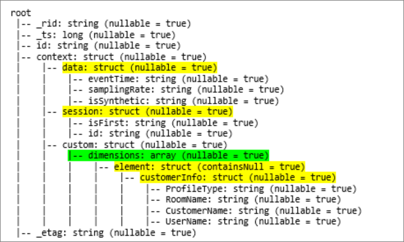
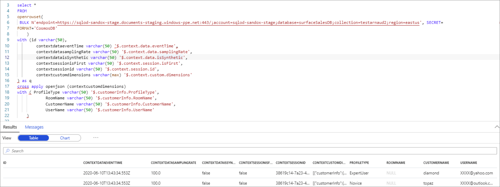

# Analyze complex data types in Synapse

This article is relevant for **Parquet** files and containers in **Azure Synapse Link for Azure Cosmos DB**. It explains how users can use Spark or SQL to read or transform data with complex schema such as arrays or nested structures. The example below is done with a single document but can easily scale to billions documents with Spark or SQL. The code below uses PySpark (Python).

## Use Case

With modern data types, complex data types are often common to handle and represent a challenge for data engineers. Analyzing nested schema and arrays present some challenges:
* Complex to write SQL queries
* Difficult to rename/cast datatype of nested columns
* Performance issues on deeply nested objects

Data Engineers need to understand how to efficiently process those data types and make them easily accessible by everyone.

In the example below, Synapse Spark will be used to read and transform objects through data frames into a flat structure. Synapse SQL serverless is used to query directly such objects and return those results as a regular table.

## What are arrays and nested structures?

The following object comes from App Insight. In this object, there are nested structures but also arrays that contain nested structures too.

```json
{
    "id": "66532691-ab20-11ea-8b1d-936b3ec64e54",
    "context": {
        "data": {
            "eventTime": "2020-06-10T13:43:34.553Z",
            "samplingRate": "100.0",
            "isSynthetic": "false"
        },
        "session": {
            "isFirst": "false",
            "id": "38619c14-7a23-4687-8268-95862c5326b1"
        },
        "custom": {
            "dimensions": [
                {
                    "customerInfo": {
                        "ProfileType": "ExpertUser",
                        "RoomName": "",
                        "CustomerName": "diamond",
                        "UserName": "XXXX@yahoo.com"
                    }
                },
                {
                    "customerInfo": {
                        "ProfileType": "Novice",
                        "RoomName": "",
                        "CustomerName": "topaz",
                        "UserName": "XXXX@outlook.com"
                    }
                }
            ]
        }
    }
}
```

### Schema example of arrays and nested structures
When printing the schema of the data frame of that object (called **df**) with the command **df.printschema**, we see the following representation:

* the yellow color represents nested structure
* the green color represents an array with two elements



_rid, _ts and _etag have been added in the system as I added them into Azure Cosmos DB.

Displaying the data frame with the command display(df.limit(10)) will show the following result:


The data frame above counts for 5 columns and 1 row only. After transformation, the curated data frame will have 13 columns and 2 rows in a tabular format.

## Flatten nested structures and explode arrays with Apache Spark

With Synapse Spark, transforming nested structures into columns and array elements into multiple rows, is easy. The steps below can be used by everyone for their own implementation.


**Step 1**: We define a function to flatten nested schema. This function can be used without change. Create a cell in a Pyspark notebook with that function:

```python
from pyspark.sql.functions import col

def flatten_df(nested_df):
    stack = [((), nested_df)]
    columns = []

    while len(stack) > 0:
        parents, df = stack.pop()

        flat_cols = [
            col(".".join(parents + (c[0],))).alias("_".join(parents + (c[0],)))
            for c in df.dtypes
            if c[1][:6] != "struct"
        ]

        nested_cols = [
            c[0]
            for c in df.dtypes
            if c[1][:6] == "struct"
        ]

        columns.extend(flat_cols)

        for nested_col in nested_cols:
            projected_df = df.select(nested_col + ".*")
            stack.append((parents + (nested_col,), projected_df))

    return nested_df.select(columns)
```

**Step 2**: use the function to flatten the nested schema of the data frame **df** into a new data frame **df_flat**:

```python
from pyspark.sql.types import StringType, StructField, StructType
df_flat = flatten_df(df)
display(df_flat.limit(10))
```

The display function should return the following result: 10 columns and 1 row. The array and its nested elements are still there.


**Step 3**: we now transform the array **context_custom_dimensions** in the data frame **df_flat** into a new dataframe **df_flat_explode**. In the code below, we also define which column we select:

```python
from pyspark.sql.functions import explode
from pyspark.sql.functions import flatten
from pyspark.sql.functions import arrays_zip
df_flat_explode = df_flat.select("_rid","_ts","id","_etag",explode(df_flat.context_custom_dimensions),"context_session_isFirst","context_session_id","context_data_eventTime","context_data_samplingRate","context_data_isSynthetic")\
.select("_rid","_ts","id","_etag","col.*","context_session_isFirst","context_session_id","context_data_eventTime","context_data_samplingRate","context_data_isSynthetic")
display(df_flat_explode.limit(10))

```

The display function should return the following result: 10 columns and 2 rows. The next step is to flatten nested schemas with the function defined in step 1.


**Step 4**: use the function to flatten the nested schema of the data frame **df_flat_explode** into a new data frame **df_flat_explode_flat**:
```python
df_flat_explode_flat = flatten_df(df_flat_explode)
display(df_flat_explode_flat.limit(10))
```

There are now 13 columns and 2 rows:


The function printSchema of the data frame df_flat_explode_flat returns the following result:


## Read arrays and nested structures directly with SQL serverless

Querying, creating views and tables over such objects is possible with SQL serverless.

First of all, depending how data has been stored, users should use the following taxonomy. Everything UPPER CASE is specific to your use case:

| BULK              | FORMAT |
| -------------------- | --- |
| 'https://ACCOUNTNAME.dfs.core.windows.net/FILESYSTEM/PATH/FINENAME.parquet' |'Parquet' (ADLSg2)|
| N'endpoint=https://ACCOUNTNAME.documents-staging.windows-ppe.net:443/;account= ACCOUNTNAME;database=DATABASENAME;collection=COLLECTIONNAME;region=REGIONTOQUERY, SECRET='YOURSECRET' |'CosmosDB' (Synapse Link)|


**SQL serverless** will support Linked Service for Azure Synapse Link for Azure Cosmos DB and AAD passthrough. The capability is currently under gated preview for Synapse Link.

Replace below:
* 'YOUR BULK ABOVE' by the connection string of the data source you connect to
* 'YOUR TYPE ABOVE' by the format you use to connect to the source

```sql
select *
FROM
openrowset(
BULK 'YOUR BULK ABOVE',
        	FORMAT='YOUR TYPE ABOVE'
)
with (id varchar(50),
        contextdataeventTime varchar(50) '$.context.data.eventTime',
        contextdatasamplingRate varchar(50) '$.context.data.samplingRate',
        contextdataisSynthetic varchar(50) '$.context.data.isSynthetic',
        contextsessionisFirst varchar(50) '$.context.session.isFirst',
        contextsessionid varchar(50) '$.context.session.id',
        contextcustomdimensions varchar(max) '$.context.custom.dimensions'
) as q 
cross apply openjson (contextcustomdimensions) 
with ( ProfileType varchar(50) '$.customerInfo.ProfileType',
            RoomName varchar(50) '$.customerInfo.RoomName',
            CustomerName varchar(50) '$.customerInfo.CustomerName',
            UserName varchar(50) '$.customerInfo.UserName'
    )
```

There are two different types of operations done:
* The line of code below will define the column called contextdataeventTime that refers to the nested element: Context.Data.eventTime
```sql
contextdataeventTime varchar(50) '$.context.data.eventTime'
```

This line will define the column called contextdataeventTime that refers to the nest element: Context>Data>eventTime

* **cross apply** is used to create new rows for each element under the array and then with defines each nested object similar to the first bullet point: 
```sql
cross apply openjson (contextcustomdimensions) 
with ( ProfileType varchar(50) '$.customerInfo.ProfileType', 
```

If the array had 5 elements with 4 nested structures, SQL serverless would return 5 rows and 4 columns.

SQL serverless will directly query in-place, flatten the object in 2 rows and, display all nested elements into columns:



## Next steps

* [Learn how to query Azure Synapse Link for Azure Cosmos DB with Spark](./synapse-link/how-to-query-analytical-store-spark.md)
* [Query parquet nested types](./sql/query-parquet-nested-types.md) 