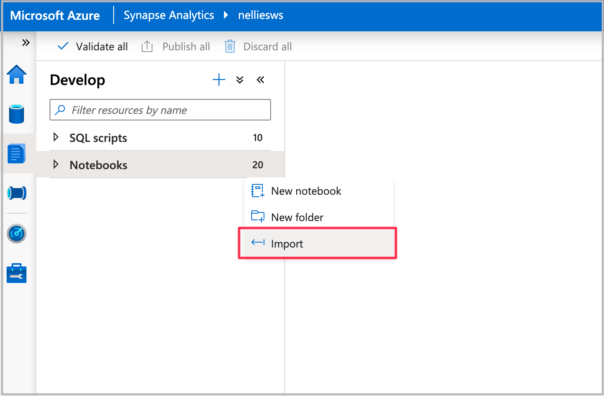
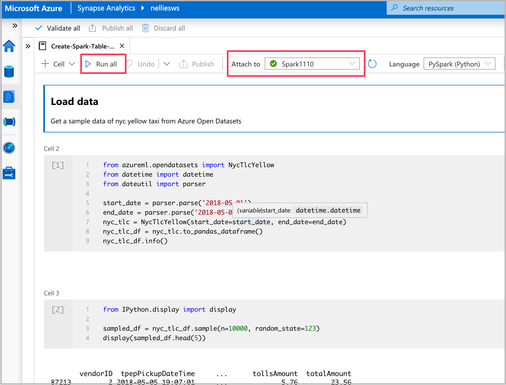
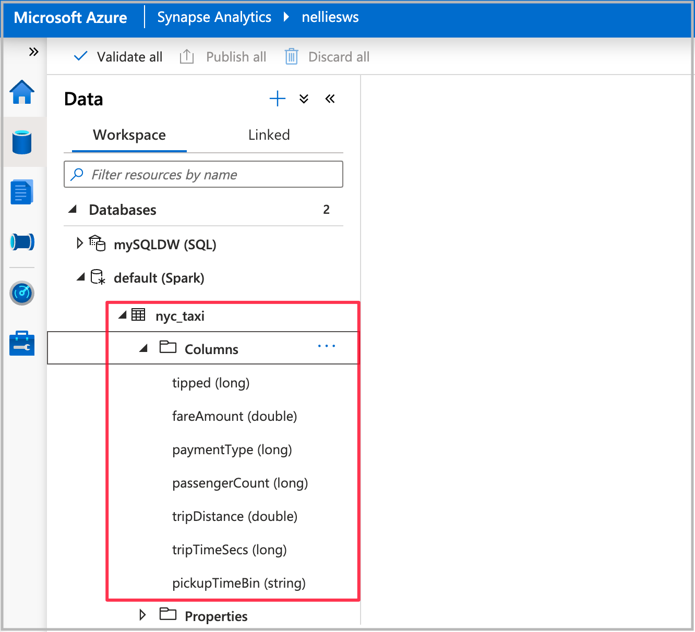
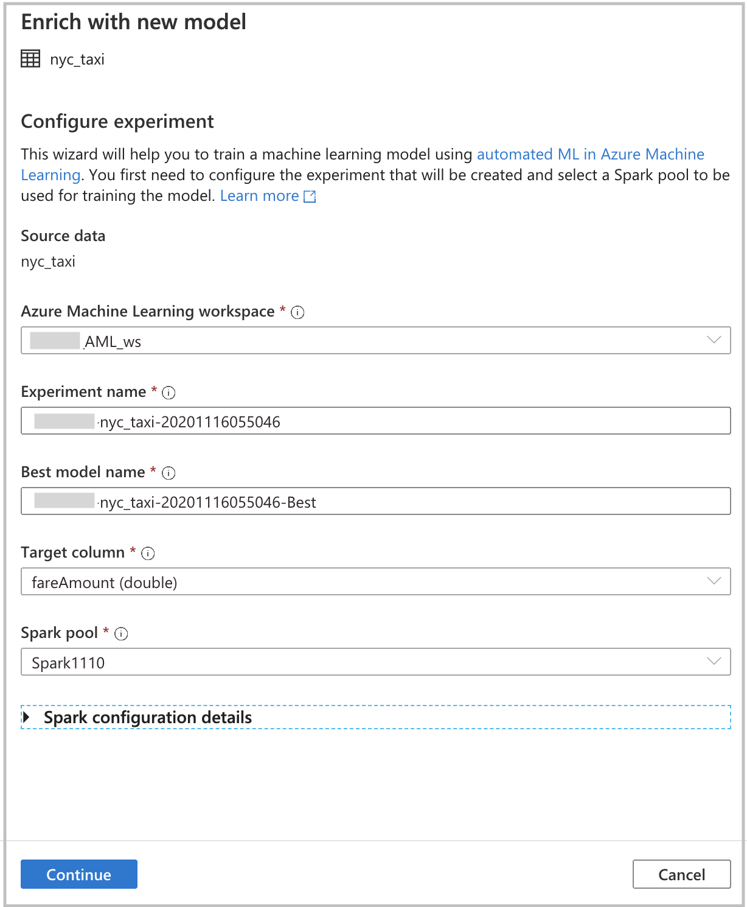
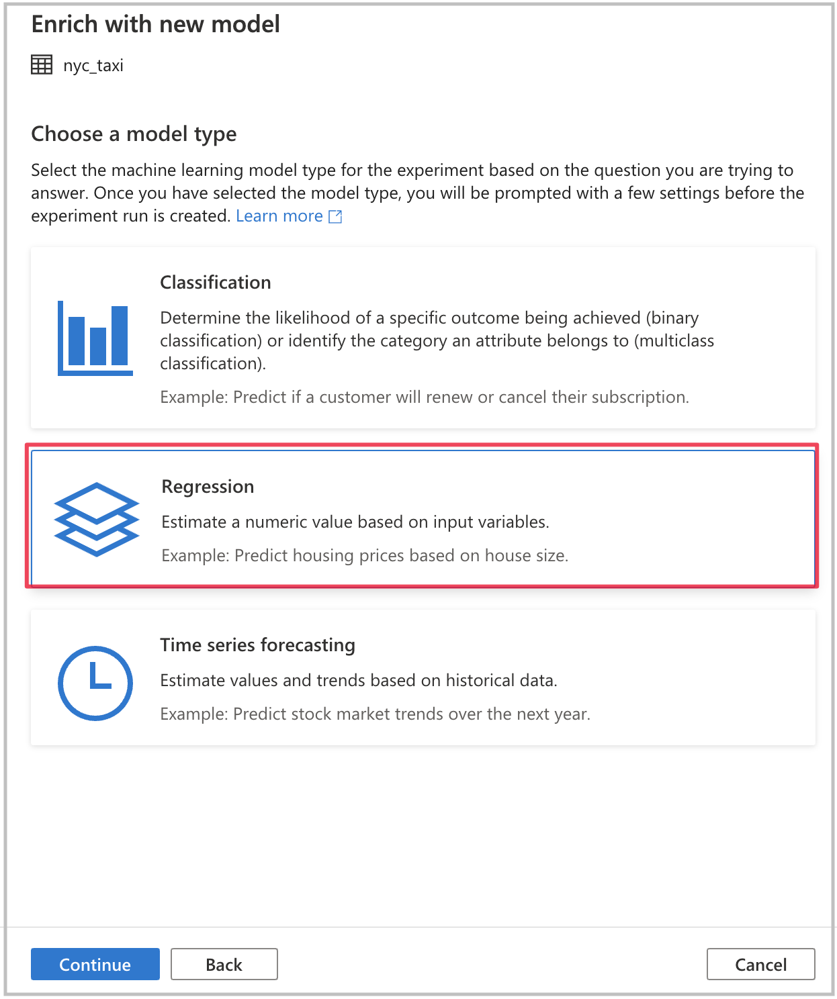
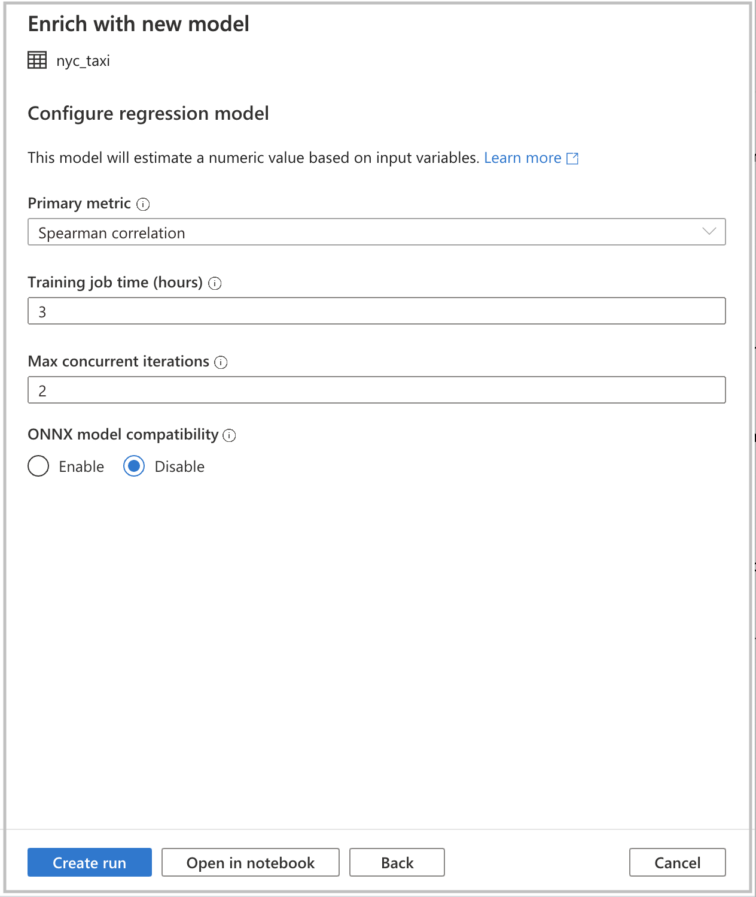
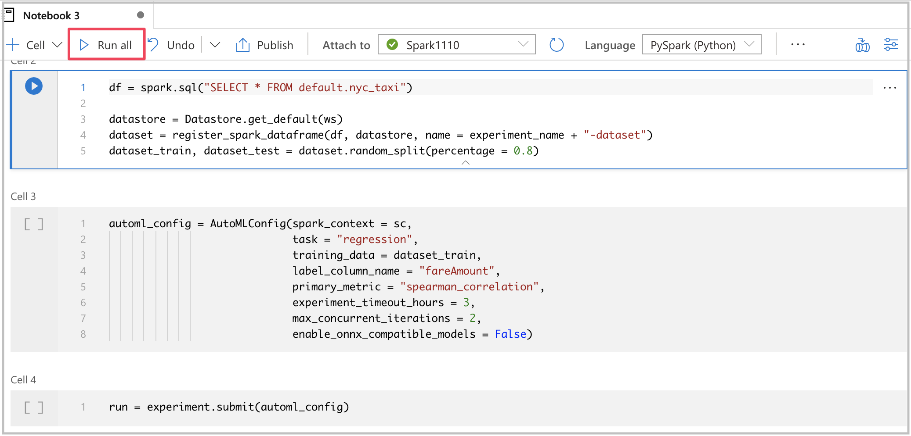
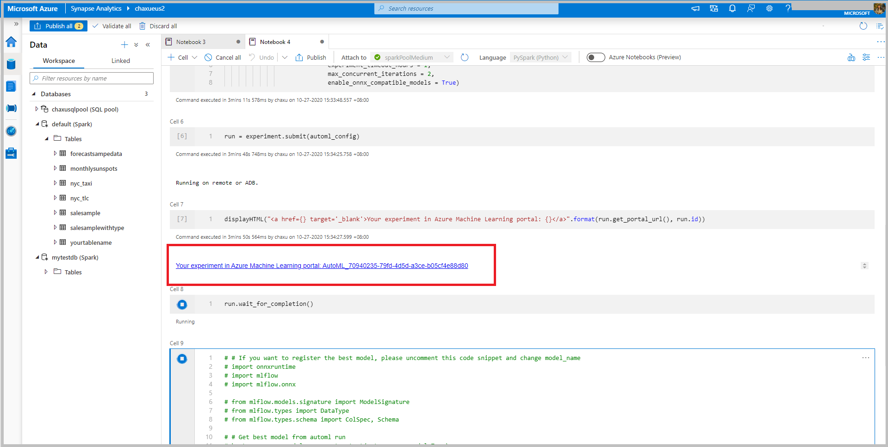

# Tutorial: Code free machine learning model training in Azure Synapse with AutoML

Learn how to easily enrich your data in Spark tables with new machine learning models that you train using [AutoML in Azure Machine Learning](https://docs.microsoft.com/azure/machine-learning/concept-automated-ml).  A user in Synapse can simply select a Spark table in the Azure Synapse workspace to use as a training dataset for building machine learning models in a code free experience.

In this tutorial, you'll learn how to:

> [!div class="checklist"]
> - Train machine learning models using a code free experience in Azure Synapse studio that uses automated ML in Azure ML. The type of model you train depends on the problem you are trying to solve.

If you don't have an Azure subscription, [create a free account before you begin](https://azure.microsoft.com/free/).

## Prerequisites

- [Synapse Analytics workspace](../get-started-create-workspace.md) with an ADLS Gen2 storage account configured as the default storage. You need to be the **Storage Blob Data Contributor** of the ADLS Gen2 filesystem that you work with.
- Spark pool in your Azure Synapse Analytics workspace. For details, see [Create a Spark pool in Azure Synapse](../quickstart-create-sql-pool-studio.md).
- Azure Machine Learning linked service in your Azure Synapse Analytics workspace. For details, see [Create an Azure Machine Learning linked service in Azure Synapse](quickstart-integrate-azure-machine-learning.md).

## Sign in to the Azure portal

Sign in to the [Azure portal](https://portal.azure.com/)

## Create a Spark table for training dataset

You will need a Spark table for this tutorial. The following notebook will create a Spark table.

1. Download the notebook [Create-Spark-Table-NYCTaxi- Data.ipynb](https://go.microsoft.com/fwlink/?linkid=2149229)

1. Import the notebook to Azure Synapse Studio.

1. Select the Spark pool you want to use and click `Run all`. Run this notebook will get New York taxi data from open dataset and save to your default Spark database.

1. After the notebook run has completed, a new Spark table will be created under the default Spark database. Go to the Data Hub and find the table named with `nyc_taxi`.

## Launch AutoML wizard to train a model

Right-click on the Spark table created in the previous step. Select "Machine Learning-> Enrich with new model" to open the wizard.

A configuration panel will appear and you will be asked to provide configuration details for creating an AutoML experiment run in Azure Machine Learning. This run will train multiple models and the best model from a successful run will be registered in the Azure ML model registry:

- **Azure ML workspace**: An Azure ML workspace is required for creation of the AutoML experiment run. You also need to link your Azure Synapse workspace with the Azure ML workspace using a [linked service](quickstart-integrate-azure-machine-learning.md). Once you have all the pre=requisites, you can specify the Azure ML workspace you want to use for this AutoML run.

- **Experiment name**: Specify the experiment name. When you submit an AutoML run, you provide an experiment name. Information for the run is stored under that experiment in the Azure ML workspace. This experience will create a new experiment by default and is generating a proposed name, but you can also provide a name of an existing experiment.

- **Best model**: Specify the name of the best model from the AutoML run. The best model will be given this name and saved in the Azure ML model registry automatically after this run. An AutoML run will create many machine learning models. Based on the primary metric that you will select in a later step, those models can be compared and the best model can be selected.

- **Target column**: This is what the model is trained to predict. Choose the column that you want to predict.

- **Spark pool**: The Spark pool you want to use for the AutoML experiment run. The computations will be executed on the pool you specify.

- **Spark configuration details**: In addition to the Spark pool, you also have the option to provide session configuration details.

In this tutorial, we select the numeric column `fareAmount` as the target column.

Click "Continue".

## Choose task type

Select the machine learning model type for the experiment based on the question you are trying to answer. Since we selected `fareAmount` as the target column, and it is a numeric value, we will select *Regression*.

Click "Continue" to config additional settings.

## Additional configurations

If you select *Classification* or *Regression* type, the additional configurations are:

- **Primary metric**: The metric used to measure how well the model is doing. This is the metric that will be used to compare different models created in the AutoML run, and determine which model performed best.

- **Training job time (hours)**: The maximum amount of time, in hours, for an experiment to run and train models. Note that you can also provide values less than 1. For example `0.5`.

- **Max concurrent iterations**: Represents the maximum number of iterations that would be executed in parallel.

- **ONNX model compatibility**: If enabled, the models trained by AutoML will be converted to the ONNX format. This is particularly relevant if you want to use the model for scoring in Azure Synapse SQL pools.

These settings all have a default value that you can customize.

> Note that ff you select "Time series forecasting", there are more configurations required. Forecasting also does not support ONNX model compatibility.

Once all required configurations are done, you can start AutoML run.

There are two ways to start an AutoML run in Azure Azure Synapse. For a code free experience, you can choose to **Create run** directly. If you prefer code, you can select **Open in notebook**, which allows you to see the code that creates the run and run the notebook.

### Create Run directly

Click "Start Run" to start AutoML run directly. There will be a notification that indicates AutoML run is starting.

After the AutoML run is started successfully, you will see another successful notification. You can also click the notification button to check the state of run submission.
Azure ML by clicking the link in the successful notification.

### Create run with notebook

Select *Open In Notebook* to generate a notebook. Click *Run all* to execute the notebook.
This also gives you an opportunity to add additional settings to your AutoML run.

After the run from the notebook has been submitted successfully, there will be a link to the experiment run in the Azure ML workspace in the notebook output. You can click the link to monitor your AutoML run in Azure ML.
)

## Next steps

- [Tutorial: Machine learning model scoring in Azure Synapse dedicated SQL Pools](tutorial-sql-pool-model-scoring-wizard.md).
- [Quickstart: Create a new Azure Machine Learning linked service in Azure Synapse](quickstart-integrate-azure-machine-learning.md)
- [Machine Learning capabilities in Azure Synapse Analytics](what-is-machine-learning.md)