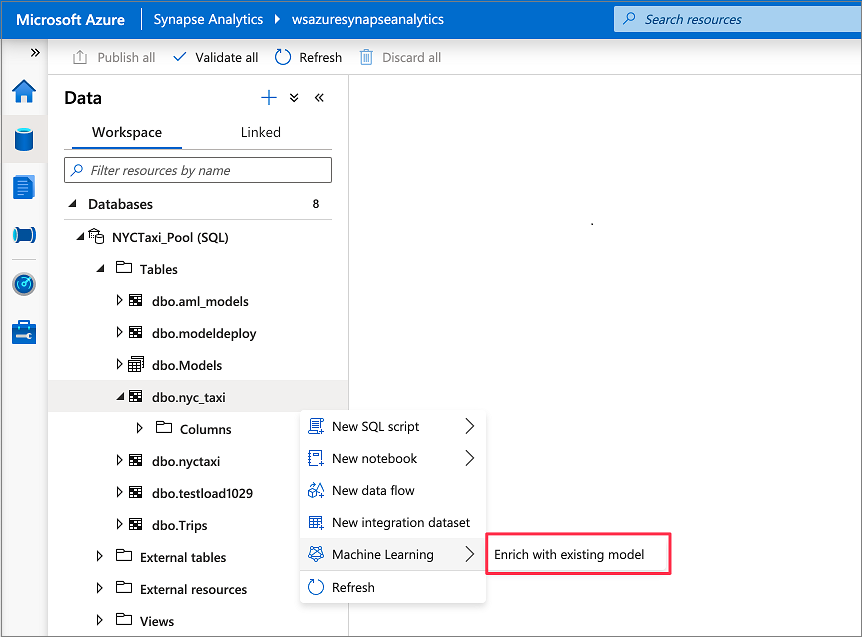
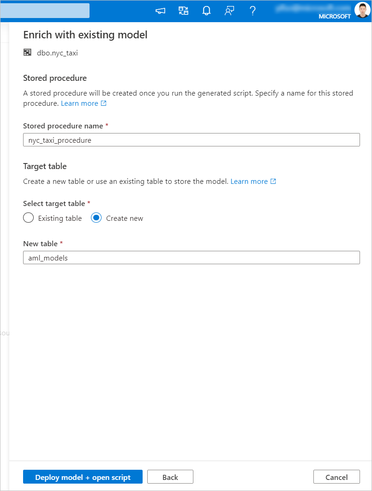

<!---Tutorials are scenario-based procedures for the top customer tasks identified in milestone one of the [Content + Learning content model](contribute-get-started-mvc.md).
You only use tutorials to show the single best procedure for completing an approved top 10 customer task.
--->

# Tutorial: Machine learning model scoring wizard for Synapse SQL pools

Learn how to easily enrich your data in SQL Pools with predictive machine learning models.  The models that your data scientists create are now easily accessible to data professionals for predictive analytics. A data professional in Synapse can simply select a model from the Azure ML model registry for deployment in Synapse SQL Pools and launch predictions to enrich the data.

In this tutorial, you learn how to:

> [!div class="checklist"]
> * Train a predictive ML model and register the model in Azure ML model registry
> * Load data into you Synapse SQL Pool
> * Select the ML model to enrich data in a Synapse SQL pool using the model scoring wizard
> * Launch predictions

If you don't have an Azure subscription, [create a free account before you begin](https://azure.microsoft.com/free/).


## Prerequisites

- [Synapse Analytics workspace](quickstart-create-workspace.md) with an ADLS Gen2 storage account configured as the default storage. You need to be the **Storage Blob Data Contributor** of the ADLS Gen2 filesystem that you work with.
- Synapse SQL Pool in your Synapse WS. [Create a Synapse SQL pool](https://docs.microsoft.com/en-us/azure/synapse-analytics/quickstart-create-sql-pool-studio)
- Azure ML linked service in your Synapse WS. [Create an Azure ML linked service in Synapse](quickstart-integrate-azure-ml.md)

## Sign in to the Azure portal

Sign in to the [Azure portal](https://portal.azure.com/)

## Train a model in Azure ML

1. Navigate to your Azure ML workspace
1. Download [Predict NYC Taxi Tips.ipynb](TODO:Link to GitHub)
1. Launch the Azure ML workspace in [Azure ML Studio](https://ml.azure.com). 
1. Go to "Notebooks" and click "Upload files", select "Predict NYC Taxi Tips.ipynb" that you had downloaded and upload the file.

1. After the notebook is uploaded and opened, click "Run all cells". 
- *Note that you need to verify that your version of sklearn is 0.20.3*
- *One of the cells may fail and ask you to authenticate to Azure. Keep an eye out for this in the cell outputs, and authenticate in your browser by following the link and entering the code. Then re-run the Notebook.*
- *Before running all cells, check if the compute instance is running.*

. The notebook will train an ONNX model and register it with MLFlow. Go to "Models" to check if the new model is registered properly.

6. Running the notebook will also export the test data into a CSV file. Now, we need to download the CSV file to local. Later, we will import the CSV file into SQL pool and use the data to test the model.
*The CSV file is created in the same folder as your notebook file. Click "Refresh" on the file explorer and then you will be able to see it.*


## Use ML model scoring wizard to launch predictions in Synapse SQL pool 
1. Open Synapse workspace with Synapse Studio.

1. Navigate to "Data -> Linked -> Storage Accounts". Upload test_data.csv to the default storage account.

1. Go to "Develop -> SQL scripts". Create a new SQL script to load test_data.csv into your SQL pool.

**[Note]** the file URL needs to be updated properly before running the below script.

   ```SQL
   IF NOT EXISTS (SELECT * FROM sys.objects WHERE NAME = 'nyc_taxi' AND TYPE = 'U')
   CREATE TABLE dbo.nyc_taxi
   (
       tipped int,
       fareAmount float,
       paymentType int,
       passengerCount int,
       tripDistance float,
       tripTimeSecs bigint,
       pickupTimeBin nvarchar(30)
   )
   WITH
   (
       DISTRIBUTION = ROUND_ROBIN,
       CLUSTERED COLUMNSTORE INDEX
   )
   GO
   
   COPY INTO dbo.nyc_taxi
   (tipped 1, fareAmount 2, paymentType 3, passengerCount 4, tripDistance 5, tripTimeSecs 6, pickupTimeBin 7)
   FROM 'https://yifsoadlsgen2westus2.dfs.core.windows.net/sparkjob/TestData/test_data.csv'
   WITH
   (
       FILE_TYPE = 'CSV',
       ROWTERMINATOR='0x0A',
       FIELDQUOTE = '"',
       FIELDTERMINATOR = ',',
       FIRSTROW = 2
   )
   GO
   
   SELECT TOP 100 * FROM nyc_taxi
   GO
   ```

 

5. Go to "Data -> Workspace". Open the SQL scoring wizard by right-clicking on the SQL Pool table. Select "Machine Learning -> Enrich with existing model".
**Note:** The Machine learning option does not appear unless you have a linked service created for Azure ML (see Prerequisites at the top of this tutorial)



6. Select a linked Azure ML workspace in the drop down box. This will load a list of machine learning models from model registry of the chosen Azure ML workspace. Currently, only ONNX models are supported and this will only display ONNX models. 

7. Select the model we just trained. Then, click "Continue".


8. Next step is to map the table columns to the model inputs, and also specify the model outputs. If the model is saved in the MLFlow format and the model signature is populated, we can automatically do the mapping for you using a logic based on the similarity of names). The interface also supports manual mapping.
Click "Continue".


9. The generated T-SQL code will be wrapped inside a Stored Procedure. and this is why you need to provide a stored procedure a name. The model binary incl. metadata (version, description, etc) will be physically copied from Azure ML to a SQL pool table. So, we also need to specify which table to save the model inn. You can either choose to "Use an existing table" or to "Create a new table". Once done, click "Deploy model + open editor" to deploy the model and generate a T-SQL prediction script.



10. Once the script is generated, you can click "Run" , to execute the scoring to get predictions.


## Next steps
