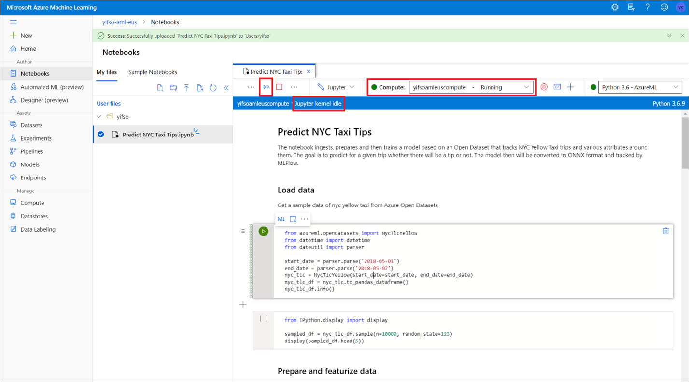
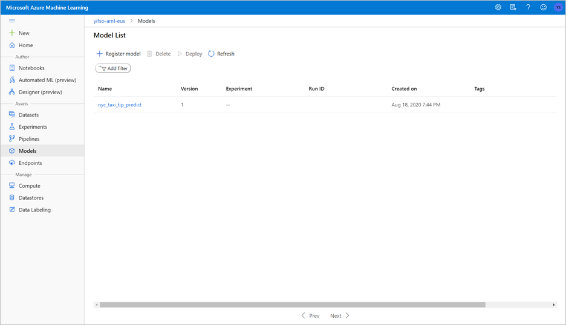
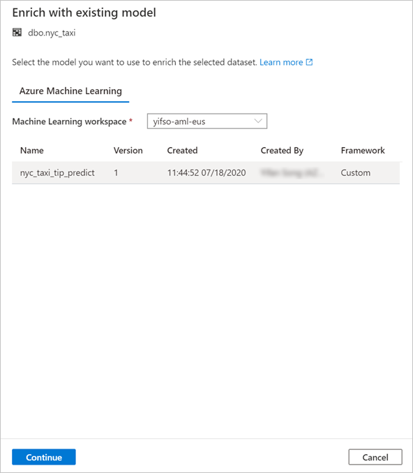
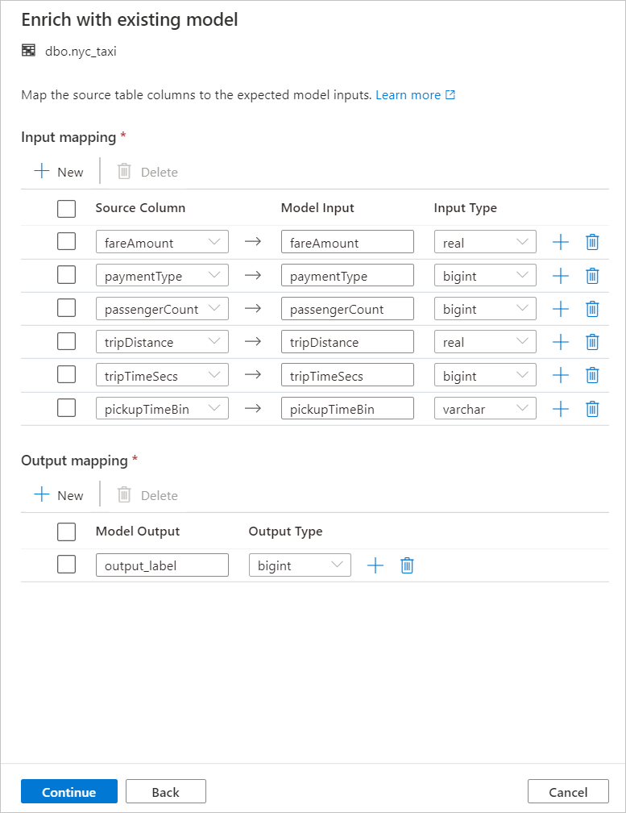

# Tutorial: Machine learning model scoring wizard for Synapse SQL pools

Learn how to easily enrich your data in SQL Pools with predictive machine learning models.  The models that your data scientists create are now easily accessible to data professionals for predictive analytics. A data professional in Synapse can simply select a model from the Azure Machine Learning model registry for deployment in Synapse SQL Pools and launch predictions to enrich the data.

In this tutorial, you'll learn how to:

> [!div class="checklist"]
> - Train a predictive machine learning model and register the model in Azure Machine Learning model registry
> - Use the SQL scoring wizard to launch predictions in Synapse SQL pool

If you don't have an Azure subscription, [create a free account before you begin](https://azure.microsoft.com/free/).

## Prerequisites

- [Synapse Analytics workspace](../get-started-create-workspace.md) with an ADLS Gen2 storage account configured as the default storage. You need to be the **Storage Blob Data Contributor** of the ADLS Gen2 filesystem that you work with.
- Synapse SQL Pool in your Synapse Analytics workspace. For details, see [Create a Synapse SQL pool](../quickstart-create-sql-pool-studio.md).
- Azure Machine Learning linked service in your Synapse Analytics workspace. For details, see [Create an Azure Machine Learning linked service in Synapse](quickstart-integrate-azure-ml.md).

## Sign in to the Azure portal

Sign in to the [Azure portal](https://portal.azure.com/)

## Train a model in Azure Machine Learning

Before you begin, verify that your version of **sklearn** is 0.20.3.

Before running all cells in the notebook, check if the compute instance is running.



1. Navigate to your Azure Machine Learning workspace.

1. Download [Predict NYC Taxi Tips.ipynb](https://go.microsoft.com/fwlink/?linkid=2144301).

1. Launch the Azure Machine Learning workspace in [Azure Machine Learning Studio](https://ml.azure.com).

1. Go to **Notebooks** and click **Upload files**, select "Predict NYC Taxi Tips.ipynb" that you downloaded and upload the file.
   

1. After the notebook is uploaded and opened, click **Run all cells**.

   One of the cells may fail and ask you to authenticate to Azure. Keep an eye out for this in the cell outputs, and authenticate in your browser by following the link and entering the code. Then re-run the Notebook.

1. The notebook will train an ONNX model and register it with MLFlow. Go to **Models** to check if the new model is registered properly.
   

1. Running the notebook will also export the test data into a CSV file. Download the CSV file to your local system. Later, you will import the CSV file into SQL pool and use the data to test the model.

   The CSV file is created in the same folder as your notebook file. Click "Refresh" on the file explorer if you don't see it right away.

   

## Launch predictions with SQL scoring wizard

1. Open the Synapse workspace with Synapse Studio.

1. Navigate to **Data** -> **Linked** -> **Storage Accounts**. Upload `test_data.csv` to the default storage account.

   

1. Go to **Develop** -> **SQL scripts**. Create a new SQL script to load `test_data.csv` into your SQL pool.

   > [!NOTE]
   > Update the file URL in this script before running it.

   ```SQL
   IF NOT EXISTS (SELECT * FROM sys.objects WHERE NAME = 'nyc_taxi' AND TYPE = 'U')
   CREATE TABLE dbo.nyc_taxi
   (
       tipped int,
       fareAmount float,
       paymentType int,
       passengerCount int,
       tripDistance float,
       tripTimeSecs bigint,
       pickupTimeBin nvarchar(30)
   )
   WITH
   (
       DISTRIBUTION = ROUND_ROBIN,
       CLUSTERED COLUMNSTORE INDEX
   )
   GO
   
   COPY INTO dbo.nyc_taxi
   (tipped 1, fareAmount 2, paymentType 3, passengerCount 4, tripDistance 5, tripTimeSecs 6, pickupTimeBin 7)
   FROM 'https://yifsoadlsgen2westus2.dfs.core.windows.net/sparkjob/TestData/test_data.csv'
   WITH
   (
       FILE_TYPE = 'CSV',
       ROWTERMINATOR='0x0A',
       FIELDQUOTE = '"',
       FIELDTERMINATOR = ',',
       FIRSTROW = 2
   )
   GO
   
   SELECT TOP 100 * FROM nyc_taxi
   GO
   ```

   

1. Go to **Data** -> **Workspace**. Open the SQL scoring wizard by right-clicking the SQL Pool table. Select **Machine Learning** -> **Enrich with existing model**.

   > [!NOTE]
   > The Machine learning option does not appear unless you have a linked service created for Azure Machine Learning (see **Prerequisites** at the beginning of this tutorial).

   

1. Select a linked Azure Machine Learning workspace in the drop down box. This loads a list of machine learning models from the model registry of the chosen Azure Machine Learning workspace. Currently, only ONNX models are supported so this will display only ONNX models.

1. Select the model you just trained then click **Continue**.

   

1. Next, map the table columns to the model inputs and specify the model outputs. If the model is saved in the MLFlow format and the model signature is populated, the mapping will be done automatically for you using a logic based on the similarity of names. The interface also supports manual mapping.

   Click **Continue**.

   

1. The generated T-SQL code is wrapped inside a Stored Procedure. This is why you need to provide a stored procedure a name. The model binary including metadata (version, description, etc) will be physically copied from Azure Machine Learning to a SQL pool table. So you need to specify which table to save the model in. You can choose either to "Use an existing table" or to "Create a new table". Once done, click **Deploy model + open editor** to deploy the model and generate a T-SQL prediction script.

   

1. Once the script is generated, click "Run" to execute the scoring and get predictions.

   

## Next steps

- See [Quickstart: Create a new Azure Machine Learning linked service in Synapse](quickstart-integrate-azure-ml.md).