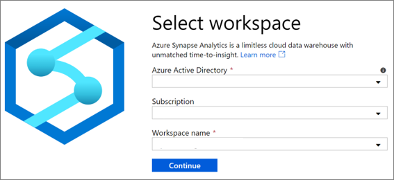
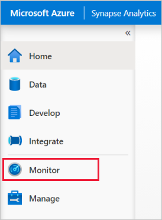
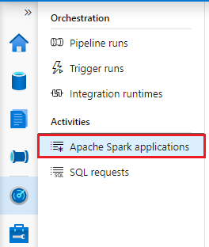

# Use the Azure Synapse Studio to monitor your Spark applications

With Azure Synapse Analytics, you can use Spark to run notebooks, jobs, and other kinds of applications on your Spark pools in your workspace.

This article explains how to monitor your Spark applications, allowing you to keep an eye on the latest status, issues, and progress.

## Accessing the list of Spark applications

To see the list of Spark applications in your workspace, first [open the Azure Synapse Studio](https://web.azuresynapse.net/) and select your workspace.

  > [!div class="mx-imgBorder"]
  > 

Once you've opened your workspace, select the **Monitor** section on the left.

  > [!div class="mx-imgBorder"]
  > 

Select **Spark applications** to view the list of Spark applications.

  > [!div class="mx-imgBorder"]
  > 

## Filtering your Spark applications

You can filter the list of Spark applications to the ones you're interested in. The filters at the top of the screen allow you to specify a field on which you'd like to filter.

For example, you can filter the view to see only the Spark applications that contain the name "sales":

  > [!div class="mx-imgBorder"]
  > 

  > [!div class="mx-imgBorder"]
  > 

## Viewing details about a specific Spark application

To view the details about one of your Spark applications, select the Spark application and view the details. If the Spark application is still running, you can monitor the progress.

## Next steps

This article showed you how to monitor Spark applications in your Azure Synapse workspace. You learned how to:

> [!div class="checklist"]
>
> * View the list of Spark applications in your workspace
> * Filter the list of Spark applications to find the Spark applications you'd like to monitor
> * Monitor your selected Spark application in detail.
