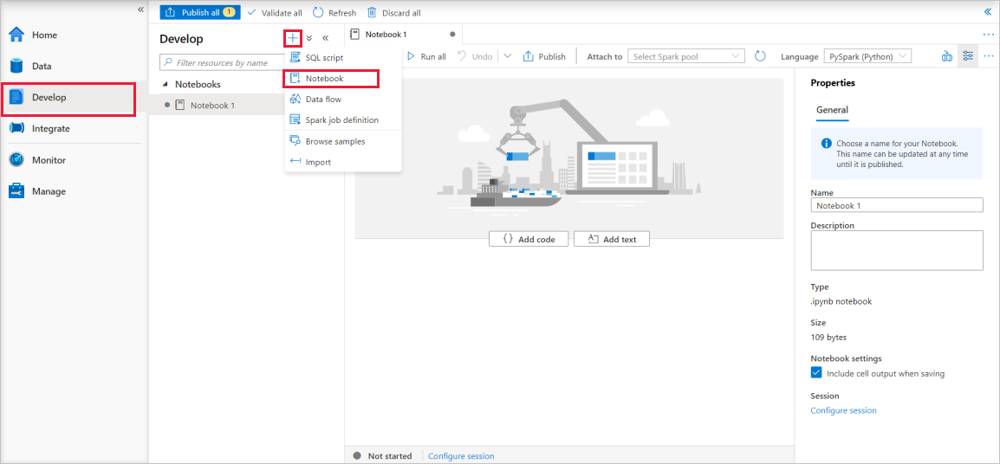
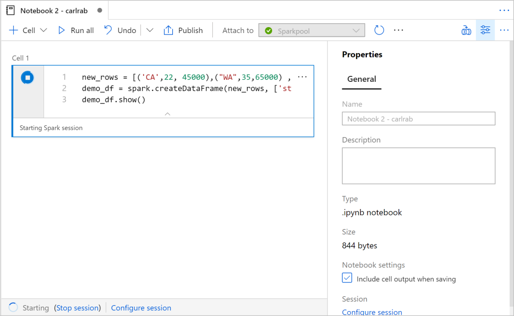
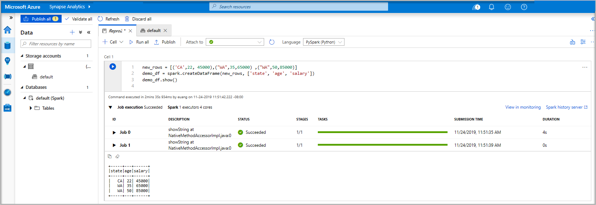

# Quickstart: Create a serverless Apache Spark pool in Azure Synapse Analytics using web tools

In this quickstart, you learn how to create a serverless Apache Spark pool (preview) in Azure Synapse using web tools. You then learn to connect to the Apache Spark pool and run Spark SQL queries against files and tables. Apache Spark enables fast data analytics and cluster computing using in-memory processing. For information on Spark in Azure Synapse, see [Overview: Apache Spark on Azure Synapse](./spark/apache-spark-overview.md).

> [!IMPORTANT]
> Billing for Spark instances is prorated per minute, whether you are using them or not. Be sure to shutdown your Spark instance after you have finished using it, or set a short timeout. For more information, see the **Clean up resources** section of this article.

If you don't have an Azure subscription, [create a free account before you begin](https://azure.microsoft.com/free/).

## Prerequisites

- Azure subscription - [create one for free](https://azure.microsoft.com/free/)
- [Synapse Analytics workspace](quickstart-create-workspace.md)
- [Serverless Apache Spark pool](quickstart-create-apache-spark-pool-studio.md)

## Sign in to the Azure portal

Sign in to the [Azure portal](https://portal.azure.com/).

If you don't have an Azure subscription, [create a free account](https://azure.microsoft.com/free/) before you begin.

## Create a notebook

A notebook is an interactive environment that supports various programming languages. The notebook allows you to interact with your data, combine code with markdown, text, and perform simple visualizations.

1. From the Azure portal view for the Azure Synapse workspace you want to use, select **Launch Synapse Studio**.
2. Once Synapse Studio has launched, select **Develop**. Then, hover over the **Notebooks** entry. Select the ellipsis (**...**).
3. From there, select **New notebook**. A new notebook is created and opened with an automatically generated name.
  

4. In the **Properties** window, provide a name for the notebook.
5. On the toolbar, click **Publish**.
6. If there is only one Apache Spark pool in your workspace, then it's selected by default. Use the drop-down to select the correct Apache Spark pool if none is selected.
7. Click **Add code**. The default language is `Pyspark`. You are going to use a mix of Pyspark and Spark SQL, so the default choice is fine. Other supported languages are Scala and .NET for Spark.
8. Next you create a simple Spark DataFrame object to manipulate. In this case, you create it from code. There are three rows and three columns:

   ```python
   new_rows = [('CA',22, 45000),("WA",35,65000) ,("WA",50,85000)]
   demo_df = spark.createDataFrame(new_rows, ['state', 'age', 'salary'])
   demo_df.show()
   ```

9. Now run the cell using one of the following methods:

   - Press **SHIFT + ENTER**.
   - Select the blue play icon to the left of the cell.
   - Select the **Run all** button on the toolbar.

   

10. If the Apache Spark pool instance isn't already running, it is automatically started. You can see the Apache Spark pool instance status below the cell you are running and also on the status panel at the bottom of the notebook. Depending on the size of pool, starting should take 2-5 minutes. Once the code has finished running, information below the cell displays showing how long it took to run and its execution. In the output cell, you see the output.

    

11. The data now exists in a DataFrame from there you can use the data in many different ways. You are going to need it in different formats for the rest of this quickstart.
12. Enter the code below in another cell and run it, this creates a Spark table, a CSV, and a Parquet file all with copies of the data:

    ```python
     demo_df.createOrReplaceTempView('demo_df')
     demo_df.write.csv('demo_df', mode='overwrite')
     demo_df.write.parquet('abfss://<<TheNameOfAStorageAccountFileSystem>>@<<TheNameOfAStorageAccount>>.dfs.core.windows.net/demodata/demo_df', mode='overwrite')
    ```

    If you use the storage explorer, it's possible to see the impact of the two different ways of writing a file used above. When no file system is specified then the default is used, in this case `default>user>trusted-service-user>demo_df`. The data is saved to the location of the specified file system.

    Notice in both the "csv" and "parquet" formats, write operations a directory is created with many partitioned files.

    

    

## Run Spark SQL statements

Structured Query Language (SQL) is the most common and widely used language for querying and defining data. Spark SQL functions as an extension to Apache Spark for processing structured data, using the familiar SQL syntax.

1. Paste the following code in an empty cell, and then run the code. The command lists the tables on the pool.

   ```sql
   %%sql
   SHOW TABLES
   ```

   When you use a Notebook with your Azure Synapse Apache Spark pool, you get a preset `sqlContext` that you can use to run queries using Spark SQL. `%%sql` tells the notebook to use the preset `sqlContext` to run the query. The query retrieves the top 10 rows from a system table that comes with all Azure Synapse Apache Spark pools by default.

2. Run another query to see the data in `demo_df`.

    ```sql
    %%sql
    SELECT * FROM demo_df
    ```

    The code produces two output cells, one that contains data results the other, which shows the job view.

    By default the results view shows a grid. But, there is a view switcher underneath the grid that allows the view to switch between grid and graph views.

    

3. In the **View** switcher, select **Chart**.
4. Select the **View options** icon from the far right-hand side.
5. In the **Chart type** field, select "bar chart".
6. In the X-axis column field, select "state".
7. In the Y-axis column field, select "salary".
8. In the **Aggregation** field, select to "AVG".
9. Select **Apply**.

   

10. It is possible to get the same experience of running SQL but without having to switch languages. You can do this by replacing the SQL cell above with this PySpark cell, the output experience is the same because the **display** command is used:

    ```python
    display(spark.sql('SELECT * FROM demo_df'))
    ```

11. Each of the cells that previously executed had the option to go to **History Server** and **Monitoring**. Clicking the links takes you to different parts of the User Experience.

> [!NOTE]
> Some of the [Apache Spark official documentation](https://spark.apache.org/docs/latest/) relies on using the Spark console, which is not available on Synapse Spark. Use the [notebook](quickstart-apache-spark-notebook.md) or [IntelliJ](./spark/intellij-tool-synapse.md) experiences instead.

## Clean up resources

Azure Synapse saves your data in Azure Data Lake Storage. You can safely let a Spark instance shut down when it is not in use. You are charged for a serverless Apache Spark pool as long as it is running, even when it is not in use. 

Since the charges for the pool are many times more than the charges for storage, it makes economic sense to let Spark instances shut down when they are not in use.

To ensure the Spark instance is shut down, end any connected sessions(notebooks). The pool shuts down when the **idle time** specified in the Apache Spark pool is reached. You can also select **end session** from the status bar at the bottom of the notebook.

## Next steps

In this quickstart, you learned how to create a serverless Apache Spark pool and run a basic Spark SQL query.

- [Azure Synapse Analytics](overview-what-is.md)
- [.NET for Apache Spark documentation](/dotnet/spark?toc=/azure/synapse-analytics/toc.json&bc=/azure/synapse-analytics/breadcrumb/toc.json)


