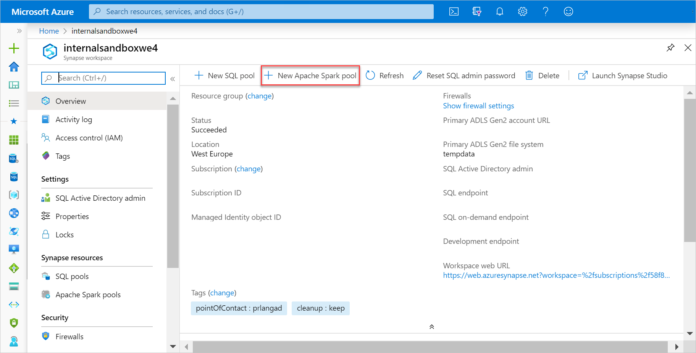
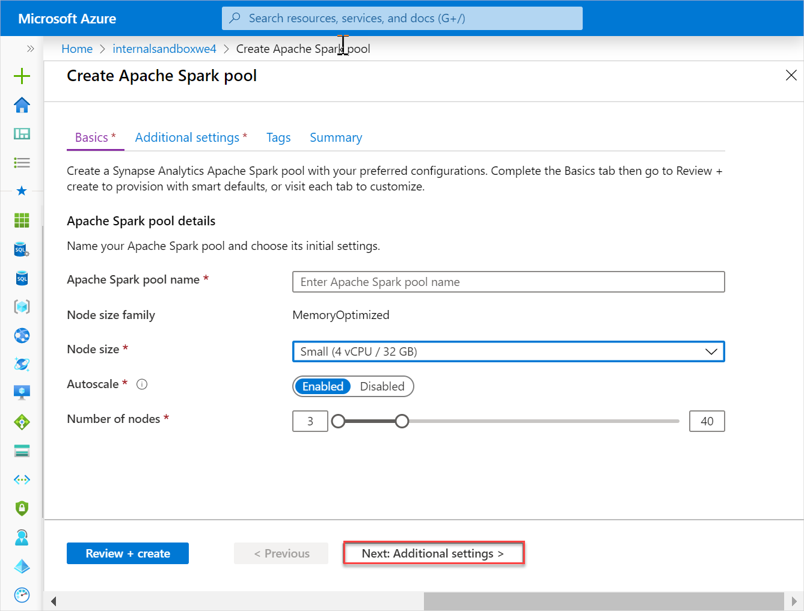
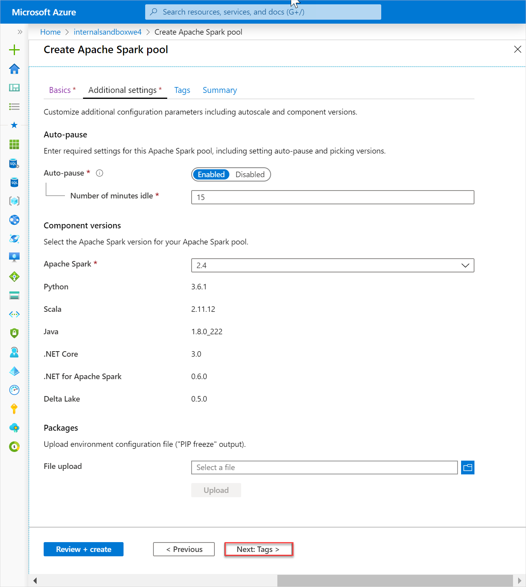
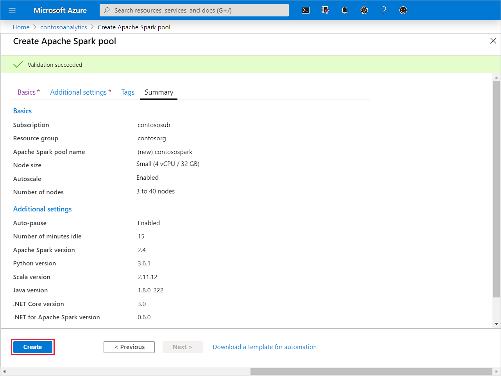
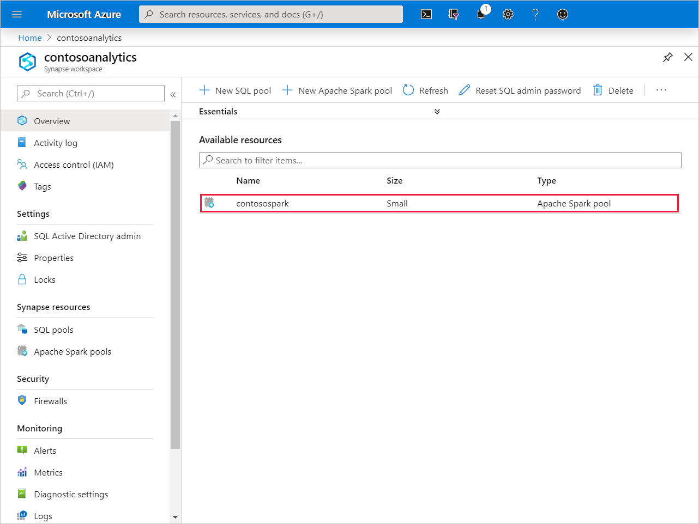
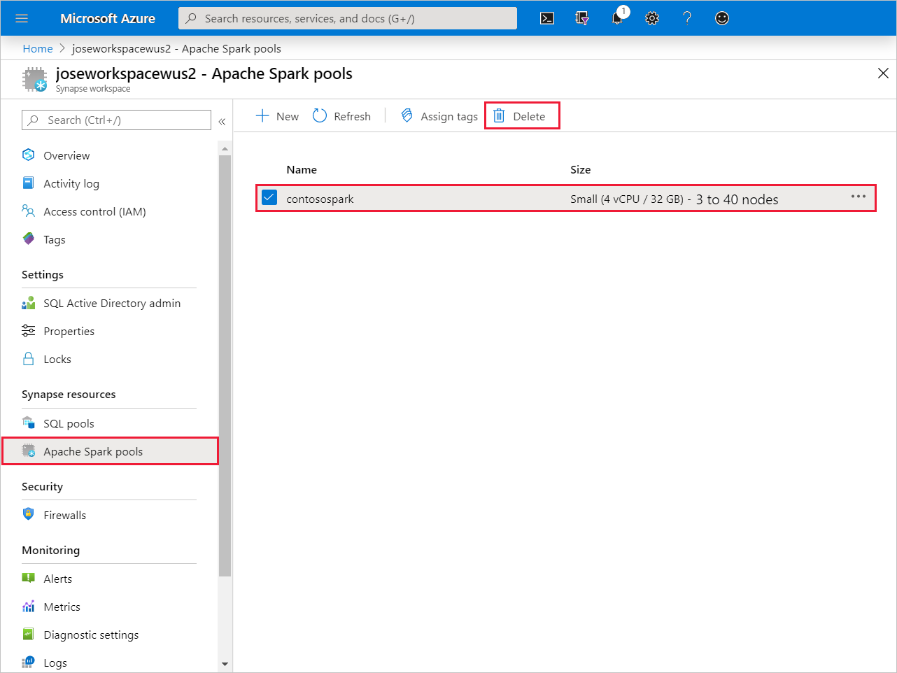
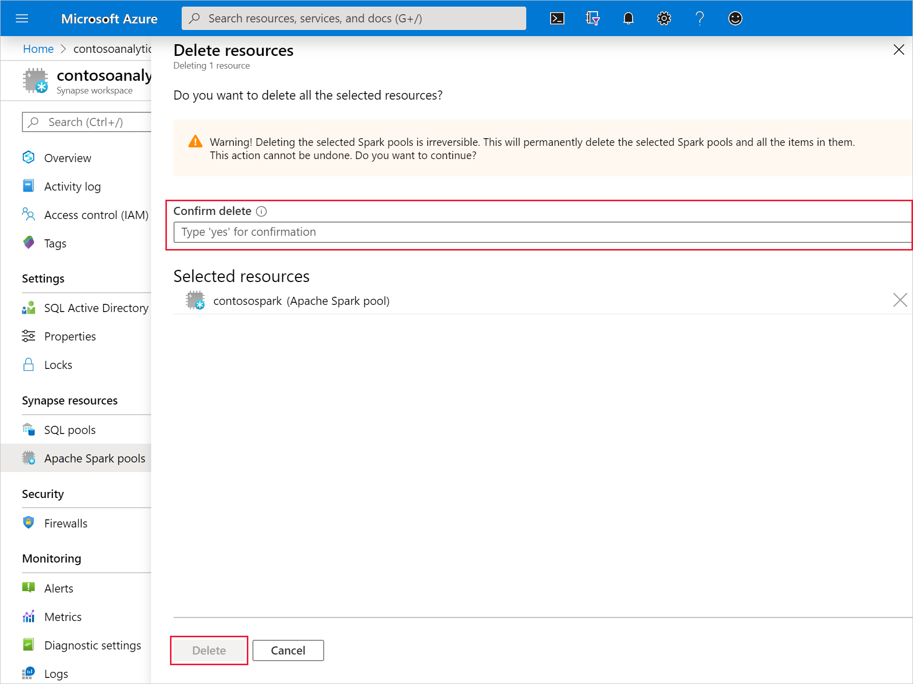

# Quickstart: Create a new Apache Spark pool

Synapse Analytics offers various analytics engines to help you ingest, transform, model, analyze,  and serve your data. An Apache Spark pool offers open-source big data compute capabilities. After creating an Apache Spark pool in your Synapse workspace, data can be loaded, modeled, processed, and served to obtain insights.  

This quickstart describes the steps to create an Apache Spark pool in a Synapse workspace by using the Azure portal.

If you don't have an Azure subscription, [create a free account before you begin](https:/azure.microsoft.com/free/).

## Prerequisites

- Azure subscription - [create one for free](https:/azure.microsoft.com/free/)
- [Synapse Analytics workspace](quickstart-create-workspace.md)

## Sign in to the Azure portal

Sign in to the [Azure portal](https:/portal.azure.com/)

## Create new Apache Spark pool

1. In the Synapse workspace where the Apache Spark pool, click **New Apache Spark pool**.
.
2. Enter the following details in the **Basics** tab:

    |Setting | Suggested value | Description |
    | :------ | :-------------- | :---------- |
    | **Apache Spark pool name** | A valid pool name | This is the name that the Apache Spark pool will have. |
    | **Node size** | Small (4 vCPU / 32 GB) | Set this to the smallest size to reduce costs for this quickstart |
    | **Autoscale** | Enabled | Leave this default setting |
    | **Number of nodes** | 3 - 40 | Leave this default setting |
    ||||

    
    > [!IMPORTANT]
    > Note that there are specific limitations for the names that Apache Spark pools can use. Names must contain letters or numbers only, must be 15 or less characters, must start with a letter, not contain reserved words, and be unique in the workspace.

3. Click **Next: additional settings** and review the default settings. Do not modify any default settings.

4.  Click **Next: tags**. Do not add any tags.

5. Click **Review + create**.

6. Make sure that the details look correct based on what was previously entered, and click **Create**.

7. At this point, the resource provisioning flow will start, indicating once it's complete
 

8. After the provisioning completes, navigating back to the workspace will show a new entry for the newly created Spark pool.
 

9. At this point, there are no resources running, no charges for Spark, you have created metadata about the Spark instances you want to create.

## Clean up resources

Follow the steps below to delete the Apache Spark pool from the workspace.
> [!WARNING]
> Deleting a Spark pool will remove the analytics engine from the workspace. It will no longer be possible to connect to the pool, and all queries, pipelines, and notebooks that use this Spark pool will no longer work.

If you want to delete the Apache Spark pool, do the following:

1. Navigate to the Apache Spark pools blade in the workspace.
2. Select the Apache pool to be deleted (in this case, **contosospark**)
3. Press **delete**.
 
4. Confirm the deletion, and press **Delete** button.
 
5. When the process completes successfully, the Apache Spark pool will no longer be listed in the workspace resources.

Once the SQL pool is created, it is available in the workspace for loading data, processing streams, reading from the lake, and so.

## Next steps

- See [Quickstart: Create an Apache Spark pool in Synapse Analytics using web tools](spark/apache-spark-notebook-create-spark-use-sql.md).
- See [Quickstart: Create a Synapse SQL pool](quickstart-create-sql-pool.md).
