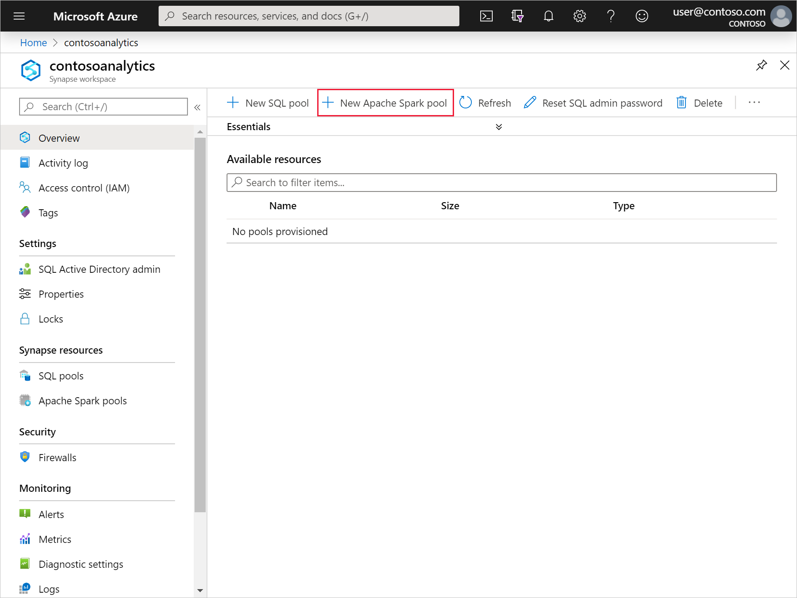
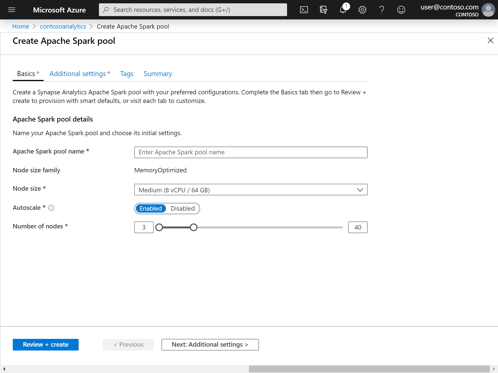
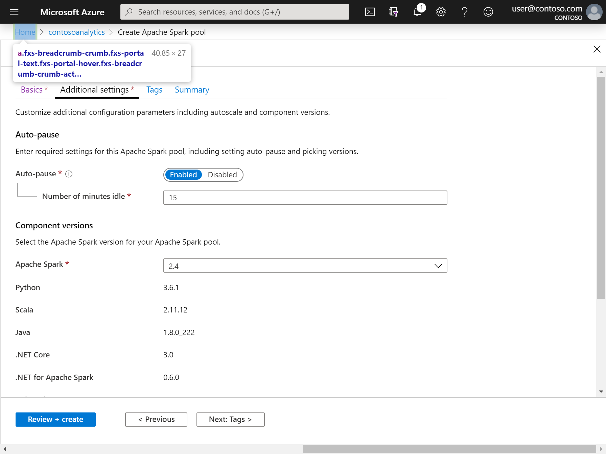
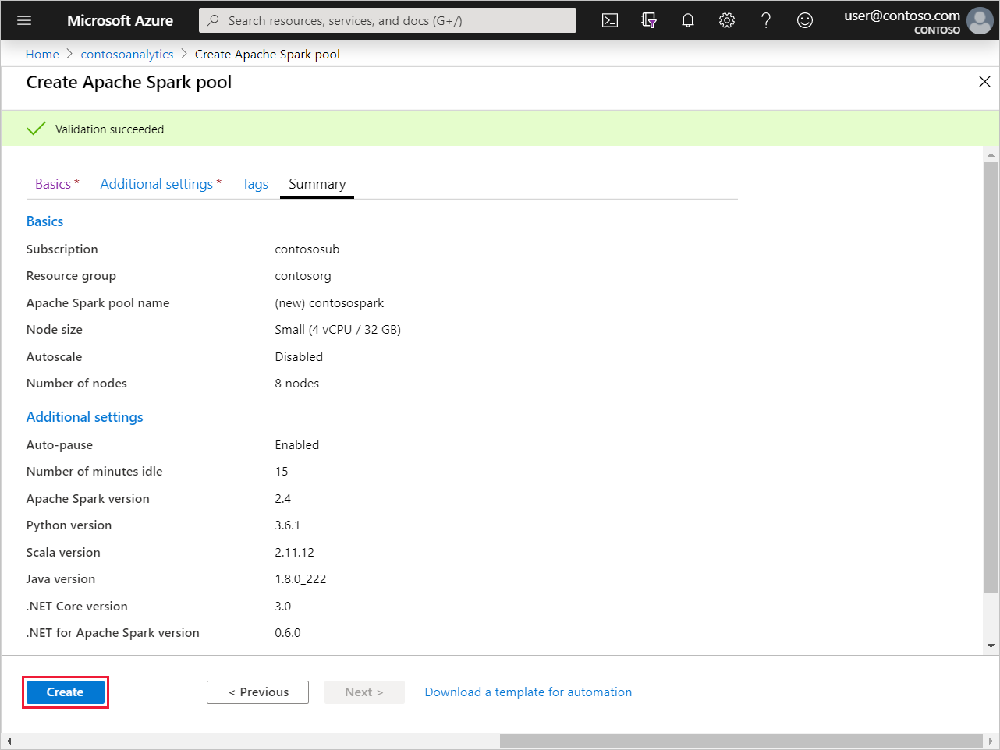
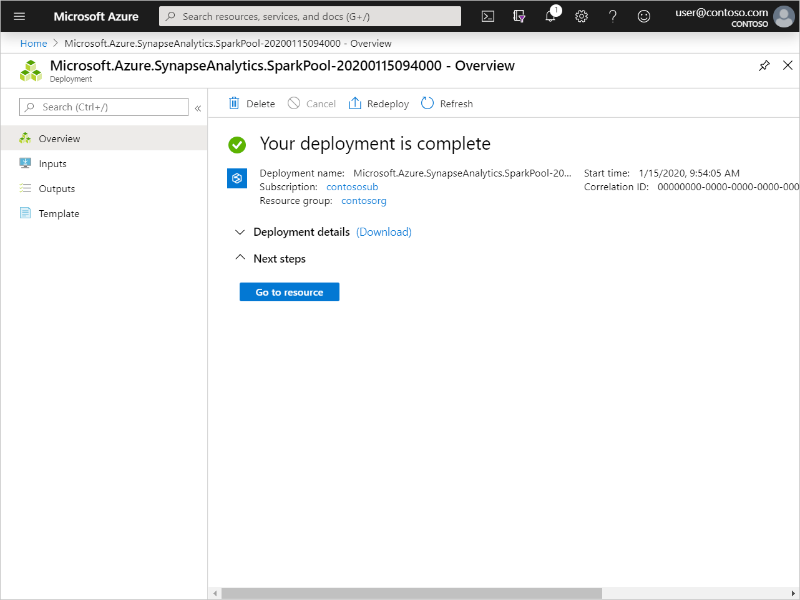
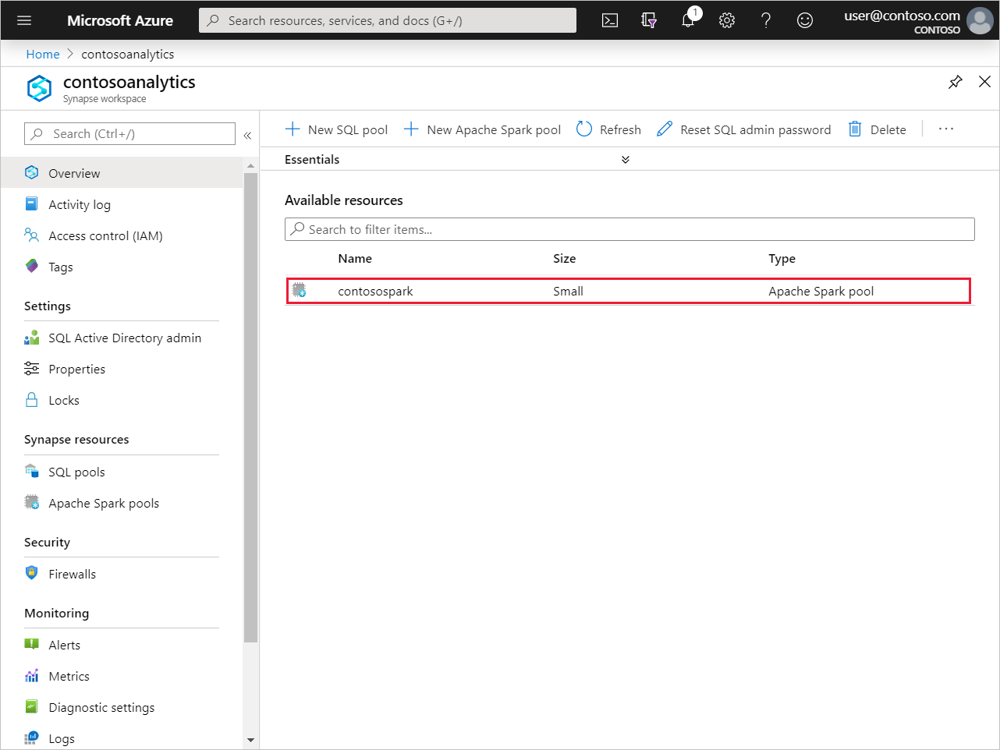
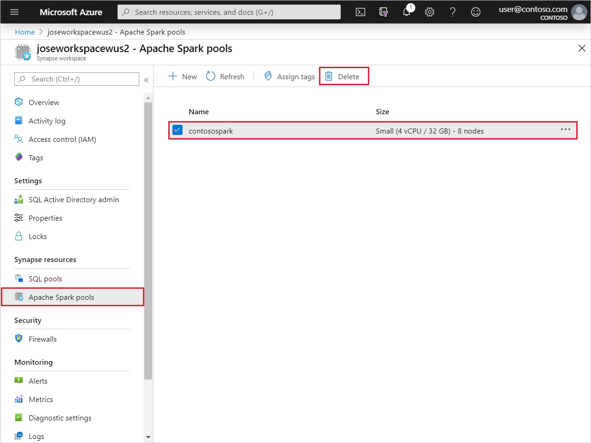
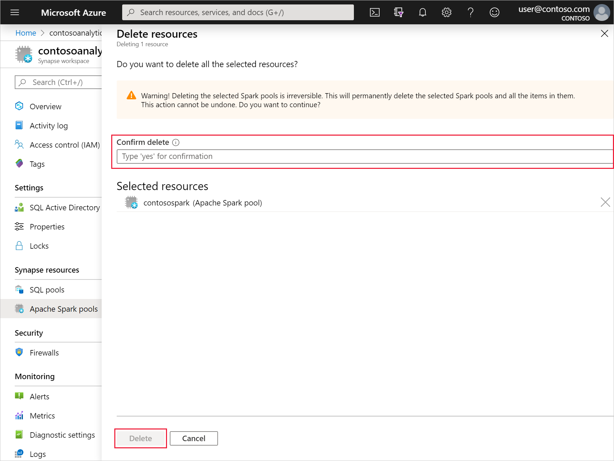

<!---Recommended: Removal all the comments in this template before you sign-off or merge to master.--->

<!---quickstarts are fundamental day-1 instructions for helping new customers use a subscription to quickly try out a specific product/service. The entire activity is a short set of steps that provides an initial experience.
You only use quickstarts when you can get the service, technology, or functionality into the hands of new customers in less than 10 minutes.
--->

# Quickstart: Create a new Apache Spark pool 
<!---Required:
Starts with "quickstart: "
Make the first word following "quickstart:" a verb.
--->

Synapse Analytics offers various analytics engines to help you ingest, transform, model, analyze,  and serve your data. An Apache Spark pool offers open-source big data compute capabilities. After creating an Apache Spark pool in your Synapse workspace, data can be loaded, modeled, processed, and served to obtain insights.  

This quickstart describes the steps to create an Apache Spark pool in a Synapse workspace by using the Azure portal.

If you don't have an Azure subscription, [create a free account before you begin](https://azure.microsoft.com/free/).

<!---Required:
Lead with a light intro that describes, in customer-friendly language, what the customer will learn, or do, or accomplish. Answer the fundamental “why would I want to do this?” question.
--->

<!---Avoid notes, tips, and important boxes. Readers tend to skip over them. Better to put that info directly into the article text.--->

## Prerequisites

- Azure subscription - [create one for free](https://azure.microsoft.com/free/)
- [Synapse Analytics workspace](./quickstart-create-new-synapse-workspace.md)
<!---If you feel like your quickstart has a lot of prerequisites, the quickstart may be the wrong content type - a tutorial or how-to guide may be the better option.
If you need them, make Prerequisites your first H2 in a quickstart.
If there’s something a customer needs to take care of before they start (for example, creating a VM) it’s OK to link to that content before they begin.
--->

## Sign in to the Azure portal

Sign in to the [Azure portal](https://portal.azure.com/)
<!---If you need to sign in to the portal to do the quickstart, this H2 and link are required.--->

## Navigate to the Synapse Analytics workspace

<!---Required:
Quickstarts are prescriptive and guide the customer through an end-to-end procedure. Make sure to use specific naming for setting up accounts and configuring technology.
Don't link off to other content - include whatever the customer needs to complete the scenario in the article. For example, if the customer needs to set permissions, include the permissions they need to set, and the specific settings in the quickstart procedure. Don't send the customer to another article to read about it.
In a break from tradition, do not link to reference topics in the procedural part of the quickstart when using cmdlets or code. Provide customers what they need to know in the quickstart to successfully complete the quickstart.
For portal-based procedures, minimize bullets and numbering.
For the CLI or PowerShell based procedures, don't use bullets or numbering.
--->

1. Navigate to the Synapse workspace where the Apache Spark pool will be created by typing the service name (or resource name directly) into the search bar:
.
1. From the list of workspaces, type the name (or part of the name) of the workspace to open -- in this case, we will use a workspace named **contosoanalytics**

1. Click on the **New Apache Spark pool** command in the top bar.

1. Enter the following details in the **Basics** tab:

    | Setting | Suggested value | Description |
    | :------ | :-------------- | :---------- |
    | **Apache Spark pool name** | contosospark | This is the name that the Apache Spark pool will have. |
    | **Node size** | Small (4 vCPU / 32 GB) | Set this to the smallest size to reduce costs for this quickstart |
    | **Autoscale** | Disabled | We will not need autoscale in this quickstart |
    | **Number of nodes** | 8 | Use a small size to limit costs in this quickstart|
    ||||
    
    > [!IMPORTANT]
    > Note that there are specific limitations for the names that Apache Spark pools can use. Names must contain letters or numbers only, must be 15 or less characters, must start with a letter, not contain reserved words, and be unique in the workspace.

4. In the next tab (Additional settings), leave all defaults, and press **Next: tags**.

1. We will not add any tags for now, so click on **Next: Review + create**.

1. In the **Review + create** tab, make sure that the details look correct based on what was previously entered, and press **create**. 

1. At this point, the resource provisioning flow will start, indicating once it's complete
 

1. After the provisioning completes, navigating back to the workspace will show a new entry for the newly created SQL pool.
 

## Clean up resources

Follow the steps below to delete the Apache Spark pool from the workspace.
> [!WARNING]
> Deleting a Spark pool will remove the analytics engine from the workspace. It will no longer be possible to connect to the pool, and all queries, pipelines, and notebooks that use this Spark pool will no longer work.

If you want to delete the Apache Spark pool, do the following:

1. Navigate to the Apache Spark pools blade in the workspace.
1. Select the Apache pool to be deleted (in this case, **contosospark**)
1. Press **delete**.
 
1. Confirm the deletion, and press **Delete** button.
 
1. When the process completes successfully, the Apache Spark pool will no longer be listed in the workspace resources. 

<!---Required:
To avoid any costs associated with following the quickstart procedure, a Clean up resources (H2) should come just before Next steps (H2)
--->

## Next steps
Once the SQL pool is created, it will be available in the workspace for loading data, processing streams, reading from the lake, etc.

See the other Synapse quickstarts to get started using the Apache Spark pool.
<!--
Advance to the next article to learn how to create...
> [!div class="nextstepaction"]
> [Next steps button](tutorial-facilities-app.md)
--->

<!--- Required:
Quickstarts should always have a Next steps H2 that points to the next logical quickstart in a series, or, if there are no other quickstarts, to some other cool thing the customer can do. A single link in the blue box format should direct the customer to the next article - and you can shorten the title in the boxes if the original one doesn’t fit.
Do not use a "More info section" or a "Resources section" or a "See also section". --->