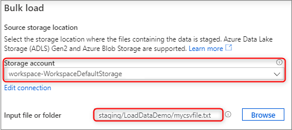

# Quickstart: Bulk loading with Synapse SQL

Loading data has never been easier when using the Bulk Load wizard in the Synapse Studio. This wizard will guide you through creating a T-SQL script with the [COPY statement](https://docs.microsoft.com/sql/t-sql/statements/copy-into-transact-sql?view=azure-sqldw-latest) to bulk load data. 

## Entry points to the Bulk Load wizard

You can now easily bulk load data using SQL pools with a simple right-click on the following areas within the Synapse Studio:

- A file or folder from an Azure storage account attached to your workspace

## Prerequisites

- This wizard generates a COPY statement which uses AAD pass-through for authentcation. Your [AAD user must have access](https://docs.microsoft.com/azure/synapse-analytics/sql-data-warehouse/quickstart-bulk-load-copy-tsql-examples#d-azure-active-directory-authentication-aad) to the workspace with at least the Storage Blob Data Contributor Azure role to the ADLS Gen2 Account.

- You must have the required [permissions to use the COPY statement](https://docs.microsoft.com/sql/t-sql/statements/copy-into-transact-sql?view=azure-sqldw-latest#permissions) and Create table permissions if you are creating a new table to load to.

- The linked service associated with the ADLS Gen2 Account **must have access to the file**/**folder** to load. For example, if the linked service authentication mechanism is Managed Identity, the workspace managed identity must have at least Storage blob reader permission on the storage account.

- If VNet is enabled on your workspace, make sure the integrated runtime associated to the ADLS Gen2 Account linked services for the source data and error file location has interactive authoring enabled. Interactive authoring is required for auto-schema detection, previewing the source file contents, and browsing ADLS Gen2 storage accounts within the wizard.

### Steps

1. Select the storage account and the file or folder you're loading from on the Source storage location panel: 
   

2. Select the file format settings including the storage account where you want to write rejected rows (error file). Currently only CSV and Parquet files are supported.

	

3. You can click on "Preview data" to see how the COPY statement will parse the file to help you configure the file format settings. Click on "Preview data" every time you change a file format setting to see how the COPY statement will parse the file with the updated setting:
    

4. Select the SQL pool you are using to load including whether the load will be for an existing table or new table:
   

5. Click on "Configure column mapping" to make sure you have the appropriate column mapping. For new tables, configuring the column mapping is critical for updating the target column data types:
   

6. Click on "Open script" and a T-SQL script will be generated with the COPY statement to load from your data lake:
   

## Next steps

- Check the [COPY statement](https://docs.microsoft.com/sql/t-sql/statements/copy-into-transact-sql?view=azure-sqldw-latest#syntax) article for more information on COPY capabilities
- Check the [data loading overview](https://docs.microsoft.com/azure/synapse-analytics/sql-data-warehouse/design-elt-data-loading#what-is-elt) article
