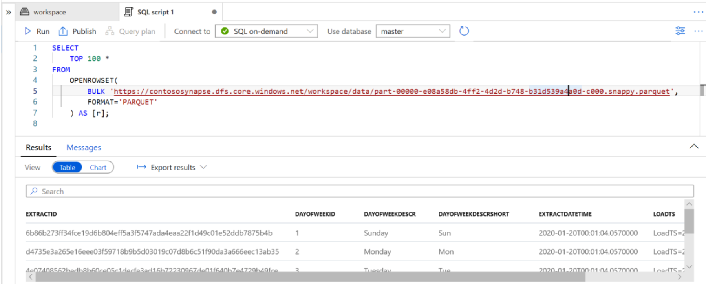

# Quickstart: Using Synapse Studio

In this quickstart, you'll learn how easy it is to query files using Synapse Studio.

If you don't have an Azure subscription, create a [free](https://azure.microsoft.com/free/) account before you begin.

## Sign in to the Azure portal

Sign in to the [Azure portal](https://portal.azure.com/).

## Prerequisites

[Create an Azure Synapse workspace and associated storage account](quickstart-create-workspace.md).

## Launch Synapse Studio

Find your Azure Synapse workspace and use the "Launch Synapse Studio" link to open the studio.

As an alternative, access [Azure Synapse Analytics](https://web.azuresynapse.net) and select tenant, subscription, and workspace.

## Browse storage accounts

Once you open Synapse Studio, go to the data section. There should be at least one storage account that was created with the workspace.

Create new folders and upload files using the links in toolbar to organize your files.

## Query files on storage account

> [!IMPORTANT]
> Make sure that you have `Storage Blob Reader` role on the underlying storage in order to be able to query the files. Learn how to [assign **Storage Blob Data Reader** or **Storage Blob Data Contributor** RBAC permissions on Azure Storage](../storage/common/storage-auth-aad-rbac-portal.md#assign-a-built-in-rbac-role).

Upload some `PARQUET` files and create a SQL script or a Spark notebook to see the content of the files.

Run the generated query or notebook to see the content of the file:

You can change the query to filter and sort results. Find language features that are available in SQL on-demand in [SQL features overview](sql-analytics/overview-features.md).

> [!WARNING]
> If you want to create a notebook, you would need to create [Spark pool in the workspace](spark/apache-spark-notebook-create-spark-use-sql.md).

> [!NOTE]
> If you select multiple files you can generate the SQL query that reads from the selected files.

## Next steps

- Enable AAD users to query files [by assigning **Storage Blob Data Reader** or **Storage Blob Data Contributor** RBAC permissions on Azure Storage](../storage/common/storage-auth-aad-rbac-portal.md#assign-a-built-in-rbac-role) 
- [Query files on Azure Storage using SQL On-Demand](sql-analytics/quickstart-sql-on-demand.md)
- [Create Spark pool](spark/apache-spark-notebook-create-spark-use-sql.md)
- [Create Power BI report on files stored on Azure Storage](sql-analytics/tutorial-connect-power-bi-desktop.md)
