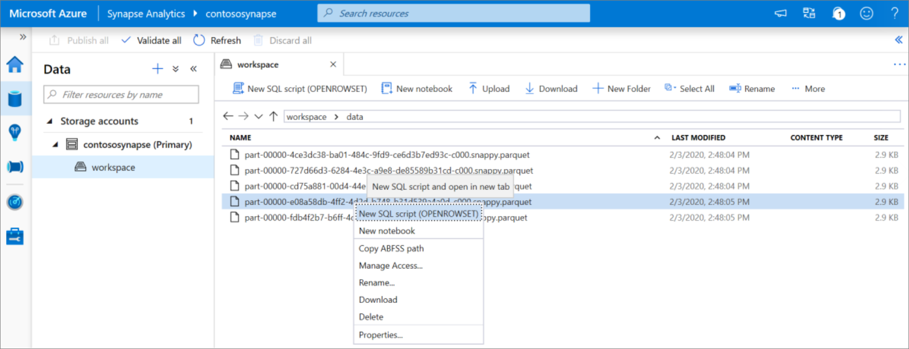

# Quickstart: Using Synapse Studio

In this quickstart, you will see and learn how easy it is to query various types of files using Synapse Studio.

## Prerequisites

[Create a Synapse workspace and associated storage account](quickstart-create-a-workspace.md).

## Launch Synapse Studio

Find you Azure Synapse workspace and use "Launch Synapse Studio" link to open the studio.

## Browse storage accounts

Once you open Synapse Studio, go to Data section where you can see all associated storage accounts.
There should be at least one storage account that is created with workspace.

Create new folders and upload files using the links in toolbar to organize your files.

## Query files on storage account

> [!IMPORTANT]
> Make sure that you have `Storage Blob Reader` role on underlying storage in order to be able to query the files. Learn here how to [assign **Storage Blob Data Reader** or **Storage Blob Data Contributor** RBAC permissions on Azure storage](../storage/common/storage-auth-aad-rbac-portal.md#assign-a-built-in-rbac-role).

Upload some `PARQUET` files and create new SQL script or Spark notebook to see the content of the files.

Run the generated query or notebook to see the content of the file:

You can change the query to filter and sort results.

> [!WARNING]
> If you want to create a Notebook, you would need to create [Spark Pool in the workspace](spark/apache-spark-notebook-create-spark-use-sql.md).

> [!NOTE]
> If you select multiple files you can generate the SQL query that reads from the selected files.

## Next steps

- Enable AAD users to query files [by assigning **Storage Blob Data Reader** or **Storage Blob Data Contributor** RBAC permissions on Azure storage](../storage/common/storage-auth-aad-rbac-portal.md#assign-a-built-in-rbac-role) 
- [Query files on Azure Storage using SQL On-Demand](sql-analytics/quickstart-sql-on-demand.md)
- [Create Spark Pool](spark/apache-spark-notebook-create-spark-use-sql.md)
- [Create Power BI report on files stored on Azure storage](sql-analytics/tutorial-connect-power-bi-desktop.md)
