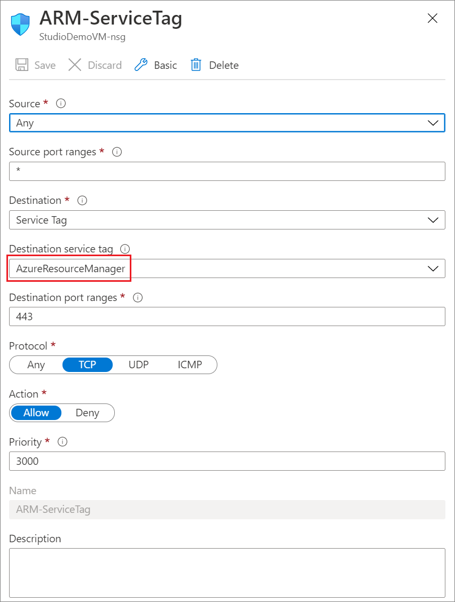
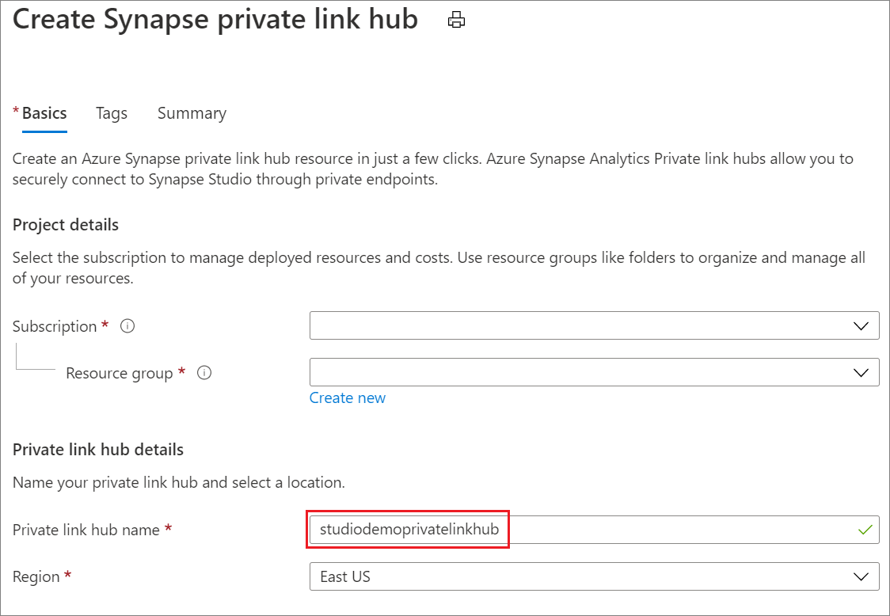
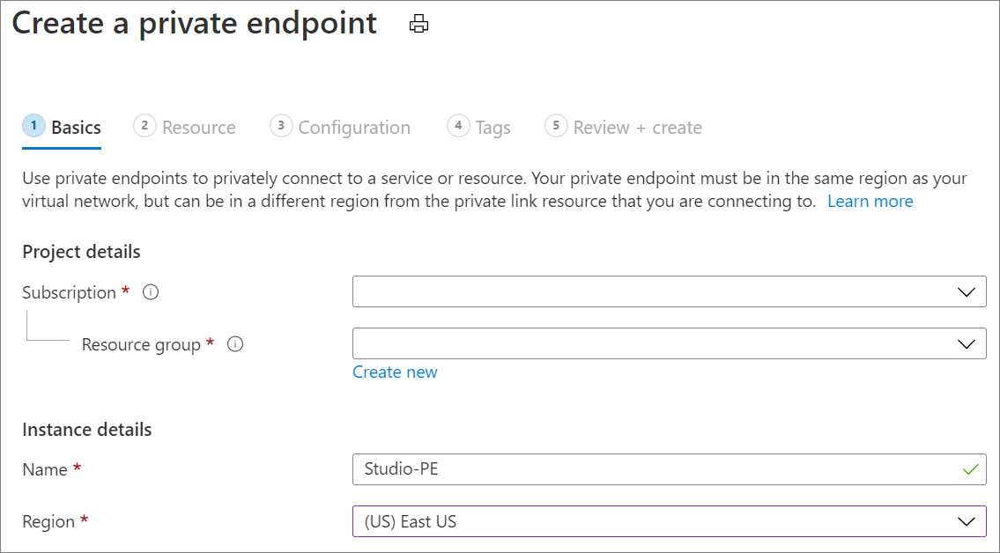
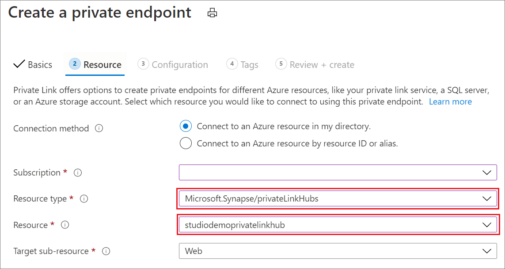
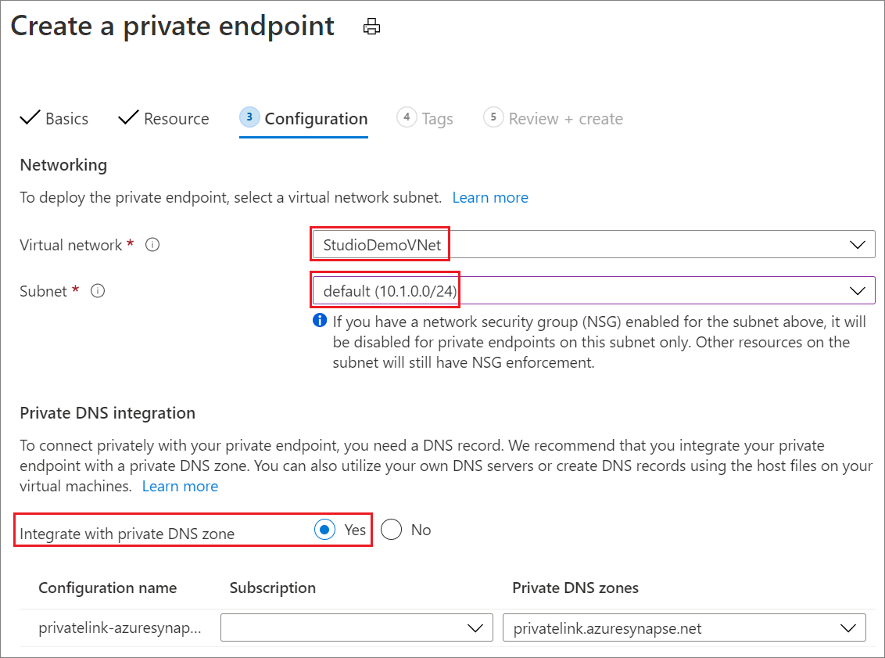
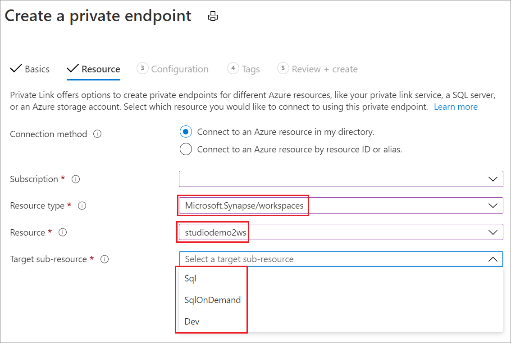

# Connect to Synapse Studio workspace resources from a restricted network

This article's target reader is the company IT admin who is managing company's restricted network. The IT admin is about to enable the network connection between the Azure Synapse Studio and the workstation within this restricted network.

From this article, you'll learn how to connect to your Azure Synapse workspace from a restricted network environment. 

## Prerequisites

* **Azure subscription**: If you don't have an Azure subscription, create a [free Azure account](https://azure.microsoft.com/free/) before you begin.
* **Azure Synapse workspace**: If you don't have a Synapse Studio, create a Synapse workspace from Azure Synapse Analytics. The workspace name will be needed in following step 4.
* **A restricted network**: The restricted network is maintained by the company IT admin. IT admin has the permission to configure the network policy. The virtual network name and its subnet will be needed in following step 3.

## Step 1: Add network outbound security rules to the restricted network

You'll need to add four network outbound security rules with four service tags. Learn more about [Service tags overview](https://docs.microsoft.com/en-us/azure/virtual-network/service-tags-overview) 
* AzureResourceManager
* AzureFrontDoor.Frontend
* AzureActiveDirectory
* AzureMonitor (Optional. Add this type of rule only when you want to share the data to Microsoft.)

**Azure Resource Manager** outbound rule details as below. When you're creating the other three rules, replace the value of "**Destination service tag**" with choosing the service tag name "**AzureFrontDoor.Frontend**", "**AzureActiveDirectory**", "**AzureMonitor**" from the drop-down selection list.

## Step 2: Create Azure Synapse Analytics (private link hubs)

You'll need to create an Azure Synapse Analytics (private link hubs) from Azure portal. Search "**Azure Synapse Analytics (private link hubs)**" through the Azure portal, and then fill the needed field and create it. Note: the region should be same as the one where your Synapse workspace is.

## Step 3: Create private link endpoint for Synapse Studio gateway

To access the Synapse Studio gateway, you'll need to create private link endpoint from Azure portal. Search "**Private Link**" through the Azure portal. Select "**Create private endpoint**" in the "**Private Link Center**" and then fill the needed field and create it. 

Note: the region should be same as the one where your Synapse workspace is.

In the next tab of "**Resource**", choose the private link hub, which was created in Step 2 above.

In the next tab of "**Configuration**", 
* Choose the restricted virtual network name you have for "**Virtual network**".
* Choose the Subnet of the restricted virtual network for "**Subnet**". 
* Select "**Yes**" to "**Integrate with private DNS zone**".

After the private link endpoint is created, you can access the sign-in page of Synapse studio web tool. However you are not able to access the resources inside your Synapse workspace yet until you will need to complete the next step.

## Step 4: Create private link endpoints for Synapse Studio workspace resource

To access the resources inside your Synapse Studio workspace resource, you'll need to create at least one private link endpoint with "**Dev**" type of "**Target sub-resource**" and two other optional private link endpoints with types of "**Sql**" or "**SqlOnDemand**" depends on what resources in Synapse studio workspace you'd like to access. This private link endpoint creation for Synapse studio workspace is similar as above endpoint creation.  

Pay attention to below areas in tab of "**Resource**":
* Select "**Microsoft.Synapse/workspaces**" to "**Resource type**".
* Select "**YourWorkSpaceName**" to "**Resource**" which you've created before.
* Select the endpoint type in "**Target sub-resource**":
  * **Sql**: is for SQL query execution in SQL pool.
  * **SqlOnDemand**: is for SQL built-in query execution.
  * **Dev**: is for accessing everything else inside Synapse Studio workspaces. You need to create at least the private link endpoint of with this type.

Now, all set. You can access your Synapse studio workspace resource.

## Next steps

Learn more about [Managed workspace Virtual Network](./synapse-workspace-managed-vnet.md)

Learn more about [Managed private endpoints](./synapse-workspace-managed-private-endpoints.md)
