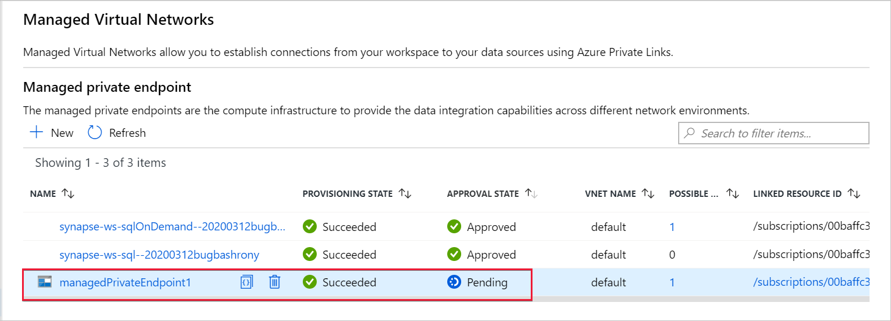

# Create a Managed private endpoint to your data source

This article will teach you how to create a Managed private endpoint to your data source in Azure. See [Managed private endpoints](./synapse-workspace-managed-private-endpoints.md) to learn more.

## Linked Services for your data sources

## Step 1: Open your Azure Synapse workspace in Azure Portal
You can create a Managed private endpoint to your data source from Azure Synapse Studio. Select the **Overview** tab in Azure Portal and select **Launch Synapse Studio**.

## Step 2: Navigate to the Managed Virtual Networks tab in Synapse Studio

In Azure Synapse Studio, select the **Manage** tabe from the left navigation. Select **Managed Virtual Networks** and then select **+ New**.

## Step 3: Select the data source type
Select the data source type. In this case, the target data source is an ADLS gen2 account. Select **Continue**.

## Step 4: Enter information about the data source
In the next window, enter information about the data source. In this example, we are creating a Managed private endpoint to an ADLS gen2 account. Enter a **Name** for the Managed private endpoint. Provide an **Azure subscription** and a **Storage account name**. Select **Create**.

## Step 5: Verify that your Managed private endpoint was successfully created
Once the Managed private endpoint creation request is submitted, you will see the status of your request. You can verify that your Managed private endpoint was created successfully by checking its *Provisioning State*. In this example, you can see that the Managed private endpoint to the ADLS gen2 account was successfully created. You can also see that the *Approval State* is *Pending*. The owner of the resource to which you are creating a Managed private endpoint must approve or deny the request before the private link is established or not. 

## Next steps

Learn more about [Managed private endpoints](./synapse-workspace-managed-private-endpoints.md)