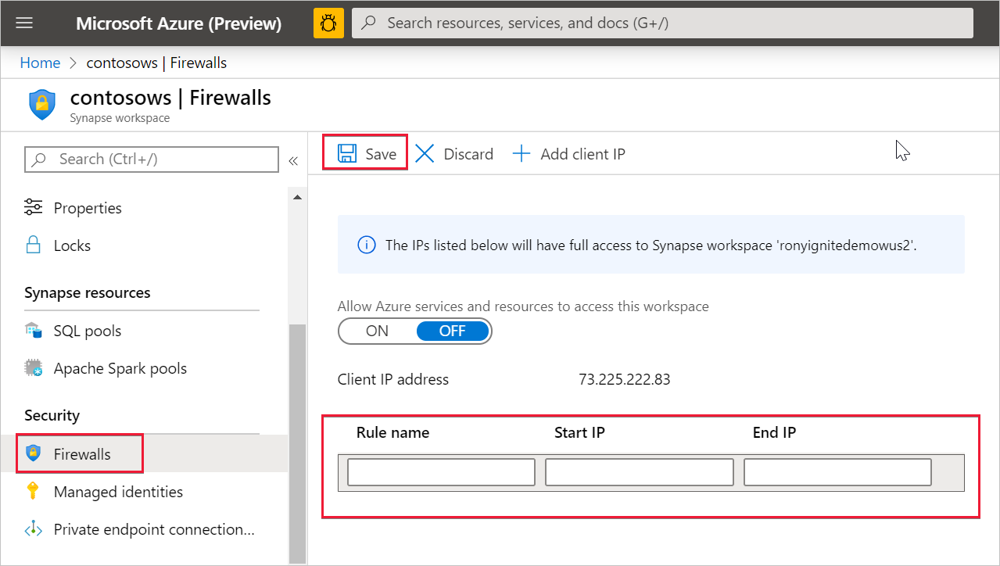

<!---Recommended: Remove all the comments in this template before you sign-off or merge to master.--->

<!---
This article explains IP firewall rules to the user and then guides the user to configure IP firewall rules for their Synapse workspace
--->

# Azure Synapse Analytics IP firewall rules (preview)
<!---Required: 
For the H1 - that's the primary heading at the top of the article - use the format "What is <service>?"
You can also use this in the TOC if your service name doesn't cause the phrase to wrap.
--->

## IP firewall rules
IP firewall rules grant or deny access to your Synapse workspace based on the originating IP address of each request. You can configure IP firewall rules for your workspace. IP firewall rules configured at the workspace level apply to all public endpoints of the workspace (SQL pools, SQL on-demand, and Development).

## Create and manage IP firewall rules

There are two ways IP firewall rules are added to a Synapse workspace. An IP firewall rule is added to your workspace if you select **Security + networking** and check **Allow connections from all IP addresses** when you create your workspace.

.

.

You can also add IP firewall rules to a Synapse workspace after the workspace is created. Select **Firewalls** under **Security** from Azure portal. To add a new IP firewall rule, give it a name, Start IP, and End IP. Select **Save** when done.

.

## Connecting to Synapse from your own network 
You can connect to your Synapse workspace using Synapse Studio. You can also use SQL Server Management Studio (SSMS) to connect to the SQL resources (SQL pools and SQL on-demand) in your workspace. You must ensure that the firewall on your network and local computer allow outgoing communication on TCP ports 80, 443 and 1443 for Synapse Studio. You must also allow outgoing communication on UDP port 53 for Synapse Studio. To connect using tools such as SSMS and Power BI, you must allow outgoing communication on TCP port 1433. If you are using the default Redirect connection policy setting, you may need to allow outgoing communication on additional ports. You can learn more about connection policies here.

NOTE: The communication that currently uses TCP port 1443 will use port 443 in the future. This document will be updated when that change is in effect.

<!--- Need to add next steps here.
## Next steps
--->