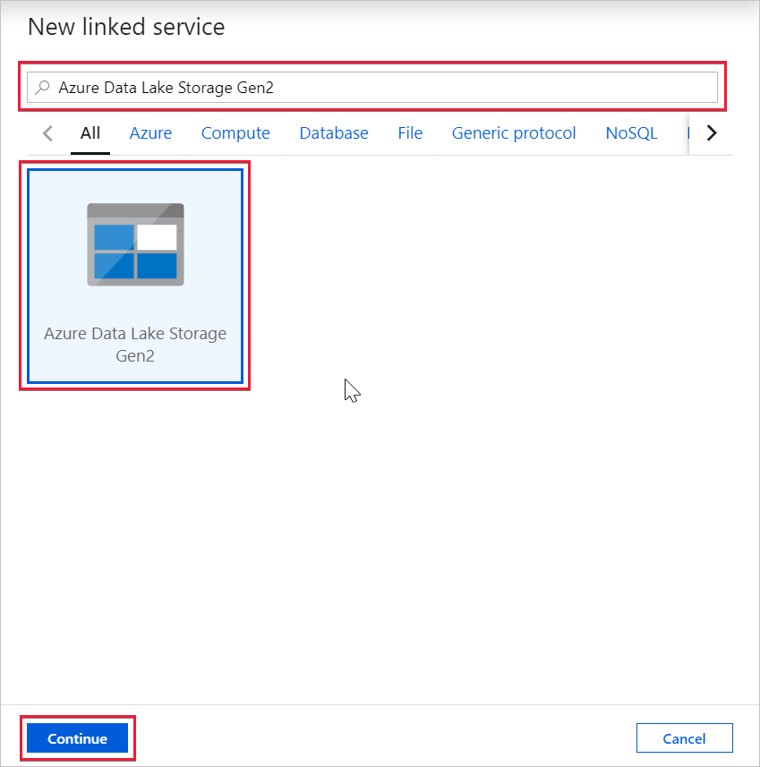

# Azure Synapse workspace managed identity (preview)

In this article, you'll learn about managed identity in Azure Synapse workspace.

## Managed identities

Managed identity for Azure resources is a feature of Azure Active Directory. The feature provides Azure services with an automatically managed identity in Azure AD. You can use the Managed Identity capability to authenticate to any service that support Azure AD authentication.

Managed identities for Azure resources are the new name for the service formerly known as Managed Service Identity (MSI). See [Managed Identities](https://docs.microsoft.com/azure/active-directory/managed-identities-azure-resources/overview) to learn more.

## Azure Synapse workspace managed identity

A system-assigned managed identity is created for your Azure Synapse workspace when you create the workspace.

>[!NOTE]
>This workspace managed identity will be referred to as managed identity through the rest of this document.

Azure Synapse uses the managed identity to orchestrate pipelines. The managed identity lifecycle is directly tied to the Azure Synapse workspace. If you delete the Azure Synapse workspace, then the managed identity is also cleaned up.

The workspace managed identity needs permissions to perform operations in the pipelines. You can use the object ID or your Azure Synapse workspace name to find the managed identity when granting permissions.

## Retrieve managed identity in Azure portal

You can retrieve the managed identity in Azure portal. Open your Azure Synapse workspace in Azure portal and select **Overview** from the left navigation. The managed identity's object ID is displayed to in the main screen.

The managed identity information will also show up when you create a linked service that supports managed identity authentication from Azure Synapse Studio.

Launch **Azure Synapse Studio** and select the **Manage** tab from the left navigation. Then select **Linked services** and choose the **+ New** option to create a new linked service.

In the **New linked service** window, type *Azure Data Lake Storage Gen2*. Select the **Azure Data Lake Storage Gen2** resource type from the list below and choose **Continue**.

In the next window, choose **Managed Identity** for **Authentication method**. You'll see the managed identity's **Name** and **Object ID**.

## Next steps

[Granting permissions to Azure Synapse workspace managed identity](./how-to-grant-workspace-managed-identity-permissions.md)
