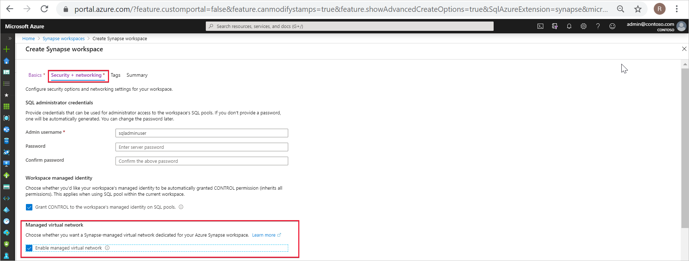

# Managed private endpoints (preview)
<!---Required: 
For the H1 - that's the primary heading at the top of the article - use the format "What is <service>?"
You can also use this in the TOC if your service name doesn't cause the phrase to wrap.
--->
This article will explain Managed private endpoints in Azure Synapse Analytics
## Managed private endpoints

<!---
Need to call out the following 
1. cost put a link
2. will need to use managed private endpoints when the vnet is closed or when a storage account is acled
--->

## Create a Synapse workspace with a Managed workspace VNet

To create a Synapse workspace that has a Managed workspace VNet associated with it, select the **Security + networking** tab in Azure portal and check the **Enable managed virtual network** checkbox. If you leave the checkbox unchecked, then your workspace won't have a VNet associated with it. 

>[!IMPORTANT]
>You can only use private links in a workspace with a Managed workspace VNet.

.

>[!NOTE] 
All outbound traffic from the Managed workspace VNet will be blocked in the future. It's recommended that you connect to all your data sources using Managed private endpoints.   

<!--- Need to add next steps here.
## Next steps
--->
