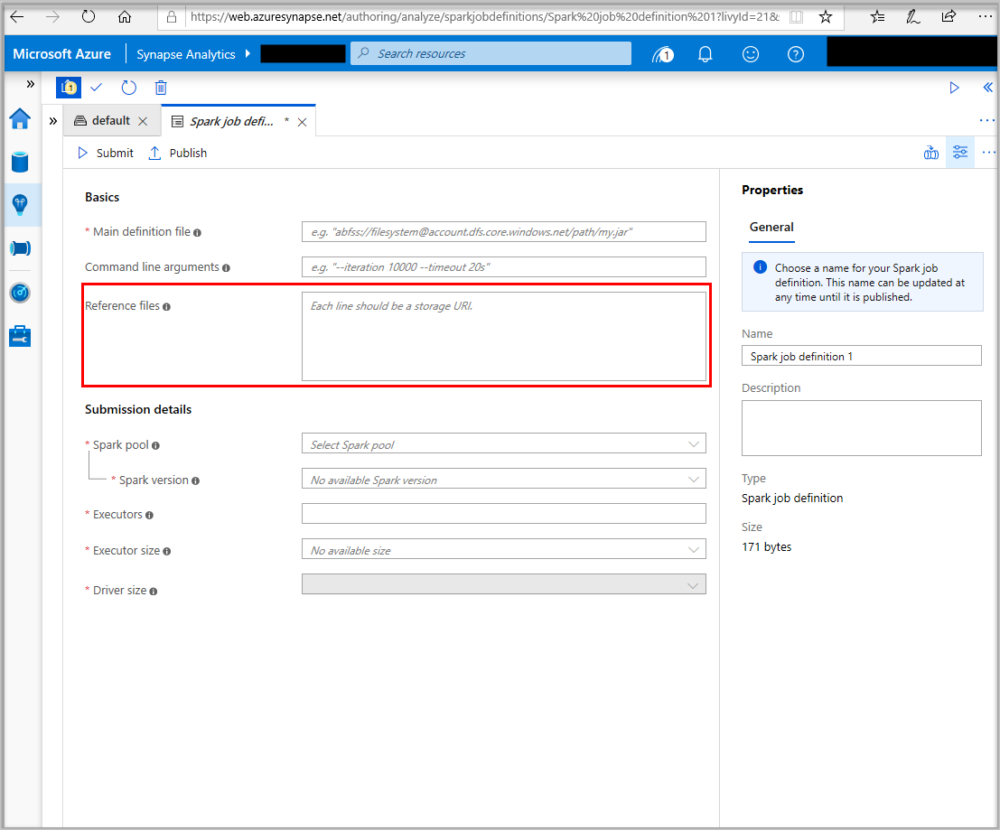

# Library and Package Management

Apache Spark depends on many libraries to provide functionality. These libraries can be augmented or replaced with additional libraries or updated versions of older ones.

Python packages can be added at the Spark pool level and .jar based packages can be added at the Spark job definition level.

## Adding or updating Python libraries

Apache Spark in Azure Synapse Analytics has a full Anacondas install plus additional libraries. The full list can be found here [Apache Spark version support](apache-spark-version-support.md). When a Spark instance starts up, a new virtual environment is created using this installation as the base. Additionally, a requirements.txt file (pip freeze output) can be used to upgrade the virtual environment. The packages listed in this file for install or upgrade are downloaded from PyPi at the time of cluster startup. This requirements file is used every time a Spark instance is created from that Spark pool.

> [!IMPORTANT]
>
> - If the package you are installing is large or takes a long time to install, this affects the Spark instance start up time.
> - Packages which require compiler support at install time, such as GCC, are not supported.
> - Packages can not be downgraded, only added or upgraded.

### Requirements format

The following snippet shows the format for the requirements file. The PyPi package name is listed along with an exact version. This file follows the format described here: [pip freeze](https://pip.pypa.io/en/stable/reference/pip_freeze/). This example pins the version specifically, you can also specify "no larger than" and "less than" versions in this file.

absl-py==0.7.0

adal==1.2.1

alabaster==0.7.10

### Python library User Interface

The UI for adding libraries is in the "Add new Apache Spark pool" UI on the additional page of the Azure portal experience.

You can see where to apply the file below:

## Adding or updating .jar files (Java or Scala)

The full list of .jar files that are preinstalled can be found here [Apache Spark version support](apache-spark-version-support.md). It is possible to use a job definition with a Spark job and one of the properties of that job definition is a list of reference file locations in ADLS storage where all the .jar files are read from.

### Spark job definition User Interface

To add a new Spark job definition, press the **+** at the top of the **Develop** explorer view that shows notebooks and other development artifacts.

You can see below:

## Next steps

- [.NET for Apache Spark documentation](https://docs.microsoft.com/dotnet/spark)
- [Azure Synapse Analytics](https://docs.microsoft.com/azure/synapse-analytics)
