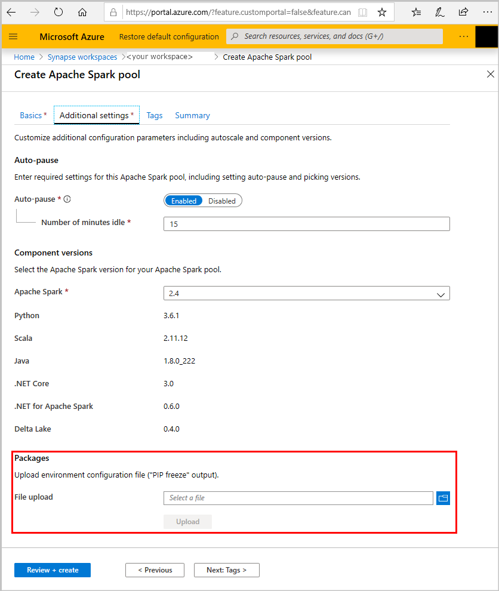

# Add and manage libraries for Apache Spark in Azure Synapse Analytics

Apache Spark depends on many libraries to provide functionality. These libraries can be augmented or replaced with additional libraries or updated versions of older ones.

Python packages can be added at the Spark pool level and .jar based packages can be added at the Spark job definition level.

## Adding or updating Python libraries

Apache Spark in Azure Synapse Analytics has a full Anacondas install plus additional libraries. The full list can be found at [Apache Spark version support](apache-spark-version-support.md). When a Spark instance starts up, a new virtual environment is created using this installation as the base. Additionally, a *requirements.txt* file (output from the `pip freeze` command) can be used to upgrade the virtual environment. The packages listed in this file for install or upgrade are downloaded from PyPi at the time of cluster startup. This requirements file is used every time a Spark instance is created from that Spark pool.

> [!IMPORTANT]
>
> * If the package you are installing is large or takes a long time to install, this affects the Spark instance start up time.
> * Packages which require compiler support at install time, such as GCC, are not supported.
> * Packages can not be downgraded, only added or upgraded.

### Requirements format

The following snippet shows the format for the requirements file. The PyPi package name is listed along with an exact version. This file follows the format described in the [pip freeze](https://pip.pypa.io/en/stable/reference/pip_freeze/) reference documentation. This example pins a specific version. You can also specify "no larger than" and "less than" versions in this file.

```
absl-py==0.7.0

adal==1.2.1

alabaster==0.7.10
```

### Python library user interface

The UI for adding libraries is in the **Additional settings** tab of the **Create Apache Spark pool** page on the Azure portal.

Upload the environment configuration file using the file selector in the **Packages** section of the page.



## Next steps

* [Azure Synapse Analytics](https://docs.microsoft.com/azure/synapse-analytics)
* [Apache Spark Documentation](https://spark.apache.org/docs/2.4.4/)
