# Tutorial: Use Azure Synapse Analytics to create Apache Spark job definitions for Synapse Spark pools

This tutorial demonstrates how to use the Azure Synapse Analytics to create Spark job definitions, and then submit them to a Synapse Spark pool. You can use the plug-in in a few ways:

* Develop and submit a Spark job definition on a Synapse Spark pool.
* View job details after submission.

In this tutorial, you learn how to:

> [!div class="checklist"]
>
> * Develop and submit a Spark job definition on a Synapse Spark pool.
> * View job details after submission.

## Prerequisites

* An Azure Synapse Analytics workspace. For instructions, see [Create an Azure Synapse Analytics workspace](../../machine-learning/how-to-manage-workspace.md?toc=/azure/synapse-analytics/toc.json&bc=/azure/synapse-analytics/breadcrumb/toc.json#create-a-workspace).

## Get started

Before submitting a Spark job definition, you need to be the Storage Blob Data Owner of the ADLS Gen2 filesystem you want to work with. If you aren't, you need to add the permission manually.

### Scenario 1: Add permission

1. Open [Microsoft Azure](https://ms.portal.azure.com), then open Storage account.

2. Click **Containers**, then create a **File system**. This tutorial uses `sparkjob`.

    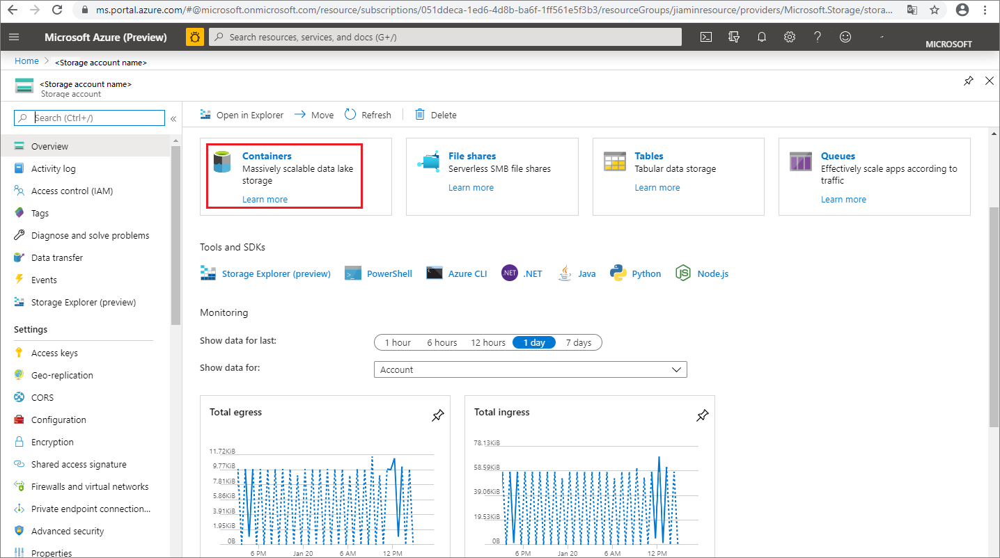

    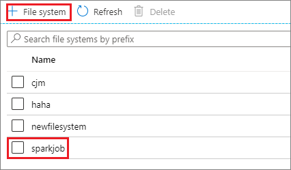

3. Open `sparkjob`, click **Access Control(IAM)**, then click **Add** and select **Add role assignment**.

    

    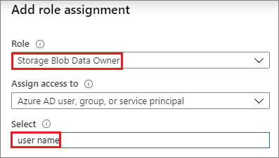

4. Click **Role assignments**, input user name, then verify user role.

    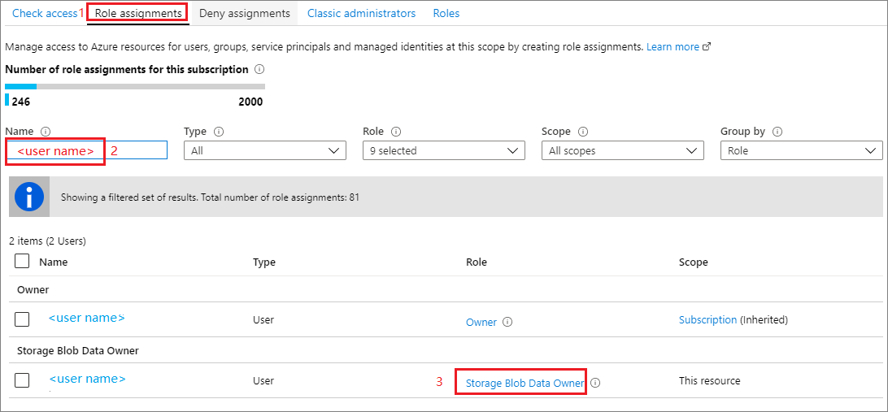

### Scenario 2: Prepare folder structure

Before submitting a Spark job definition, one job you need to do is uploading files to ADLS Gen2 and preparing folder structure there. We use Storage node in Synapse Studio to store files.

1. Open [Azure Synapse Analytics](https://web.azuresynapse.net/).

2. Click **Data**, select **Storage accounts**, and Upload the relevant files to your ADLS Gen2 filesystem. We support Scala, Java, .NET, and Python. This tutorial uses the example in the figure as a demonstration, you can change project structure as you wish.

    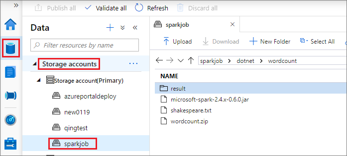

## Create a Spark job definition

1. Open [Azure Synapse Analytics](https://web.azuresynapse.net/), and select **Develop**.

2. Select **Spark job definitions** from the left pane.

3. Click **Actions** node on the right of the "Spark job definitions".

     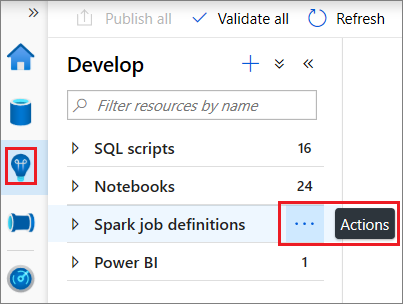

4. From the **Actions** drop-down list, select **New Spark job definition**

     

5. In the New Spark job definition window, select language, then provide the following information:  

   * Select **Language** as **Spark(Scala)**.

    |  Property   | Description   |  
    | ----- | ----- |  
    |Job definition name| Enter a name for your Spark job definition.  This tutorial uses `job definition sample`. This name can be updated at any time until it's published.|  
    |Main definition file| The main file used for the job. Select a JAR file from your storage. You can select **Upload file** to upload the file to a storage account. |
    |Main class name| The fully qualified identifier or the main class that is in the main definition file.|
    |Command-line arguments| Optional arguments to the job.|
    |Reference files| Additional files used for reference in the main definition file. You can select **Upload file** to upload the file to a storage account.|
    |Spark pool| The job will be submitted to the selected Spark pool.|
    |Spark version| Version of Spark that the Spark pool is running.|
    |Executors| Number of executors to be given in the specified Spark pool for the job.|
    |Executor size| Number of cores and memory to be used for executors given in the specified Spark pool for the job.|  
    |Driver size| Number of cores and memory to be used for driver given in the specified Spark pool for the job.|

    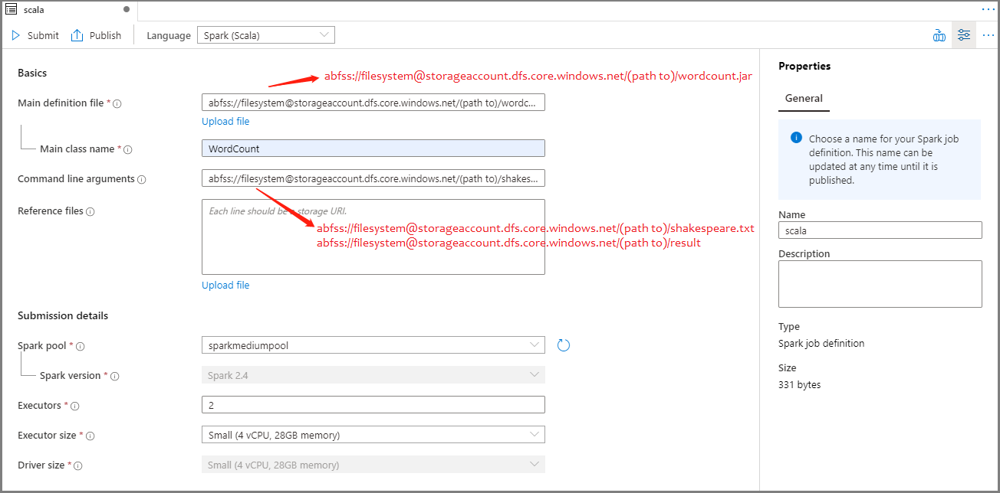

   * Select **Language** as **PySpark(Python)**.

    |  Property   | Description   |  
    | ----- | ----- |  
    |Job definition name| Enter a name for your Spark job definition.  This tutorial uses `job definition sample`. This name can be updated at any time until it's published.|  
    |Main definition file| The main file used for the job. Select a PY file from your storage. You can select **Upload file** to upload the file to a storage account.|
    |Command-line arguments| Optional arguments to the job.|
    |Reference files| Additional files used for reference in the main definition file. You can select **Upload file** to upload the file to a storage account.|
    |Spark pool| The job will be submitted to the selected Spark pool.|
    |Spark version| Version of Spark that the Spark pool is running.|
    |Executors| Number of executors to be given in the specified Spark pool for the job.|
    |Executor size| Number of cores and memory to be used for executors given in the specified Spark pool for the job.|  
    |Driver size| Number of cores and memory to be used for driver given in the specified Spark pool for the job.|

    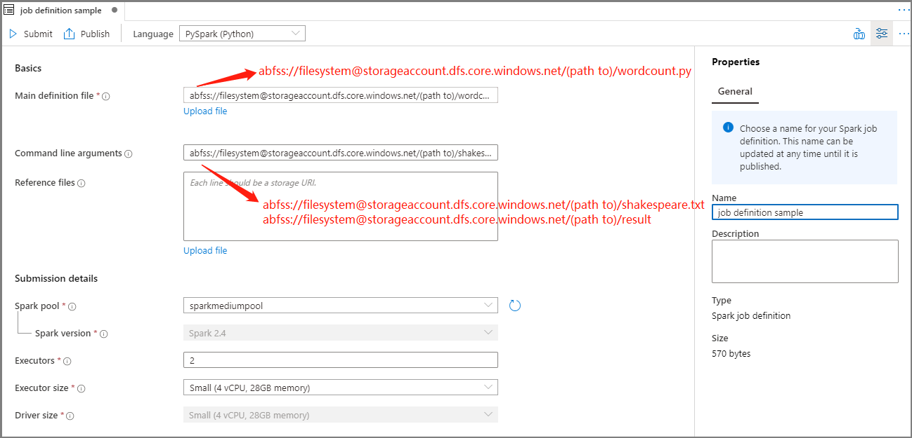

   * Select **Language** as **.NET Spark(C#/F#)**.

    |  Property   | Description   |  
    | ----- | ----- |  
    |Job definition name| Enter a name for your Spark job definition.  This tutorial uses `job definition sample`. This name can be updated at any time until it's published.|  
    |Main definition file| The main file used for the job. Select a ZIP file that contains your .NET for Spark application(that is, the main executable file, DLLs containing user-defined functions, and other required files) from your storage. You can select **Upload file** to upload the file to a storage account.|
    |Main executable file| The main executable file in the main definition ZIP file.|
    |Command-line arguments| Optional arguments to the job.|
    |Reference files| Additional files needed by the worker nodes for executing the .NET for Spark application that isn't included in the main definition ZIP file(that is, dependent jars, additional user-defined function DLLs, and other config files). You can select **Upload file** to upload the file to a storage account.|
    |Spark pool| The job will be submitted to the selected Spark pool.|
    |Spark version| Version of Spark that the Spark pool is running.|
    |Executors| Number of executors to be given in the specified Spark pool for the job.|
    |Executor size| Number of cores and memory to be used for executors given in the specified Spark pool for the job.|  
    |Driver size| Number of cores and memory to be used for driver given in the specified Spark pool for the job.|

    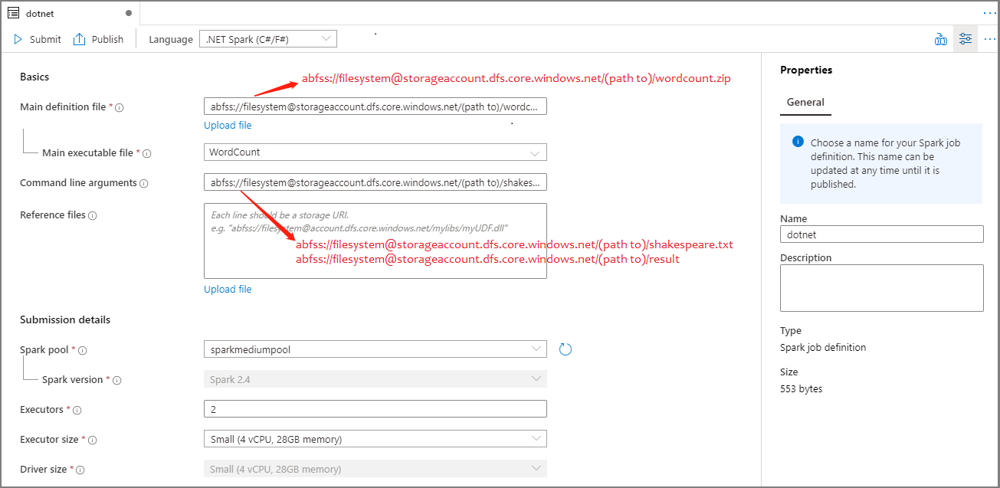

6. Select **Publish** to save the Spark job definition.

    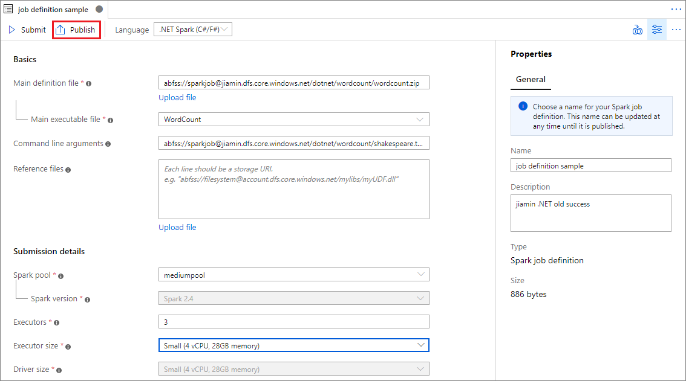

## Submit a Spark job definition

After creating a Spark job definition, you can submit it to a Synapse Spark pool. Make sure you've gone through steps in **Get-started** before trying samples in this part.

### Scenario 1: Submit Spark job definition

1. Open a spark job definition window by clicking it.

      

2. Click **submit** icon to submit your project to the selected Spark Pool. You can click **Spark monitoring URL** tab to see the LogQuery of the Spark application.

    

    

### Scenario 2: View Spark job running progress

1. Click **Monitor**, then select the **Spark applications** option. You can find the submitted Spark application.

    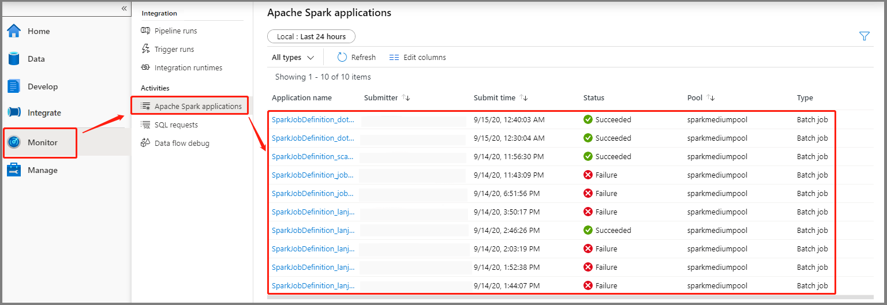

2. Then click the Spark application, **LogQuery** window displays. You can view the job execution progress from **LogQuery**.

    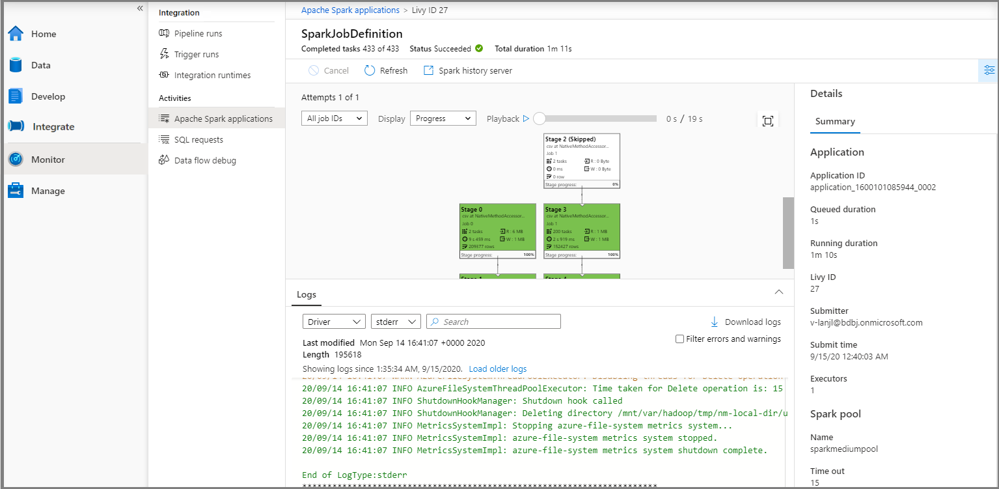

### Scenario 3: Check output file

 1. Click **Data**, then select **Storage accounts**. After a successful run, you can go to the ADLS Gen2 storage and check outputs are generated.

    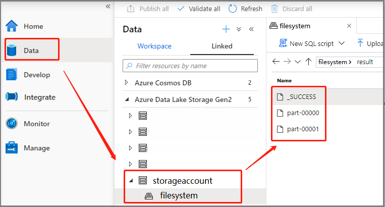

## Next steps

This tutorial demonstrated how to use the Azure Synapse Analytics to create Spark job definitions, and then submit them to a Synapse Spark pool. Next you can use Azure Synapse Analytics to create Power BI datasets and manage Power BI data. 

- [Connect to data in Power BI Desktop](https://docs.microsoft.com/power-bi/desktop-quickstart-connect-to-data)
- [Visualize with Power BI](../sql-data-warehouse/sql-data-warehouse-get-started-visualize-with-power-bi.md?toc=/azure/synapse-analytics/toc.json&bc=/azure/synapse-analytics/breadcrumb/toc.json)
