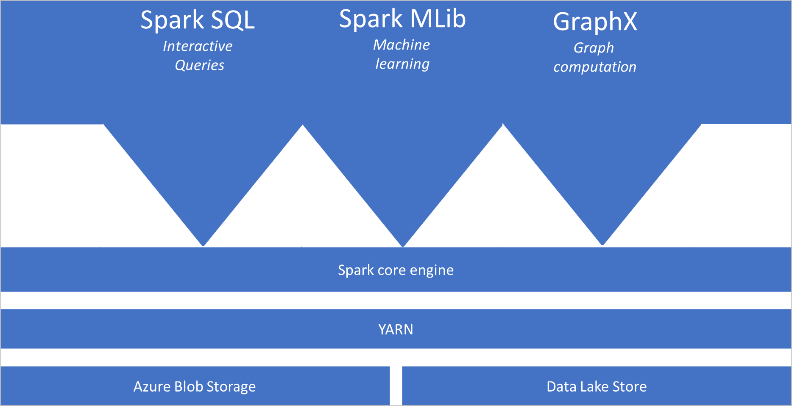
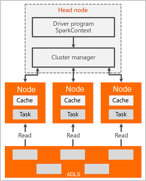

# What is Apache Spark in Azure Synapse Analytics

Apache Spark is a parallel processing framework that supports in-memory processing to boost the performance of big-data analytic applications. Apache Spark in Azure Synapse Analytics is one of Microsoft's implementations of Apache Spark in the cloud. Azure Synapse Analytics makes it easy to create and configure a Spark pool in Azure. Spark pools in Synapse Analytics are compatible with Azure Storage and Azure Data Lake Generation 2 Storage. So you can use Synapse Analytics Spark pools to process your data stored in Azure. 

## What is Apache Spark

Spark provides primitives for in-memory cluster computing. A Spark job can load and cache data into memory and query it repeatedly. In-memory computing is much faster than disk-based applications. Spark also integrates with multiple programming languages to let you manipulate distributed data sets like local collections. There's no need to structure everything as map and reduce operations.

Spark pools in Synapse Analytics offer a fully managed Spark service. The benefits of creating a Spark pool in Synapse Analytics are listed here.

| Feature | Description |
| --- | --- |
| Speed and Efficiency |Spark instances start in approx. 2 mins for fewer than 60 nodes and approx. 5 mins for more than 60 nodes. The instance will shut down, by default, in 5 mins after the last job executed unless it is "kept alive" by a notebook connection. |
| Ease of creation |You can create a new Spark pool in Synapse Analytics in minutes using the Azure portal, Azure PowerShell, or the Synapse Analytics .NET SDK. See [Get started with Apache Spark pools in Synapse Analytics](apache-spark-notebook-create-spark-use-sql.md). |
| Ease of use |Synapse Analytics includes a custom notebook derived from nteract. You can use these notebooks for interactive data processing and visualization.|
| REST APIs |Spark in Synapse Analytics includes [Apache Livy](https://github.com/cloudera/hue/tree/master/apps/spark/java#welcome-to-livy-the-rest-spark-server), a REST API-based Spark job server to remotely submit and monitor jobs. |
| Support for Azure Data Lake Storage Generation 2| Spark pools in Synapse Analytics can use Azure Data Lake Storage Generation 2 as well as BLOB storage. For more information on Data Lake Storage, see [Overview of Azure Data Lake Storage](../../data-lake-store/data-lake-store-overview.md). |
| Integration with third-party IDEs | Synapse Analytics provides an IDE plugin for Jetbrains IntelliJ that is useful to create and submit applications to an Synapse Analytics Spark pool. |
| Pre-loaded Anaconda libraries |Spark pools in Synapse Analytics come with Anaconda libraries pre-installed. [Anaconda](https://docs.continuum.io/anaconda/) provides close to 200 libraries for machine learning, data analysis, visualization, etc. |
| Scalability | Apache Spark in Synapse Analytics pools can have Auto-Scale enabled, pools will scale up and down as needed. Also, Spark pools can be shut down with no loss of data since all the data is stored in Azure Storage or Data Lake Storage. |

Apache Spark pools in Synapse Analytics include the following components that are available on the pools by default.

* [Spark Core](https://spark.apache.org/docs/latest/). Includes Spark Core, Spark SQL, Spark streaming APIs, GraphX, and MLlib.
* [Anaconda](https://docs.continuum.io/anaconda/)
* [Apache Livy](https://github.com/cloudera/hue/tree/master/apps/spark/java#welcome-to-livy-the-rest-spark-server)
* [Nteract notebook](https://nteract.io/)

## Spark pool architecture

<!--- TODO: Need to replace this diagram

--->
It is easy to understand the components of Spark by understanding how Spark runs on Synapse Analytics.

Spark applications run as independent sets of processes on a pool, coordinated by the SparkContext object in your main program (called the driver program).

The SparkContext can connect to the cluster manager, which allocates resources across applications. The cluster manager is [Apache Hadoop YARN](https://hadoop.apache.org/docs/current/hadoop-yarn/hadoop-yarn-site/YARN.html). Once connected, Spark acquires executors on nodes in the pool, which are processes that run computations and store data for your application. Next, it sends your application code (defined by JAR or Python files passed to SparkContext) to the executors. Finally, SparkContext sends tasks to the executors to run.

The SparkContext runs the user's main function and executes the various parallel operations on the nodes. Then, the SparkContext collects the results of the operations. The nodes read and write data from and to the file system. The nodes also cache transformed data in-memory as Resilient Distributed Datasets (RDDs).

The SparkContext connects to the Spark pool and is responsible for converting an application to a directed graph (DAG). The graph consists of individual tasks that get executed within an executor process on the nodes. Each application gets its own executor processes, which stay up for the duration of the whole application and run tasks in multiple threads.

## Apache Spark in Synapse Analytics use cases

Spark instances in Synapse Analytics enable the following key scenarios:

* Data Engineering/Data Preparation

    Apache Spark includes many language features to support preparation and processing of large volumes of data so that it can be made more valuable and then consumed by other services within Synapse Analytics. This is enabled through multiple languages (C#, Scala, PySpark, Spark SQL) and supplied libraries for processing and connectivity.

* Machine Learning

    Apache Spark comes with [MLlib](https://spark.apache.org/mllib/), a machine learning library built on top of Spark that you can use from a Spark pool in Synapse Analytics. Spark pools in Synapse Analytics also includes Anaconda, a Python distribution with a variety of packages for data science including machine learning. When combined with built-in support for notebooks, you have an environment for creating machine learning applications.

<!--- TODO: add this back in when streaming is enabled
* Spark streaming and real-time data analysis

    Spark pools in Synapse Analytics offer rich support for building real-time analytics solutions. While Spark already has connectors to ingest data from many sources like Kafka, Flume, Twitter, ZeroMQ, or TCP sockets, Spark in Synapse Analytics adds first-class support for ingesting data from Azure Event Hubs. Event Hubs is the most widely used queuing service on Azure. Having an out-of-the-box support for Event Hubs makes Spark clusters in Synapse Analytics an ideal platform for building real-time analytics pipeline.
--->

## Where do I start

You can use the following articles to learn more about Apache Spark in Synapse Analytics:

* [Quickstart: Create an Apache Spark cluster in HDInsight and run interactive query using Jupyter](./apache-spark-notebook-create-spark-use-sql.md)
<!---TODO: * [Tutorial: Run an Apache Spark job using Jupyter](./apache-spark-load-data-run-query.md)--->
* [Tutorial: Machine learning using Apache Spark](./apache-spark-machine-learning-mllib-notebook.md)
<!---TODO: * [Tutorial: Create a Scala Maven application using IntelliJ](./apache-spark-create-standalone-application.md)--->

## Next Steps

In this overview, you get some basic understanding of Apache Spark in Azure HDInsight. Advance to the next article to learn how to create an HDInsight Spark cluster and run some Spark SQL queries:

* [Create an Apache Spark cluster in Azure Synapse](./apache-spark-notebook-create-spark-use-sql.md)
