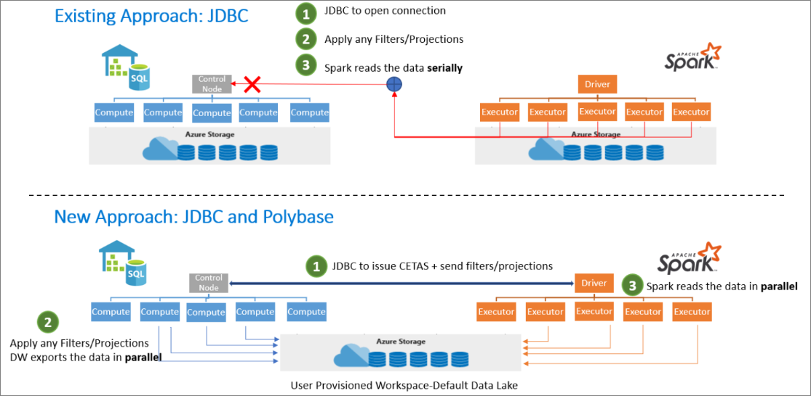

# Introduction

The Spark SQL Analytics Connector is designed to efficiently transfer data between Apache Spark pools and SQL pools in Azure Synapse. The Spark SQL Analytics Connector works on SQL pools only, it does not work with SQL on-Demand.

## Design

Transferring data between Apache Spark pools and SQL pools can be done using JDBC. However, given two distributed systems such as Spark and SQL pools (which provides massively parallel processing (MPP)), JDBC tends to be a bottleneck with serial data transfer.

The Apache Spark pools to SQL Analytics Connector is a data source implementation for Apache Spark. It uses the Azure Data Lake Storage Gen 2, and Polybase in SQL pools to efficiently transfer data between the Spark cluster and the SQL Analytics instance.



## Authentication in Azure Synapse Analytics

Authentication between systems is made seamless in Azure Synapse Analytics. There is a Token Service that connects with Azure Active Directory to obtain security tokens for use when accessing the storage account or the data warehouse server. For this reason, there is no need to create credentials or specify them in the connector API as long as AAD-Auth is configured at the storage account and the data warehouse server. If not, SQL Auth can be specified. Find more details in the [Usage](#usage) section.

## Constraints

- This connector works only in Scala.

## Prerequisites

- Have **db_exporter** role in the database/SQL pool you want to transfer data to/from.

To create users, connect to the database, and follow these examples:

```Sql
CREATE USER Mary FROM LOGIN Mary;
CREATE USER [mike@contoso.com] FROM EXTERNAL PROVIDER;
```

To assign a role:

```Sql
EXEC sp_addrolemember 'db_exporter', 'Mary';
```

## Usage

The import statements do not need to be provided, they are pre-imported for the notebook experience.

### Transferring data to or from a SQL pool in the Logical Server (DW Instance) attached with the workspace

> [!NOTE]
> **Imports not needed in notebook experience**

```Scala
 import com.microsoft.spark.sqlanalytics.utils.Constants
 import org.apache.spark.sql.SqlAnalyticsConnector._
```

#### Read API

```Scala
val df = spark.read.sqlanalytics("[DBName].[Schema].[TableName]")
```

The above API will work for both Internal (Managed) as well as External Tables in the SQL pool.

#### Write API

```Scala
df.write.sqlanalytics("[DBName].[Schema].[TableName]", [TableType])
```

where TableType can be Constants.INTERNAL or Constants.EXTERNAL

```Scala
df.write.sqlanalytics("[DBName].[Schema].[TableName]", Constants.INTERNAL)
df.write.sqlanalytics("[DBName].[Schema].[TableName]", Constants.EXTERNAL)
```

The authentication to Storage and the SQL Server is done

### If you are transferring data to or from a SQL pool or database in a Logical Server outside the workspace

> [!NOTE]
> Imports not needed in notebook experience

```Scala
 import com.microsoft.spark.sqlanalytics.utils.Constants
 import org.apache.spark.sql.SqlAnalyticsConnector._
```

#### Read API

```Scala
val df = spark.read.
option(Constants.SERVER, "samplews.database.windows.net").
sqlanalytics("<DBName>.<Schema>.<TableName>")
```

#### Write API

```Scala
df.write.
option(Constants.SERVER, "[samplews].[database.windows.net]").
sqlanalytics("[DBName].[Schema].[TableName]", [TableType])
```

### Using SQL Auth instead of AAD

#### Read API

Currently the connector does not support token-based auth to a SQL pool that is outside of the workspace. You need to use SQL Auth.

```Scala
val df = spark.read.
option(Constants.SERVER, "samplews.database.windows.net").
option(Constants.USER, [SQLServer Login UserName]).
option(Constants.PASSWORD, [SQLServer Login Password]).
sqlanalytics("<DBName>.<Schema>.<TableName>")
```

#### Write API

```Scala
df.write.
option(Constants.SERVER, "[samplews].[database.windows.net]").
option(Constants.USER, [SQLServer Login UserName]).
option(Constants.PASSWORD, [SQLServer Login Password]).
sqlanalytics("[DBName].[Schema].[TableName]", [TableType])
```

### Using the PySpark connector

> [!NOTE]
> This example is given with only the notebook experience kept in mind.

Assume you have a dataframe "pyspark_df" that you want to write into the DW.

Create a temp table using the dataframe in PySpark

```Python
pyspark_df.createOrReplaceTempView("pysparkdftemptable")
```

Run a Scala cell in the PySpark notebook using magics

```Scala
%%spark
val scala_df = spark.sqlContext.sql ("select * from pysparkdftemptable")

pysparkdftemptable.write.sqlanalytics("sqlpool.dbo.PySparkTable", Constants.INTERNAL)
```

Similarly, in the read scenario, read the data using Scala and write it into a temp table, and use Spark SQL in PySpark to query the temp table into a dataframe.
