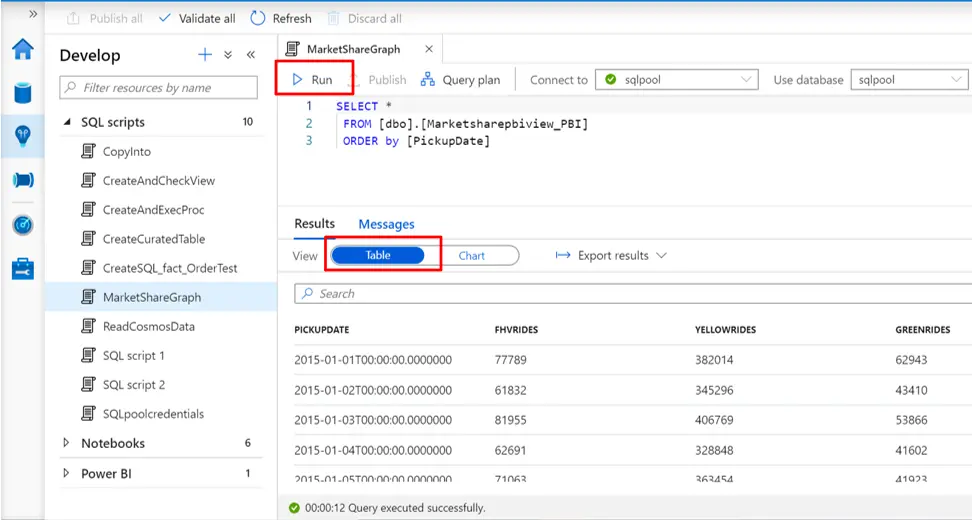
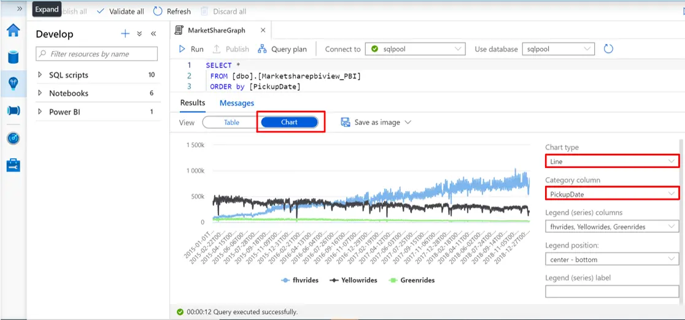
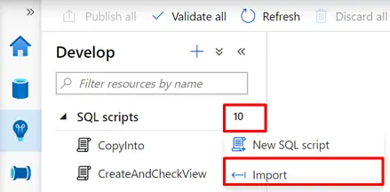
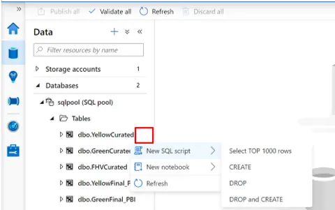

# Using Azure Synapse Analytics studio SQL Script

Azure Synapse Analytics studio SQL script is a web interface for you to author your SQL query connecting to SQL pool and SQL On-demand.

## Create a SQL Script and author its content

There are few ways to start the authoring experience in SQL script. You can create a new SQL script: 
1. Add new resource by clicking on the "+" icon and choose "SQL script"  

a. Choose a name for your SQL script by clicking on the "Property" button   and replace the default name assigned to the SQL script

b. Choose the specific SQL Pool or the SQL On-Demand from the "Connect to" drop-down menu and if necessary choose the database from "Use database"

c. Start authoring your SQL script and leverage the intellisense feature

d. Run your SQL script
Click the "Run" button to execute your SQL script. The results are displayed by default in a table  

You can export the results to your local storage in different formats (including CSV, Excel, JSON, XML) by clicking "Export results" and choose the extension. 
You can also visualize the SQL script results in a chart by clicking on the "Chart" button. Select the "Chart type" and "Category column". You can finally export the chart into a picture by clicking on "Save as image".  

1. Other methods to create a new SQL Script
a. Choose "New SQL script" from the "Actions" menu under Develop SQL scripts. Then continue the authoring process following the instructions from step 1.a

b. Choose "Import" from the "Actions" menu under Develop SQL scripts and select an existing SQL script from your local storage. Then continue the authoring process following the instructions from step 1.a   

1. Exploring Data from Storage accounts and Database using "SQL script"
a. Parquet file using SQL analytics on-demand: You can explore Parquet files in a Storage Account using SQL script to preview the file content  

1. SQL Tables, external tables, views: by clicking on the "Actions" menu under Data you can perform several actions like: "New SQL script" "Select TOP 1000 rows", "CREATE", "DROP and CREATE". Explore the available gesture by clicking on the right nodes of SQL Pool and SQL analytics on-demand   

## Next steps

For more information about authoring a SQL script, see:
[Azure Synapse Analytics](https://docs.microsoft.com/azure/synapse-analytics)