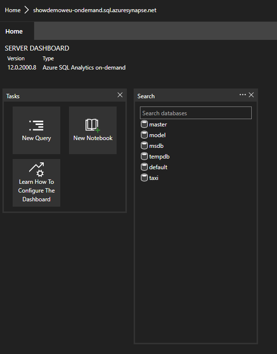
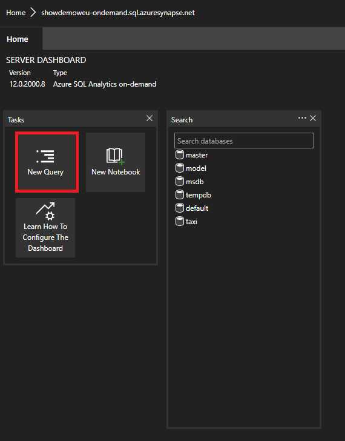

# Connect to SQL Analytics with Azure Data Studio (preview)

> [!div class="op_single_selector"]
> * [Azure Data Studio](get-started-azure-data-studio.md)
> * [Power BI](get-started-power-bi-professional.md)
> * [Visual Studio](../sql-data-warehouse/sql-data-warehouse-query-visual-studio.md)
> * [sqlcmd](get-started-connect-sqlcmd.md)
> * [SSMS](get-started-ssms.md)
> 
> 

You can use [Azure Data Studio (preview)](/sql/azure-data-studio/download-azure-data-studio) to connect to and query SQL Analytics in Azure Synapse Analytics. 

## Connect 

To connect to SQL Analytics, open Azure Data Studio and select **New Connection**.


Choose **Microsoft SQL Server** as the **Connection type**. 

The connection requires the following parameters:

* **Server:** Server in the form `<Azure Synapse workspace name>`-ondemand.sql.azuresynapse.net
* **Database:** Database name

> [!NOTE]
> If you would like to use **SQL on-demand (preview)** the URL should look like: 
> - `<Azure Synapse workspace name>`-ondemand.sql.azuresynapse.net.

> [!NOTE]
> If you would like to use **SQL pool** the URL should look like: 
> - `<Azure Synapse workspace name>`.sql.azuresynapse.net

Choose **Windows Authentication**, **Azure Active Directory**, or **SQL Login** as the **Authentication Type**. 

To use **SQL Login** as the authentication type, add the username/password parameters:

* **User:** Server user in the form `<User>`
* **Password:** Password associated with the user

To use Azure Active Directory, you need to choose the needed authentication type.


This screenshot shows the **Connection Details** for **Windows Authentication**:


This screenshot shows the **Connection Details** using **SQL Login**: 


After successful login, you should see a dashboard like this:


## Query

Once connected, you can query SQL Analytics using supported [Transact-SQL (T-SQL)](https://docs.microsoft.com/sql/t-sql/language-reference) statements against the instance. Select **New query** from the dashboard view to get started.



For example, you can use the following Transact-SQL statement to [query Parquet files](query-parquet-files.md) using SQL on-demand: 

```sql
SELECT COUNT(*) 
FROM  
OPENROWSET(
    BULK 'https://azureopendatastorage.blob.core.windows.net/censusdatacontainer/release/us_population_county/year=20*/*.parquet', 
    FORMAT='PARQUET'
)
```

## Next steps 
Explore other ways to connect to SQL Analytics: 

- [SSMS](get-started-ssms.md)
- [Power BI](get-started-power-bi-professional.md)
- [Visual Studio](../sql-data-warehouse/sql-data-warehouse-query-visual-studio.md)
- [sqlcmd](get-started-connect-sqlcmd.md)


 
