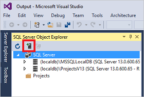
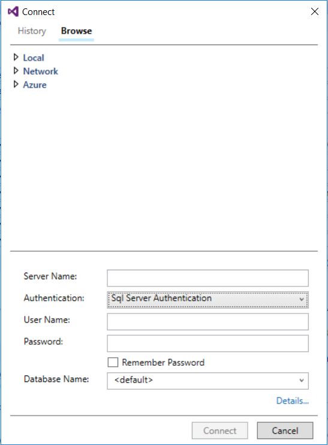
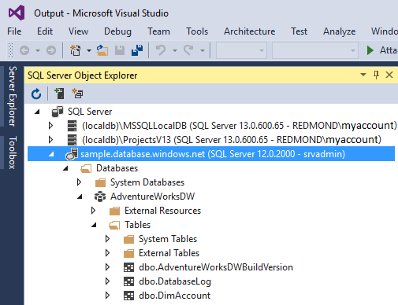
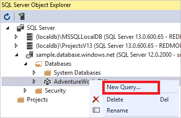

# Connect to SQL Analytics with Visual Studio and SSDT
> [!div class="op_single_selector"]
> * [Azure Data Studio](get-started-azure-data-studio.md)
> * [Power BI](get-started-power-bi-professional.md)
> * [Visual Studio](get-started-visual-studio.md)
> * [sqlcmd](get-started-connect-sqlcmd.md) 
> * [SSMS](get-started-ssms.md)
> 
> 

Use Visual Studio to query SQL pool using Azure Synapse Analytics. This method uses the SQL Server Data Tools (SSDT) extension in Visual Studio 2019. 

### Supported tools for SQL on-demand
Visual studio is not currently supported for SQL on-demand. However, Azure Data Studio is a fully supported tool. SQL Server Management Studio is partially supported from version 18.4 and has limited features such as connecting and querying.

## Prerequisites
To use this tutorial, you need to have the following components:

* An existing SQL Pool. If you do not have one, see [Create a SQL Pool](../../sql-data-warehouse/create-data-warehouse-portal.md) to complete this prerequisite.
* SSDT for Visual Studio. If you have Visual Studio, you probably already have this component. For installation instructions and options, see [Installing Visual Studio and SSDT](../../sql-data-warehouse/sql-data-warehouse-install-visual-studio.md).
* The fully qualified SQL server name. To find this, see [Connect to SQL Pool](connect-overview.md).

## 1. Connect to SQL Pool
1. Open Visual Studio 2019.
2. Open the SQL Server Object Explorer. To do this, select **View** > **SQL Server Object Explorer**.
   
    
3. Click the **Add SQL Server** icon.
   
    
4. Fill in the fields in the Connect to Server window.
   
    
   
   * **Server name**: Enter the **server name** previously identified.
   * **Authentication**: Select **SQL Server Authentication** or **Active Directory Integrated Authentication**:
   * **User Name** and **Password**: Enter your user name and password if SQL Server Authentication was selected above.
   * Click **Connect**.
5. To explore, expand your Azure SQL server. You can view the databases associated with the server. Expand AdventureWorksDW to see the tables in your sample database.
   
    

## 2. Run a sample query
Now that a connection has been established to your database, you'll write a query.

1. Right-click your database in SQL Server Object Explorer.
2. Select **New Query**. A new query window opens.
   
    
3. Copy the following T-SQL query into the query window:
   
    ```sql
    SELECT COUNT(*) FROM dbo.FactInternetSales;
    ```
4. Run the query. To do this, click the green arrow or use the following shortcut: `CTRL`+`SHIFT`+`E`.
   
    
5. Look at the query results. In this example, the FactInternetSales table has 60398 rows.
   
    

## Next steps
Now that you can connect and query, try [visualizing the data with Power BI](get-started-power-bi-professional.md).
To configure your environment for Azure Active Directory authentication, see [Authenticate to SQL Pool](../../sql-data-warehouse/sql-data-warehouse-authentication.md).
 