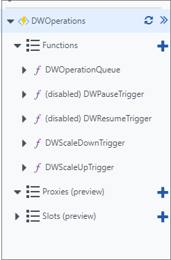
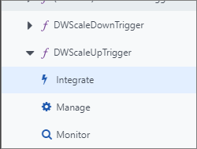
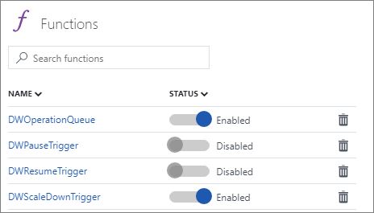
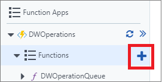
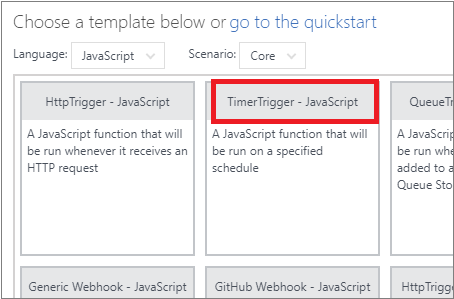
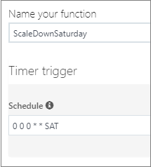

# Use Azure Functions to manage compute resources in Azure Synapse Analytics SQL pool

This tutorial uses Azure Functions to manage compute resources for a SQL pool in Azure Synapse Analytics.

In order to use Azure Function App with SQL pool, you must create a [Service Principal Account](../../active-directory/develop/howto-create-service-principal-portal.md?toc=/azure/synapse-analytics/sql-data-warehouse/toc.json&bc=/azure/synapse-analytics/sql-data-warehouse/breadcrumb/toc.json) with contributor access under the same subscription as your SQL pool instance.

## Deploy timer-based scaling with an Azure Resource Manager template

To deploy the template, you need the following information:

- Name of the resource group your SQL pool instance is in
- Name of the server your SQL pool instance is in
- Name of your SQL pool instance
- Tenant ID (Directory ID) of your Azure Active Directory
- Subscription ID
- Service Principal Application ID
- Service Principal Secret Key

Once you have the preceding information, deploy this template:

[](https://portal.azure.com/#create/Microsoft.Template/uri/https%3A%2F%2Fraw.githubusercontent.com%2FMicrosoft%2Fsql-data-warehouse-samples%2Fmaster%2Farm-templates%2FsqlDwTimerScaler%2Fazuredeploy.json)

Once you've deployed the template, you should find three new resources: a free Azure App Service Plan, a consumption-based Function App plan, and a storage account that handles the logging and the operations queue. Continue reading the other sections to see how to modify the deployed functions to fit your need.

## Change the compute level

1. Navigate to your Function App service. If you deployed the template with the default values, this service should be named *DWOperations*. Once your Function App is open, you should notice there are five functions deployed to your Function App Service.

   

2. Select either *DWScaleDownTrigger* or *DWScaleUpTrigger* depending on whether you would like to change the scale up or scale down time. In the drop-down menu, select Integrate.

   

3. Currently the value displayed should say either *%ScaleDownTime%* or *%ScaleUpTime%*. These values indicate the schedule is based on values defined in your [Application Settings](../../azure-functions/functions-how-to-use-azure-function-app-settings.md?toc=/azure/synapse-analytics/sql-data-warehouse/toc.json&bc=/azure/synapse-analytics/sql-data-warehouse/breadcrumb/toc.json). For now, you can ignore this value and change the schedule to your preferred time based on the next steps.

4. In the schedule area, add the time the CRON expression you would like to reflect how often you want Azure Synapse Analytics to be scaled up.

   

   The value of `schedule` is a [CRON expression](https://en.wikipedia.org/wiki/Cron#CRON_expression) that includes these six fields:

   ```json
   {second} {minute} {hour} {day} {month} {day-of-week}
   ```

   For example, *"0 30 9 * * 1-5"* would reflect a trigger every weekday at  9:30am. For more information, visit Azure Functions [schedule examples](../../azure-functions/functions-bindings-timer.md?toc=/azure/synapse-analytics/sql-data-warehouse/toc.json&bc=/azure/synapse-analytics/sql-data-warehouse/breadcrumb/toc.json#example).

## Change the time of the scale operation

1. Navigate to your Function App service. If you deployed the template with the default values, this service should be named *DWOperations*. Once your Function App is open, you should notice there are five functions deployed to your Function App Service.

2. Select either *DWScaleDownTrigger* or *DWScaleUpTrigger* depending on whether you would like to change the scale up or scale down compute value. Upon selecting the functions, your pane should show the *index.js* file.

   

3. Change the value of *ServiceLevelObjective* to the level you would like and hit save. This value is the compute level that your data warehouse instance will scale to based on the schedule defined in the Integrate section.

## Use pause or resume instead of scale

Currently, the functions on by default are *DWScaleDownTrigger* and *DWScaleUpTrigger*. If you would like to use pause and resume functionality instead, you can enable *DWPauseTrigger* or *DWResumeTrigger*.

1. Navigate to the Functions pane.

   

2. Click on the sliding toggle for the corresponding triggers you would like to enable.

3. Navigate to the *Integrate* tabs for the respective triggers to change their schedule.

   > [!NOTE]
   > The functional difference between the scaling triggers and the pause/resume triggers is the message that is sent to the queue. For more information, see [Add a new trigger function](manage-compute-with-azure-functions.md#add-a-new-trigger-function).

## Add a new trigger function

Currently, there are only two scaling functions included within the template. With these functions, during the course of a day, you can only scale down once and up once. For more granular control, such as scaling down multiple times per day or having different scaling behavior on the weekends, you need to add another trigger.

1. Create a new blank function. Select the *+* button near your Functions location to show the function template pane.

   

2. From Language, select *JavaScript*, then select *TimerTrigger*.

   

3. Name your function and set your schedule. The image shows how one may trigger their function every Saturday at midnight (late Friday evening).

   

4. Copy the content of *index.js* from one of the other trigger functions.

   

5. Set your operation variable to the desired behavior as follows:

   ```JavaScript
   // Resume the SQL pool instance
   var operation = {
       "operationType": "ResumeDw"
   }

   // Pause the SQL pool instance
   var operation = {
       "operationType": "PauseDw"
   }

   // Scale the SQL pool instance to DW600c
   var operation = {
       "operationType": "ScaleDw",
       "ServiceLevelObjective": "DW600c"
   }
   ```

## Complex scheduling

This section briefly demonstrates what is necessary to get more complex scheduling of pause, resume, and scaling capabilities.

### Example 1

Daily scale up at 8am to DW600 and scale down at 8pm to DW200.

| Function  | Schedule     | Operation                                |
| :-------- | :----------- | :--------------------------------------- |
| Function1 | 0 0 8 * * *  | `var operation = {"operationType": "ScaleDw",    "ServiceLevelObjective": "DW600"}` |
| Function2 | 0 0 20 * * * | `var operation = {"operationType": "ScaleDw", "ServiceLevelObjective": "DW200"}` |

### Example 2

Daily scale up at 8am to DW1000, scale down once to DW600 at 4pm, and scale down at 10pm to DW200.

| Function  | Schedule     | Operation                                |
| :-------- | :----------- | :--------------------------------------- |
| Function1 | 0 0 8 * * *  | `var operation = {"operationType": "ScaleDw",    "ServiceLevelObjective": "DW1000"}` |
| Function2 | 0 0 16 * * * | `var operation = {"operationType": "ScaleDw", "ServiceLevelObjective": "DW600"}` |
| Function3 | 0 0 22 * * * | `var operation = {"operationType": "ScaleDw", "ServiceLevelObjective": "DW200"}` |

### Example 3

Scale up at 8am to DW1000 , scale down once to DW600 at 4pm on the weekdays. Pauses Friday 11pm, resumes 7am Monday morning.

| Function  | Schedule       | Operation                                |
| :-------- | :------------- | :--------------------------------------- |
| Function1 | 0 0 8 * * 1-5  | `var operation = {"operationType": "ScaleDw",    "ServiceLevelObjective": "DW1000"}` |
| Function2 | 0 0 16 * * 1-5 | `var operation = {"operationType": "ScaleDw", "ServiceLevelObjective": "DW600"}` |
| Function3 | 0 0 23 * * 5   | `var operation = {"operationType": "PauseDw"}` |
| Function4 | 0 0 7 * * 0    | `var operation = {"operationType": "ResumeDw"}` |

## Next steps

Learn more about [timer trigger](../../azure-functions/functions-create-scheduled-function.md?toc=/azure/synapse-analytics/sql-data-warehouse/toc.json&bc=/azure/synapse-analytics/sql-data-warehouse/breadcrumb/toc.json) Azure functions.

Checkout the SQL pool [samples repository](https://github.com/Microsoft/sql-data-warehouse-samples).
