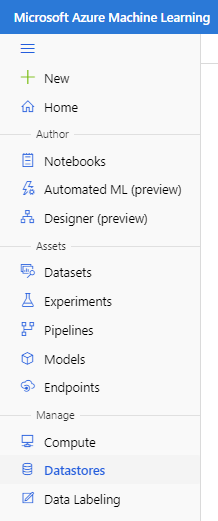
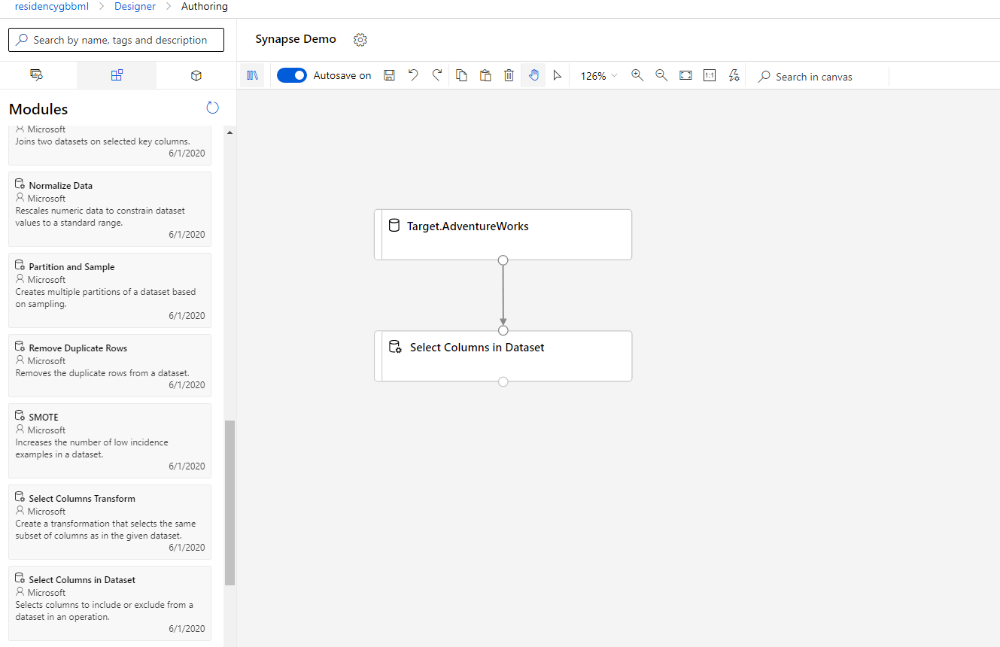
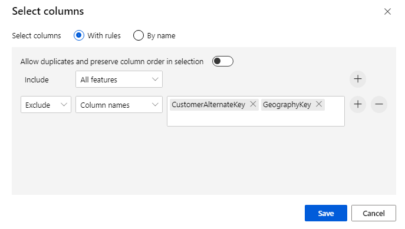
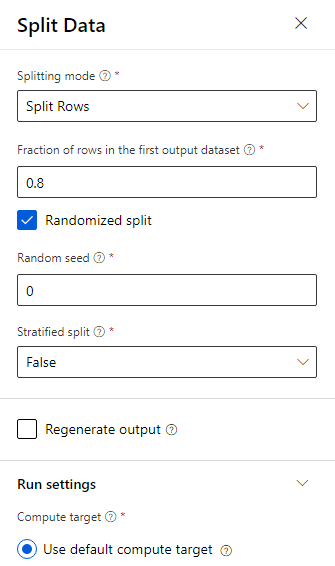
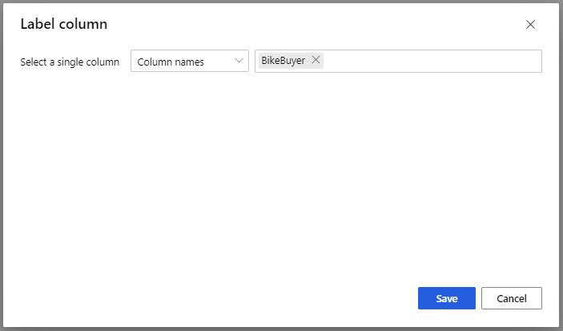
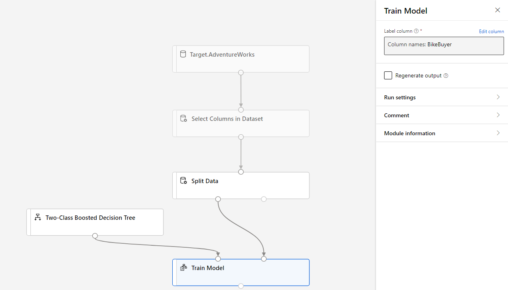
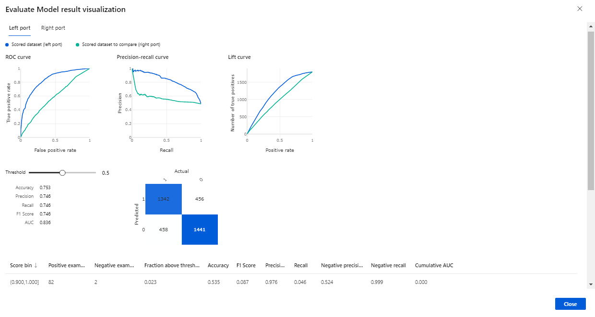

# Analyze data with Azure Machine Learning

This tutorial uses [Azure Machine Learning designer](https://docs.microsoft.com/azure/machine-learning/concept-designer) to build a predictive machine learning model based on data stored in Azure Synapse. The tutorial walks through the steps of building a targeted marketing campaign for Adventure Works, the bike shop, by predicting if a customer is likely to buy a bike or not.

## Prerequisites

To step through this tutorial, you need:

* a SQL pool pre-loaded with AdventureWorksDW sample data. To provision this, see [Create a SQL pool](create-data-warehouse-portal.md) and choose to load the sample data. If you already have a data warehouse but do not have sample data, you can [load sample data manually](load-data-from-azure-blob-storage-using-polybase.md).
* an Azure Machine learning workspace. Follow [this tutorial](https://docs.microsoft.com/azure/machine-learning/how-to-manage-workspace) to create a new one.

## Get the data

The data used is in the dbo.vTargetMail view in AdventureWorksDW. To use Datastore in this tutorial, the data is first loaded into Azure Data Lake Storage account. Azure Data Factory can be used to export data from the data warehouse to Azure Data Lake Storage using the [copy activity](https://docs.microsoft.com/en-us/azure/data-factory/copy-activity-overview). Use the following query for import:

```sql
SELECT [CustomerKey]
  ,[GeographyKey]
  ,[CustomerAlternateKey]
  ,[MaritalStatus]
  ,[Gender]
  ,cast ([YearlyIncome] as int) as SalaryYear
  ,[TotalChildren]
  ,[NumberChildrenAtHome]
  ,[EnglishEducation]
  ,[EnglishOccupation]
  ,[HouseOwnerFlag]
  ,[NumberCarsOwned]
  ,[CommuteDistance]
  ,[Region]
  ,[Age]
  ,[BikeBuyer]
FROM [dbo].[vTargetMail]
```

Once the data is available in Azure Data Lake Storage, Datastores in Azure Machine Learning is used to [connect to Azure storage services](https://docs.microsoft.com/azure/machine-learning/how-to-access-data). Follow the steps below to create a Datastore and a corresponding Dataset:

1. Launch Azure Machine learning studio either from Azure portal or sign in at [Azure Machine Learning studio](https://ml.azure.com/).

1. Click on **Datastores** on the left pane in the **Manage** section and then click on **New Datastore**. 

    

1. Provide a name for the datastore, select the type as 'Azure Blob Storage', provide location and credentials. Then, click **Create**.

1. Next, click on **Datasets** on the left pane in the **Assets** section. Select **Create dataset** with the option **From datastore**.

1. Specify the name of the dataset and select the type to be **Tabular**. Then, click **Next** to move forward.

1. In **Select or create a datastore section**, select the option **Previously created datastore** and select the datastore created earlier. Click Next and specify the path and file settings. Make sure to specify column header if the files contain one.

1. Finally, click **Create** to create the dataset.

## Configure designer experiment

Next, follow steps below for designer configuration:

1. Click on **Designer** tab on the left pane in the **Author** section.

1. Select **Easy-to-use prebuilt modules** to build a new pipeline.

1. In the settings pane on the right, specify the name of the pipeline.

1. Also, select a target compute cluster for the whole experiment in settings button to a previously provisioned cluster. Close the Settings pane.

## Import the data

1. Select the **Datasets** subtab in the left pane below the search box.

1. Drag the dataset your created earlier into the canvas.

    

## Clean the data

To clean the data, drop columns that are not relevant for the model. To do this:

1. Select the **Modules** subtab in the left pane.

1. Drag the **Select Columns in Dataset** module under **Data Transformation < Manipulation** into the canvas. Connect this module to the **Dataset** module.

    

1. Click on the module to open properties pane. Click on Edit column to specify which columns you wish to drop.

1. Exclude two columns: CustomerAlternateKey and GeographyKey. Click **Save**

   

## Build the model

The data is split 80-20: 80% to train a machine learning model and 20% to test the model. "Two-Class" algorithms are used in this binary classification problem.

1. Drag the **Split Data** module into the canvas.

1. In the properties pane, enter 0.8 for **Fraction of rows in the first output dataset**.

   

1. Drag the **Two-Class Boosted Decision Tree** module into the canvas.

1. Drag the **Train Model** module into the canvas and specify inputs by connecting it to the **Two-Class Boosted Decision Tree** (ML algorithm) and **Split Data** (data to train the algorithm on) modules. 

1. For Train Model model,  in **Label column** option in the Properties pane, select Edit column. Select the **BikeBuyer** column as the column to predict and select **Save**.

   

     

## Score the model

Now, test how the model performs on test data. Two different algorithms will be compared to see which performs better. To do this, follow the steps below:

1. Drag **Score Model** module into the canvas and connect it to **Train Model** and **Split Data** modules.

1. Drag the **Two-Class Bayes Averaged Perceptron** into the experiment canvas. You will compare how this algorithm performs in comparison to the Two-Class Boosted Decision Tree.

1. Copy and paste the modules **Train Model** and **Score Model** in the canvas.

1. Drag the **Evaluate Model** module into the canvas to compare the two algorithms.

1. Click **submit** to setup the pipeline run. 

   

1. Once the run finishes, right click on the **Evaluate Model** module and click **Visualize Evaluation results**.

   

The metrics provided are the ROC curve, precision-recall diagram, and lift curve. Look at these metrics to see that the first model performed better than the second one. To look at what the first model predicted, right click on the Score Model module and click and click Visualize Scored dataset to see the predicted results.

You will see two more columns added to your test dataset.

* Scored Probabilities: the likelihood that a customer is a bike buyer.
* Scored Labels: the classification done by the model – bike buyer (1) or not (0). This probability threshold for labeling is set to 50% and can be adjusted.

Compare the column BikeBuyer (actual) with the Scored Labels (prediction), to see how well the model has performed. Next, you can use this model to make predictions for new customers and [publish this model as a web service](https://docs.microsoft.com/azure/machine-learning/tutorial-designer-automobile-price-deploy) or write results back to Azure Synapse.

## Next steps

To learn more about building predictive machine learning models, refer to [Introduction to Machine Learning on Azure](https://docs.microsoft.com/azure/machine-learning/overview-what-is-azure-ml).