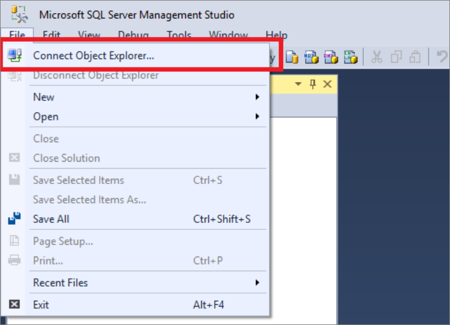
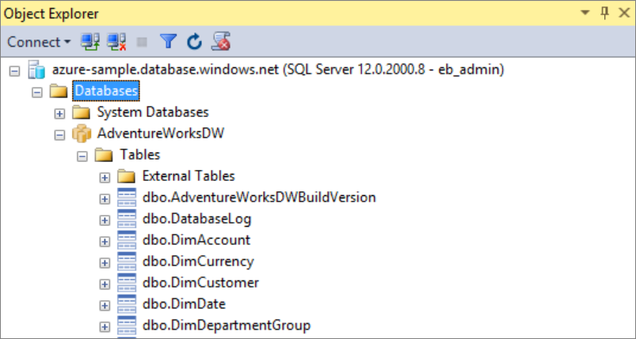
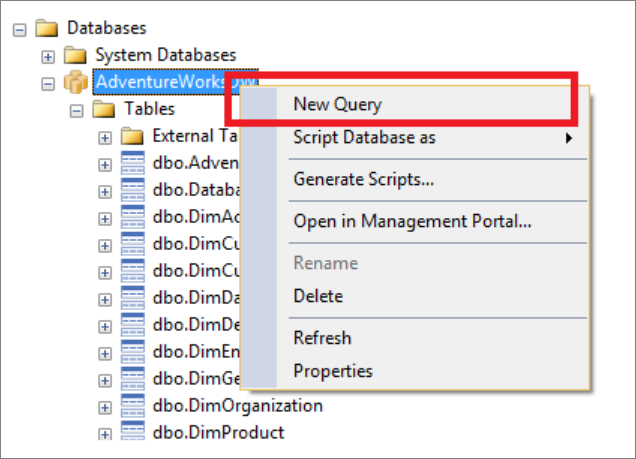

# Connect to Azure Synapse Analytics with SQL Server Management Studio (SSMS)
> [!div class="op_single_selector"]
> * [Power BI](sql-data-warehouse-get-started-visualize-with-power-bi.md)
> * [Azure Machine Learning](../../sql-data-warehouse/sql-data-warehouse-get-started-analyze-with-azure-machine-learning.md)
> * [Visual Studio](sql-data-warehouse-query-visual-studio.md)
> * [sqlcmd](../../sql-data-warehouse/sql-data-warehouse-get-started-connect-sqlcmd.md)
> * [SSMS](sql-data-warehouse-query-ssms.md)
> 
> 

Use SQL Server Management Studio (SSMS) to connect to and query a data warehouse within Azure Synapse. 

## Prerequisites
To use this tutorial, you need:

* An existing SQL pool. To create one, see [Create a SQL pool](create-data-warehouse-portal.md).
* SQL Server Management Studio (SSMS) installed. [Install SSMS](https://msdn.microsoft.com/library/hh213248.aspx) for free if you don't already have it.
* The fully qualified SQL server name. To find this information, see [Connect to SQL pool](../../sql-data-warehouse/sql-data-warehouse-connect-overview.md).

## 1. Connect to your SQL pool
1. Open SSMS.
2. Open Object Explorer by selecting **File** > **Connect Object Explorer**.
   
    
3. Fill in the fields in the Connect to Server window.
   
    
   
   * **Server name**. Enter the **server name** previously identified.
   * **Authentication**. Select **SQL Server Authentication** or **Active Directory Integrated Authentication**.
   * **User Name** and **Password**. Enter user name and password if SQL Server Authentication was selected above.
   * Click **Connect**.
4. To explore, expand your Azure SQL server. You can view the databases associated with the server. Expand AdventureWorksDW to see the tables in your sample database.
   
    

## 2. Run a sample query
Now that a connection has been established to your database, let's write a query.

1. Right-click your database in SQL Server Object Explorer.
2. Select **New Query**. A new query window opens.
   
    
3. Copy the following T-SQL query into the query window:
   
    ```sql
    SELECT COUNT(*) FROM dbo.FactInternetSales;
    ```
4. Run the query by clicking `Execute` or use the following shortcut: `F5`.
   
    
5. Look at the query results. In this example, the FactInternetSales table has 60398 rows.
   
    

## Next steps
Now that you can connect and query, try [visualizing the data with Power BI](sql-data-warehouse-get-started-visualize-with-power-bi.md ).
To configure your environment for Azure Active Directory authentication, see [Authenticate to SQL pool](../../sql-data-warehouse/sql-data-warehouse-authentication.md).
