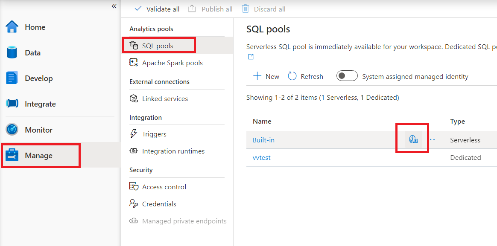
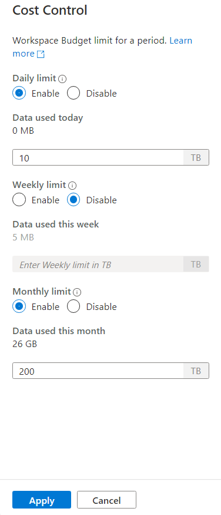

# Cost management for serverless SQL pool in Azure Synapse Analytics

This article explains how you can estimate and manage costs for serverless SQL pool in Azure Synapse Analytics:
- Estimate amount of data processed before issuing a query
- Use cost control feature to set the budget

Understand that the costs for serverless SQL pool in Azure Synapse Analytics are only a portion of the monthly costs in your Azure bill. If you are using other Azure services, you’re billed for all the Azure services and resources used in your Azure subscription, including the third-party services. This article explains how to plan for and manage costs for serverless SQL pool in Azure Synapse Analytics.

## Data processed

Data processed is the amount of data temporarily stored in the system while executing a query and consists of:

- Amount of data read from storage – which includes:
  - Amount of data read while reading data
  - Amount of data read while reading metadata (for file formats that contain metadata, like Parquet)
- Amount of data in intermediate results – data transferred among nodes during query execution, including data transfer to your endpoint, in uncompressed format. 
- Amount of data written to storage – if you use CETAS to export your result set to storage, you'll be charged for bytes written out and the amount of data processed for the SELECT part of CETAS.

Reading files from storage is highly optimized and uses:

- Prefetching - which may add a small overhead to the amount of data read. If a query reads a whole file, there will be no overhead. If a file is read partially, like in TOP N queries, a bit more data will be read with prefetching.
- Optimized CSV parser – if you use PARSER_VERSION=’2.0’ to read CSV files it will result in slightly increased amounts of data read from storage.  Optimized CSV parser reads files in parallel in chunks of equal size. There is no guarantee that chunks will contain whole rows. To ensure all rows are parsed, small fragments of adjacent chunks will also be read, adding a small amount of overhead.

### Statistics

The serverless SQL pool query optimizer relies on statistics to generate optimal query execution plans. You can create statistics manually or they will be created automatically by serverless SQL pool. Either way, statistics are created by executing a separate query that returns a specific column at provided sample rate. This query has an associated amount of data processed.

If you run the same or any other query that would benefit from created statistics, statistics will be reused if possible and there will be no additional data processed for statistics creation.

Creating statistics for a Parquet column will result in reading only the relevant column from files. Creating statistics for a CSV column will result in reading and parsing whole files.

### Rounding

The amount of data processed will be rounded up to the nearest MB per query, with a minimum of 10 MB of data processed per query.

### What is not included in data processed

- Server-level metadata (like logins, roles, server-level credentials)
- Databases you create in your endpoint as those databases contain only metadata (like users, roles, schemas, views, inline TVFs, stored procedures, database scoped credentials, external data sources, external file formats, external tables)
  - If you use schema inference, fragments of files will be read to infer column names and data types
- DDL statements except CREATE STATISTICS as it will process data from storage based on the specified sample percentage
- Metadata-only queries

### Reduce amount of data processed

You can optimize your per-query amount of data processed and get better performance by partitioning and converting your data to a compressed columnar format like Parquet.

### Examples

Let's say that there are two tables, each having the same data in five equally sized columns:

- population_csv table backed by 5 TB of CSV files
- population_parquet table backed by 1 TB of Parquet files – this table is smaller than previous one as Parquet contains compressed data
- very_small_csv table backed by 100 KB of CSV files

**Query #1**: SELECT SUM(population) FROM population_csv

This query will read and parse whole files to get values for the population column. Nodes will process fragments of this table, the population sum for each fragment will be transferred among nodes, and the final sum will be transferred to your endpoint. This query will process 5 TB of data plus small overhead for transferring sums of fragments.

**Query #2**: SELECT SUM(population) FROM population_parquet

Querying compressed and column-oriented formats like Parquet results in reading less data than in the previous query, as serverless SQL pool will read a single compressed column instead of the whole file. In this case 0.2 TB will be read (five equal sized columns, 0.2 TB each). Nodes will process fragments of this table, the population sum for each fragment will be transferred among nodes, and the final sum will be transferred to your endpoint. This query will process 0.2 TB plus a small overhead for transferring sums of fragments.

**Query #3**: SELECT * FROM population_parquet

This query will read all columns and transfer all data in uncompressed format. If compression format is 5:1, it will process 6 TB as it will read 1 TB + transfer 5 TB of uncompressed data.

**Query #4**: SELECT COUNT(*) FROM very_small_csv

This query will read whole files. The total size of files in storage for this table is 100 KB. Nodes will process fragments of this table, the sum for each fragment will be transferred among nodes, and the final sum will be transferred to your endpoint. This query will process slightly more than 100 KB of data. The amount of data processed for this query will be rounded up to 10 MB as specified in [Rounding](#rounding).

## Cost control

Cost control feature in serverless SQL pool enables you to set the budget for amount of data processed. You can set the budget in TB of data processed for a day, week, and month. At the same time you can have one or more budgets set. To configure cost control for serverless SQL pool, you can use Synapse Studio or T-SQL.

### Configure cost control for serverless SQL pool in Synapse Studio
 
To configure cost control for serverless SQL pool in Synapse Studio navigate to Manage item in the menu on the left, than select SQL pool item under Analytics pools. As you hover of serverless SQL pool, you will notice an icon for cost control - click on this icon.



Once you click on the cost control icon, a side bar will appear:



To set one or more budgets, first click on Enable radio button for a budget you want to set, than enter the integer value in the text box. Unit for the value is TBs. Once you have configured the budgets you wanted click on apply button at the bottom of the side bar. That's it, you budget is now set.

### Configure cost control for serverless SQL pool in T-SQL

To configure cost control for serverless SQL pool in T-SQL, you need to execute one or more of the following stored procedures.

```sql
sp_set_data_processed_limit
	@type = N'daily',
	@limit_tb = 1

sp_set_data_processed_limit
	@type= N'weekly',
	@limit_tb = 2

sp_set_data_processed_limit
	@type= N'monthly',
	@limit_tb = 3334
```

To see the current configuration execute the following T-SQL statement:

```sql
SELECT * FROM sys.configurations
WHERE name like 'Data processed %';
```

To see how much data was processed during the current day, week, or month, execute the following T-SQL statement:

```sql
SELECT * FROM sys.dm_external_data_processed
```

## Next steps

To learn how to optimize your queries for performance, check [Best practices for serverless SQL pool](best-practices-sql-on-demand.md).
