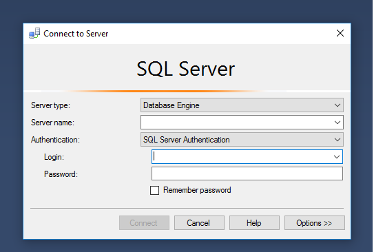
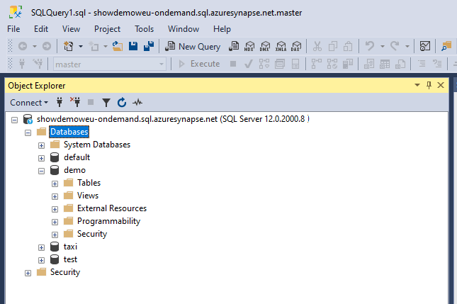
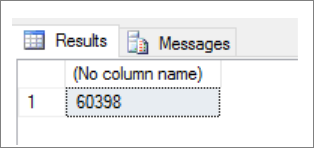
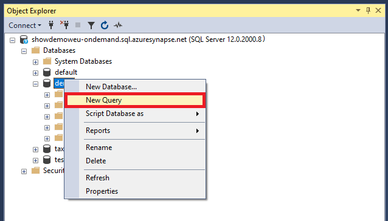

# Connect to Synapse SQL with SQL Server Management Studio (SSMS)
> [!div class="op_single_selector"]
> * [Azure Data Studio](get-started-azure-data-studio.md)
> * [Power BI](get-started-power-bi-professional.md)
> * [Visual Studio](../sql-data-warehouse/sql-data-warehouse-query-visual-studio.md?toc=/azure/synapse-analytics/toc.json&bc=/azure/synapse-analytics/breadcrumb/toc.json)
> * [sqlcmd](../sql/get-started-connect-sqlcmd.md)
> * [SSMS](get-started-ssms.md)
> 
> 

You can use [SQL Server Management Studio (SSMS)](/sql/ssms/download-sql-server-management-studio-ssms) to connect to and query Synapse SQL in Azure Synapse Analytics through either SQL on-demand (preview) or SQL pool resources. 

### Supported tools for SQL on-demand (preview)

SSMS is partially supported starting in version 18.5 with limited features such as connecting and querying. [Azure Data Studio](/sql/azure-data-studio/download-azure-data-studio) is fully supported.

## Prerequisites

Before you begin, make sure you have the following prerequisites:  

* [SQL Server Management Studio (SSMS)](/sql/ssms/download-sql-server-management-studio-ssms). 
* For SQL pool, you need an existing data warehouse. To create one, see [Create a SQL pool](../quickstart-create-sql-pool.md). For SQL on-demand, one is already provisioned in your workspace at creation time. 
* The fully qualified SQL Server name. To find this, see [Connect to Synapse SQL](connect-overview.md).

## Connect

### SQL pool

To connect to Synapse SQL using SQL pool, follow these steps: 

1. Open SQL Server Management Studio (SSMS). 
1. In the **Connect to Server** dialog box, fill in the fields and then select **Connect**: 
  
    
   
   * **Server name**: Enter the **server name** previously identified.
   * **Authentication**:  Choose an authentication type, such as **SQL Server Authentication** or **Active Directory Integrated Authentication**.
   * **User Name** and **Password**: Enter your user name and password if SQL Server Authentication was selected above.

1. Expand your Azure SQL Server in **Object Explorer**. You can view the databases associated with the server, such as the sample AdventureWorksDW database. You can expand the database to see the tables:
   
    


### SQL on-demand (preview)

To connect to Synapse SQL using SQL on-demand, follow these steps: 

1. Open SQL Server Management Studio (SSMS).
1. In the **Connect to Server** dialog box, fill in the fields and then select **Connect**: 
   
    
   
   * **Server name**: Enter the **server name** previously identified.
   * **Authentication**: Choose an authentication type, such as **SQL Server Authentication** or **Active Directory Integrated Authentication**:
   * **User Name** and **Password**: Enter your user name and password if SQL Server Authentication was selected above.
   * Click **Connect**.

4. To explore, expand your Azure SQL server. You can view the databases associated with the server. Expand *demo* to see the content in your sample database.
   
    


## Run a sample query

### SQL pool

Now that a database connection has been established, you can query the data.

1. Right-click your database in SQL Server Object Explorer.
2. Select **New Query**. A new query window opens.
   
    
3. Copy this T-SQL query into the query window:
   
    ```sql
    SELECT COUNT(*) FROM dbo.FactInternetSales;
    ```
4. Run the query. To do this, click `Execute` or use the following shortcut: `F5`.
   
    
5. Look at the query results. In this example, the FactInternetSales table has 60398 rows.
   
    

### SQL on-demand

Now that you've established a database connection, you can query the data.

1. Right-click your database in SQL Server Object Explorer.
2. Select **New Query**. A new query window opens.
   
    
3. Copy the following T-SQL query into the query window:
   
    ```sql
    SELECT COUNT(*) FROM demo.dbo.usPopulationView
    ```
4. Run the query. To do this, click `Execute` or use the following shortcut: `F5`.
   
    
5. Look at the query results. In this example, the usPopulationView view has 3664512 rows.
   
    

## Next steps
Now that you can connect and query, try [visualizing the data with Power BI](get-started-power-bi-professional.md).

To configure your environment for Azure Active Directory authentication, see [Authenticate to Synapse SQL](../sql-data-warehouse/sql-data-warehouse-authentication.md?toc=/azure/synapse-analytics/toc.json&bc=/azure/synapse-analytics/breadcrumb/toc.json).

