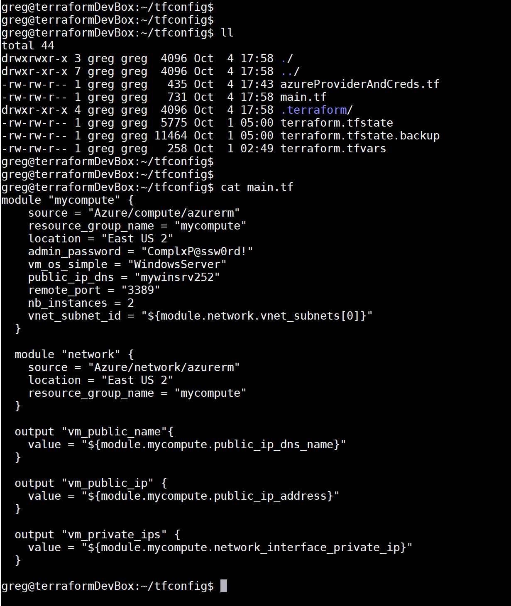

# Create a small VM cluster using the Module Registry

The [Terraform Registry](https://registry.terraform.io) is a repository of modules written by the Terraform community. The registry can be used to help you get started with Terraform more quickly, see examples of how Terraform is written, and find pre-made modules for infrastructure components you require.

This tutorial demonstrates creating a small compute cluster using the 'compute' module found at this [location](https://registry.terraform.io/modules/Azure/compute/azurerm/1.0.2). It uses the Linux VM mode of operation from those explicated on this [page](./tutorial_operational_modes.md).

I have already gone through authentication via: https://www.terraform.io/docs/providers/azurerm/authenticating_via_service_principal.html

I created a terraform.tfvars file to hold my creds and azureProviderAndCreds.tf, which brings in the creds and references the AzureRM provider. These files get aggregated with any other .tf files in the folder when TF runs. This picture of my configuration directory shows what this looks like: 


Copy the usage sample (either Windows or Linux) from the location above and store it in your configuration folder (along with ```azureProviderAndCreds.tf```, etc) as ```main.tf```.  

It should look something like this:



Run ```terraform init``` in your configuration directory. You should see output similar to this, with version >=0.10.6 of Terraform:


You will see the lines showing the downloads when there is a module you haven't referenced yet or an updated module.

Next just ```terraform plan``` ...


and ```terraform apply``` as usual:


