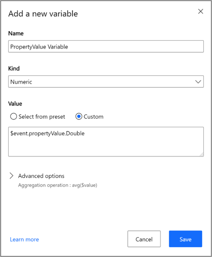
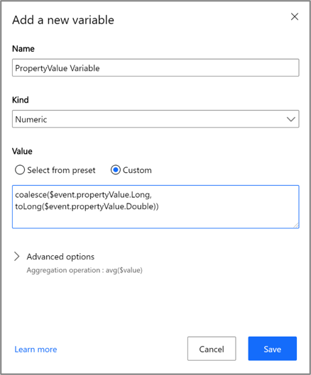
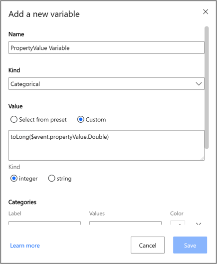

# Adding support for long data type

These changes will be applied to Gen2 environments only. If you have a Gen1 environment, you may disregard these changes.

We are making changes to how we store and index numeric data in Azure Time Series Insights Gen2 that might impact you. If you’re impacted by any of the following cases, make the necessary changes as soon as possible.

Your data will start being indexed as ********Long** and **Double** between 29 June and 30 June 2020, depending on your region. If you have any questions or concerns about this change, submit a support ticket through the Azure portal and mention this communication.

This change impacts you in the following cases:

- **Case 1**: If you currently use Time Series Model variables and send only integral data types in your telemetry data.
- **Case 2**: If you currently use Time Series Model variables and send both integral and nonintegral data types in your telemetry data.
- **Case 3**: If you use categorical variables to map integer values to categories.
- **Case 4**: If you use the JavaScript SDK to build a custom front-end application.
- **Case 5**: If you're nearing the 1,000-property name limit in Warm Store and send both integral and nonintegral data, the property count can be viewed as a metric in the [Azure portal](https://portal.azure.com/).

If any of the cases apply to you, you need to make changes to your model. Update the Time Series Expression (TSX) in your variable definition with the recommended changes. Update both:

- Azure Time Series Insights Gen2 explorer
- Any custom client that uses our APIs

Depending on your IoT solution and constraints, you might not have visibility into the data being sent to your Azure Time Series Insights Gen2 environment. If you’re unsure if your data is integral only or both integral and nonintegral, you have a few options:

- You can wait for the feature to be released and then explore your raw events in the explorer UI to understand which properties have been saved in two separate columns.
- You can preemptively make the recommended changes for all numeric tags.
- You can temporarily route a subset of events to storage to better understand and explore your schema.

To store events, turn on [event capture](https://docs.microsoft.com/azure/event-hubs/event-hubs-capture-overview) for Azure Event Hubs, or [route](https://docs.microsoft.com/azure/iot-hub/iot-hub-devguide-messages-d2c#azure-storage) from your IoT Hub to Azure Blob storage.

Data can also be observed through the [Event Hub Explorer](https://marketplace.visualstudio.com/items?itemName=Summer.azure-event-hub-explorer), or by using the [Event Processor Host](https://docs.microsoft.com/azure/event-hubs/event-hubs-dotnet-standard-getstarted-send#receive-events).

If you use IoT Hub, see [Read device-to-cloud messages from the built-in endpoint](https://docs.microsoft.com/azure/iot-hub/iot-hub-devguide-messages-read-builtin) for how to access the built-in endpoint.

> [!NOTE]
> If you're unable to make the recommended changes by the indicated dates, you might experience a disruption. The impacted Time Series variables accessed via the query APIs or Time Series Insights Explorer will return **null** (i.e. show no data in the Explorer).

## Recommended changes

### Cases 1 and 2: Using Time Series Model variables and sending only integral data types OR sending both integral and nonintegral types in telemetry data

If you currently send integer telemetry data, your data will be divided into two columns:

- **propertyValue_double**
- **propertyValue_long**

Your integer data writes to **propertyValue_long**  when the changes go into effect. Previously ingested (and future ingested) numeric data in **propertyValue_double** aren't copied over.

If you want to query data across these two columns for the **propertyValue** property, you need to use the **coalesce()** scalar function in your TSX. The function accepts arguments of the same DataType and returns the first non-null value in the argument list. See [Azure Time Series Insights Gen2 data access concepts](https://docs.microsoft.com/rest/api/time-series-insights/preview#other-functions) for more information.

#### Variable definition in TSX - numeric

- Previous variable definition:

  [](media/time-series-insights-long-data-type/var-def-previous.png#lightbox)

- New variable definition:

   [](media/time-series-insights-long-data-type/var-def.png#lightbox)

You can also use **coalesce($event.propertyValue.Double, toDouble($event.propertyValue.Long))** as the custom [Time Series Expression](https://docs.microsoft.com/rest/api/time-series-insights/preview#time-series-expression-and-syntax).

#### Inline variable definition using TSX query APIs - numeric

- Previous Variable Definition:

```JSON
"PropertyValueVariable": {

    "kind": "numeric",

    "value": {

        "tsx": "$event.propertyValue.Double"

    },

    "filter": null,

    "aggregation": {

        "tsx": "avg($value)"
    }
}
```

- New Variable Definition:

```JSON
"PropertyValueVariable ": {

    "kind": "numeric",

    "value": {

        "tsx": "coalesce($event.propertyValue.Long, toLong($event.propertyValue.Double))"

    },

    "filter": null,

    "aggregation": {

        "tsx": "avg($value)"
    }
}
```

You can also use **coalesce($event.propertyValue.Double, toDouble($event.propertyValue.Long))** as the custom [Time Series Expression](https://docs.microsoft.com/rest/api/time-series-insights/preview#time-series-expression-and-syntax).

> [!NOTE]
> We recommend that you update these variables in all places they might be used. Such as, Time Series Model, saved queries, and Power BI connector queries.

### Case 3: Using categorical variables to map integer values to categories

If you currently use categorical variables that map integer values to categories, you're likely using the **toLong** function to convert data from **Double** type to **Long** type. Just like Cases 1 and 2, you need to coalesce the **Double** and **Long** DataType columns.

#### Variable definition in Time Series Explorer - categorical

- Previous variable definition:

  [](media/time-series-insights-long-data-type/var-def-cat-previous.png#lightbox)

- New variable definition:

  [](media/time-series-insights-long-data-type/var-def-cat.png#lightbox)

You can also use **coalesce($event.propertyValue.Double, toDouble($event.propertyValue.Long))** as the custom [Time Series Expression](https://docs.microsoft.com/rest/api/time-series-insights/preview#time-series-expression-and-syntax).

Categorical variables still require the value to be of an integer type. The DataType of all the arguments in **coalesce()** must be of type **Long** in the custom [Time Series Expression.](https://docs.microsoft.com/rest/api/time-series-insights/preview#time-series-expression-and-syntax)

#### Inline variable definition using TSX query APIs - categorical

- Previous variable definition:

```JSON
"PropertyValueVariable_Long": {

    "kind": "categorical",

    "value": {

        "tsx": "tolong($event.propertyValue.Double)"

    },

    "categories": [

    {
        "label": "Good",

        "values": [0, 1, 2 ]

    },

    {

        "label": "Bad",

        "values": [ 3, 4 ]

    } ],

    "defaultCategory": {

        "label": "Unknown"

    }
}
```

- New variable definition:

```JSON
"PropertyValueVariable_Long": {

    "kind": "categorical",

    "value": {

        "tsx": "coalesce($event.propertyValue.Long, tolong($event.propertyValue.Double))"

    },

    "categories": [

    {
        "label": "Good",

        "values": [0, 1, 2 ]

    },

    {

        "label": "Bad",

        "values": [ 3, 4 ]

    } ],

    "defaultCategory": {

        "label": "Unknown"

    }
}
```

Categorical variables still require the value to be of an integer type. The DataType of all the arguments in **coalesce()** must be of type **Long** in the custom [Time Series Expression](https://docs.microsoft.com/rest/api/time-series-insights/preview#time-series-expression-and-syntax).

> [!NOTE]
> We recommend that you update these variables in all places they might be used. Such as, Time Series Model, saved queries, and Power BI connector queries.

### Case 4: Using the JavaScript SDK to build a custom front-end application

If you're impacted by Cases 1 through 3 and build custom applications, you need to update your queries to use the **coalesce()** function, as demonstrated in the previous examples.

### Case 5: Nearing Warm Store 1,000 property limit

If you're a Warm Store user with a large number of properties and believe that this change would push your environment over the 1,000 Warm Store property-name limit, submit a support ticket through the Azure portal and mention this communication.

## Next steps

* View the full list of [supported data types](concepts-supported-data-types.md)
