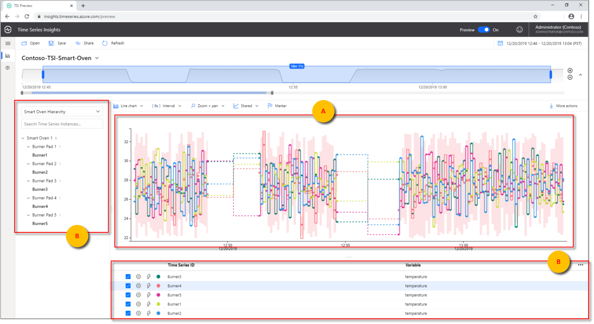
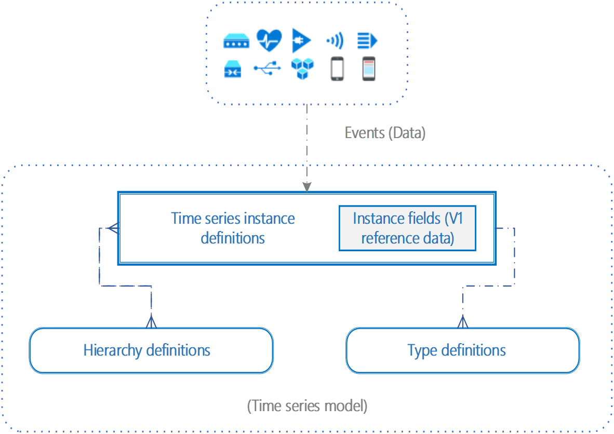
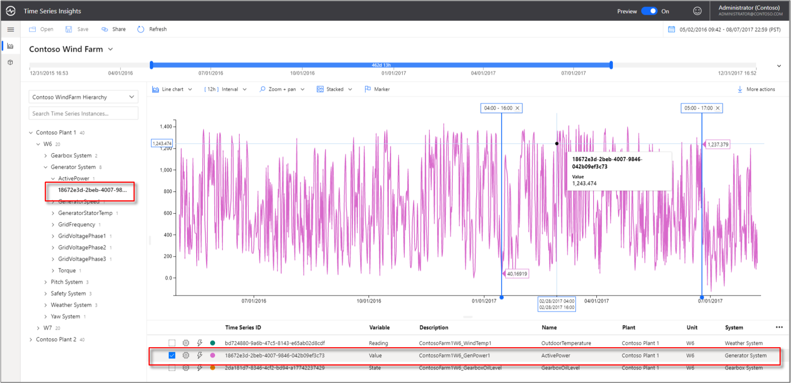
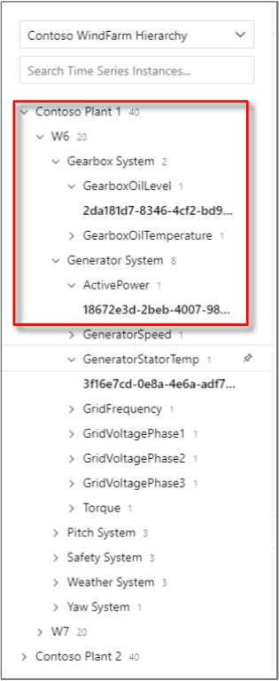
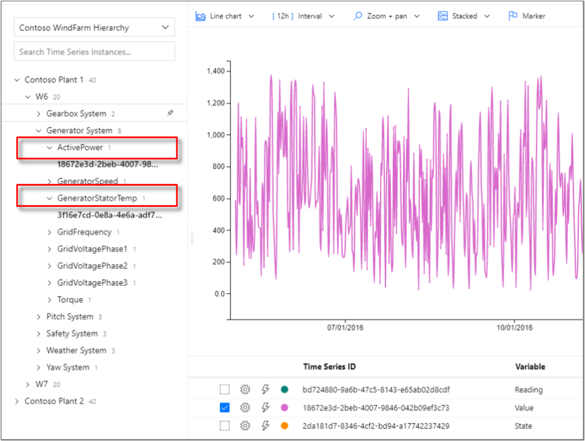

---
title: 'Time Series Model - Azure Time Series Insights Gen2 | Microsoft Docs'
description: Learn about Time Series Model in Azure Time Series Insights Gen2.
author: deepakpalled
ms.author: dpalled
manager: diviso
ms.workload: big-data
ms.service: time-series-insights
services: time-series-insights
ms.topic: conceptual
ms.date: 07/07/2020
ms.custom: seodec18
---

# Time Series Model in Azure Time Series Insights Gen2

This article describes Time Series Model, the capabilities, and how to start building and updating your own models in the Azure Time Series Insights Gen2 environment.

> [!TIP]
>
> * Go to the [Contoso Wind Farm demo](https://insights.timeseries.azure.com/preview/samples) environment for a live Time Series Model example.
> * Learn [how to work with Time Series Model](time-series-insights-update-how-to-tsm.md) using the Azure Time Series Insights Gen2 Explorer.

## Summary

Traditionally, the data that's collected from IoT devices lacks contextual information, which makes it difficult to find and analyze sensors quickly. The main motivation for Time Series Model is to simplify finding and analyzing IoT or Time Series data. It achieves this objective by enabling the curation, maintenance, and enrichment of time series data to help prepare consumer-ready datasets for analytics.

## Scenario: Contoso's new smart oven

**Consider the fictitious scenario of a Contoso smart oven.** In this scenario, suppose that each Contoso smart oven has five temperature sensors, one for each of four top burners and one for the oven itself. Until recently, each Contoso temperature sensor sent, stored, and visualized its data individually. For its kitchen appliance monitoring, Contoso relied on basic charts, one for each individual sensor.

While Contoso was satisfied with its initial data and visualization solution, several limitations became apparent:

* Customers wanted to know how hot the overall oven would get when most of the top burners were on. Contoso had more difficulty analyzing and presenting a unified answer about the conditions of the overall oven.
* Contoso engineers wanted to verify that the top burners being run simultaneously wouldn't result in inefficient power draw. There was difficulty cross-referencing which temperature and voltage sensors were associated with each other and how to locate them in the store.
* The Contoso quality assurance team wanted to audit and compare the history between two sensor versions. There was difficulty determining what data belonged to which sensor version.

Without the ability to structure, organize, and define the overarching smart oven time series model, each temperature sensor maintained dislocated, isolated, and less informative data points. Turning these data points into actionable insights was more difficult since each dataset lived independently of the others.

These limitations revealed the importance of smart data aggregation and visualization tools to accompany Contoso's new oven:

* Data visualization proves useful when you're able to associate and combine data into a convenient view. An example is showing voltage sensors along with temperature sensors.
* Managing multidimensional data for several entities along with comparison, zooming, and time range functionalities can be difficult to accomplish.

**Time Series Model provides a convenient solution** for many of the scenarios encountered in this fictitious example:

[](media/v2-update-tsm/time-series-model-smart-oven.png#lightbox)

* Time Series Model plays a vital role in queries and navigation because it contextualizes data by allowing comparisons to be drawn across time ranges and between sensor and device kinds. (**A**)
* Data is further contextualized because data persisted in Time Series Model preserves time series query computations as variables and reuses them at query time.
* Time Series Model organizes and aggregates data for improved visualization and management capabilities. (**B**)

### Key capabilities

With the goal to make it simple and effortless to manage time series contextualization, Time Series Model enables the following capabilities in Azure Time Series Insights Gen2. It helps you:

* Author and manage computations or formulas leveraging scalar functions, aggregate operations, and so on.
* Define parent-child relationships to enable navigation, search, and reference.
* Define properties that are associated with the instances, defined as *instance fields*, and use them to create hierarchies.

### Components

Time Series Model has three core components:

* [Time Series Model instances](#time-series-model-instances)
* [Time Series Model hierarchies](#time-series-model-hierarchies)
* [Time Series Model types](#time-series-model-types)

These components are combined to specify a time series model and to organize your data.

[](media/v2-update-tsm/time-series-model-overview.png#lightbox)

A time series model can be created and managed through the [Azure Time Series Insights Gen2 Explorer](time-series-insights-update-how-to-tsm.md). Time Series Model settings can be managed through the [Model Settings API](https://docs.microsoft.com/rest/api/time-series-insights/preview-model#model-settings-api).

## Time Series Model instances

Time Series Model *instances* are virtual representations of the time series themselves.

In most cases, instances are uniquely identified by **deviceId** or **assetId**, which are saved as time series IDs.

Instances have descriptive information associated with them called *instance properties*, such as a time series ID, type, name, description, hierarchies, and instance fields. At a minimum, instance properties include hierarchy information.

*Instance fields* are a collection of descriptive information that can include values for hierarchy levels, as well as manufacturer, operator, and so on.

After an event source is configured for the Azure Time Series Insights Gen2 environment, instances are automatically discovered and created in a time series model. The instances can be created or updated via the Azure Time Series Insights Gen2 Explorer by using Time Series Model queries.

The [Contoso Wind Farm demo](https://insights.timeseries.azure.com/preview/samples) provides several live instance examples.

[](media/v2-update-tsm/time-series-model-instance.png#lightbox)

### Instance properties

Instances are defined by **timeSeriesId**, **typeId**, **name**, **description**, **hierarchyIds**, and **instanceFields**. Each instance maps to only one *type*, and one or more *hierarchies*.

| Property | Description |
| --- | ---|
| timeSeriesId | The unique ID of the time series the instance is associated with. In most cases, instances are uniquely identified by a property like deviceId or assetId. In some cases, a more specific composite ID combining up to 3 properties can be used. |
| typeId | The case-sensitive unique string ID of the Time Series Model type the instance is associated with. By default, all discovered new instances get associated to a default type.
| name | The **name** property is optional and case-sensitive. If **name** isn't available, it defaults to **timeSeriesId**. If a name is provided, **timeSeriesId** is still available in the [well](time-series-insights-update-explorer.md#4-time-series-well). |
| description | A text description of the instance. |
| hierarchyIds | Defines which hierarchies the instance belongs to. |
| instanceFields | The properties of an instance and any static data that defines an instance. They define values of hierarchy or non-hierarchy properties while also supporting indexing to perform search operations. |

> [!NOTE]
> Hierarchies are built by using instance fields. Additional **instanceFields** can be added for further instance property definitions.

Instances have the following JSON representation:

```JSON
{
  "timeSeriesId": ["PU2"],
  "typeId": "545314a5-7166-4b90-abb9-fd93966fa39b",
  "hierarchyIds": ["95f0a8d1-a3ef-4549-b4b3-f138856b3a12"],
  "description": "Pump #2",
  "instanceFields": {
    "Location": "Redmond",
    "Fleet": "Fleet 5",
    "Unit": "Pump Unit 3",
    "Manufacturer": "Contoso",
    "ScalePres": "0.54",
    "scaleTemp": "0.54"
  }
}
```

> [!TIP]
> For Instance API create, read, update, and delete (CRUD) support, read the [Data querying](time-series-insights-update-tsq.md#time-series-model-query-tsm-q-apis) article and the [Instance API REST documentation](https://docs.microsoft.com/rest/api/time-series-insights/preview-model#instances-api).

## Time Series Model hierarchies

Time Series Model *hierarchies* organize instances by specifying property names and their relationships.

You can configure multiple hierarchies in a given Azure Time Series Insights Gen2 environment. A Time Series Model instance can map to a single hierarchy or multiple hierarchies (many-to-many relationship).

The [Contoso Wind Farm demo](https://insights.timeseries.azure.com/preview/samples) displays a standard instance and type hierarchy.

[](media/v2-update-tsm/time-series-model-hierarchies.png#lightbox)

### Hierarchy definition

Hierarchies are defined by hierarchy **id**, **name**, and **source**.

| Property | Description |
| ---| ---|
| id | The unique identifier for the hierarchy, which is used, for example, when you define an instance. |
| name | A string used to provide a name for the hierarchy. |
| source | Specifies the organizational hierarchy or path, which is a top-down parent-child order of the hierarchy that users want to create. The parent-child properties map instance fields. |

Hierarchies are represented in JSON as:

```JSON
{
  "hierarchies": [
    {
      "id": "6e292e54-9a26-4be1-9034-607d71492707",
      "name": "Location",
      "source": {
        "instanceFieldNames": [
          "state",
          "city"
        ]
      }
    },
    {
      "id": "a28fd14c-6b98-4ab5-9301-3840f142d30e",
      "name": "ManufactureDate",
      "source": {
        "instanceFieldNames": [
          "year",
          "month"
        ]
      }
    }
  ]
}
```

In the previous JSON example:

* `Location` defines a hierarchy with parent `states` and child `cities`. Each `location` can have multiple `states`, which in turn can have multiple `cities`.
* `ManufactureDate` defines a hierarchy with parent `year` and child `month`. Each `ManufactureDate` can have multiple `years`, which in turn can have multiple `months`.

> [!TIP]
> For Hierarchy API create, read, update, and delete (CRUD) support, read the [Data querying](concepts-query-overview.md#time-series-model-query-tsm-q-apis) article and the [Hierarchy API REST documentation](https://docs.microsoft.com/rest/api/time-series-insights/preview-model#hierarchies-api).

### Hierarchy example

Consider an example where hierarchy **H1** has `building`, `floor`, and `room` as part of its **instanceFieldNames** definition:

```JSON
{
  "id": "aaaaaa-bbbbb-ccccc-ddddd-111111",
  "name": "H1",
  "source": {
    "instanceFieldNames": [
      "building",
      "floor",
      "room"
    ]
  }
}
```

Given the instance fields used in the previous definition and several time series, the hierarchy attributes and values appear as shown in the following table:

| Time Series ID | Instance fields |
| --- | --- |
| ID1 | "building" = "1000", "floor" = "10", "room" = "55"  |
| ID2 | "building" = "1000", "room" = "55" |
| ID3 | "floor" = "10" |
| ID4 | "building" = "1000", "floor" = "10"  |
| ID5 | None of "building", "floor", or "room" is set. |

Time Series **ID1** and **ID4** are displayed as part of hierarchy **H1** in the [Azure Time Series Insights Gen2 Explorer](time-series-insights-update-explorer.md) because they have fully defined and correctly ordered *building*, *floor*, and *room* parameters.

The others are classified under *Unparented Instances* because they don't conform to the specified data hierarchy.

## Time Series Model types

Time Series Model *types* help you define variables or formulas for doing computations. Types are associated with a specific instance.

A type can have one or more variables. For example, a Time Series Model instance might be of type *Temperature Sensor*, which consists of the variables *avg temperature*, *min temperature*, and *max temperature*.

The [Contoso Wind Farm demo](https://insights.timeseries.azure.com/preview/samples) visualizes several Time Series Model types associated with their respective instances.

[](media/v2-update-tsm/time-series-model-types.png#lightbox)

> [!TIP]
> For Types API create, read, update, and delete (CRUD) support, read the [Data querying](concepts-query-overview.md#time-series-model-query-tsm-q-apis) article and the [Type API REST documentation](https://docs.microsoft.com/rest/api/time-series-insights/preview-model#types-api).

### Type properties

Time Series Model types are defined by **id**, **name**, **description**, and **variables**.

| Property | Description |
| ---| ---|
| id | The case-sensitive unique string ID for the type. |
| name | A string used to provide a name for the type. |
| description | A string description for the type. |
| variables | Specify variables associated with the type. |

Types conform to the following JSON example::

```JSON
{
  "types": [
    {
      "id": "1be09af9-f089-4d6b-9f0b-48018b5f7393",
      "name": "DefaultType",
      "description": "Default type",
      "variables": {
        "EventCount": {
          "kind": "aggregate",
          "value": null,
          "filter": null,
          "aggregation": {
            "tsx": "count()"
          }
        },
        "Interpolated Speed": {
          "kind": "numeric",
          "value": {
              "tsx": "$event['Speed-Sensor'].Double"
          },
          "filter": null,
          "interpolation": {
              "kind": "step",
              "boundary": {
                  "span": "P1D"
              }
          },
          "aggregation": {
              "tsx": "right($value)"
          }
        }
      }
    }
  ]
}
```
Time Series Model types can have many variables that specify formula and computation rules on events. Read more about [how to define Time Series Model variables](./concepts-variables.md)

## Next steps

- Read the [Time Series Model](https://docs.microsoft.com/rest/api/time-series-insights/preview-model) reference documentation for more information on how to edit the model via APIs.

- Explore the formulas and computations you can create with [Time Series Model variables](./concepts-variables.md)

- Learn about [querying data](concepts-query-overview.md) in Azure Time Series Insights Gen2
