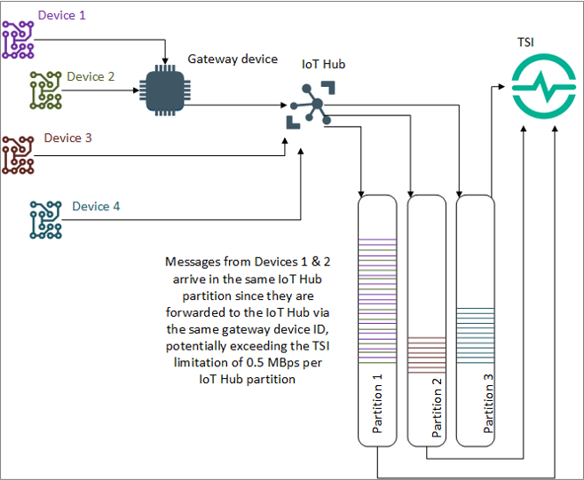

# Streaming Ingestion Throughput Limits

Azure Time Series Insights streaming data ingress limitations are described below.

> [!TIP]
> Read [Plan your Preview environment](https://docs.microsoft.com/azure/time-series-insights/time-series-insights-update-plan#review-preview-limits) for a comprehensive list of all Preview limits. **TODO** remove the word "Preview" here once that article title has been updated.

## Per environment limitations

In general, ingress rates are viewed as the factor of the number of devices that are in your organization, event emission frequency, and the size of each event:

*  **Number of devices** × **Event emission frequency** × **Size of each event**.

By default, Time Series Insights can ingest incoming data at a rate of **up to 1 megabyte per second (MBps) per Time Series Insights environment**. There are additional limitations [per hub partition](https://docs.microsoft.com/azure/time-series-insights/time-series-insights-update-storage-ingress#hub-partitions-and-per-partition-limits).

> [!TIP]
>
> * Environment support for ingesting speeds up to 16 MBps can be provided by request.
> * Contact us if you require higher throughput by submitting a support ticket through Azure portal.
 
* **Example 1:**

    Contoso Shipping has 100,000 devices that emit an event three times per minute. The size of an event is 200 bytes. They’re using an IoT Hub with four partitions as the Time Series Insights event source.

    * The ingestion rate for their Time Series Insights environment would be: **100,000 devices * 200 bytes/event * (3/60 event/sec) = 1 MBps**.
    * The ingestion rate per partition would be 0.25 MBps.
    * Contoso Shipping's ingestion rate would be within the scale limitation.

* **Example 2:**

    Contoso Fleet Analytics has 60,000 devices that emit an event every second. They are using an Event Hub with a partition count of 4 as the Time Series Insights event source. The size of an event is 200 bytes.

    * The environment ingestion rate would be: **60,000 devices * 200 bytes/event * 1 event/sec = 12 MBps**.
    * The per partition rate would be 3 MBps.
    * Contoso Fleet Analytics' ingestion rate is over the environment and partition limits. They can submit a request to Time Series Insights through Azure portal to increase the ingestion rate for their environment, and create an Event Hub with more partitions to be within the Preview limits.

## Hub partitions and per partition limits

When planning your Time Series Insights environment, it's important to consider the configuration of the event source(s) that you'll be connecting to Time Series Insights. Both Azure IoT Hub and Event Hubs utilize partitions to enable horizontal scale for event processing. 

A *partition* is an ordered sequence of events held in a hub. The partition count is set during the hub creation phase and cannot be changed.

For Event Hubs partitioning best practices, review [How many partitions do I need?](https://docs.microsoft.com/azure/event-hubs/event-hubs-faq#how-many-partitions-do-i-need)

> [!NOTE]
> Most IoT Hubs used with Azure Time Series Insights only need four partitions.

Whether you're creating a new hub for your Time Series Insights environment or using an existing one, you'll need to calculate your per partition ingestion rate to determine if it's within the limits. 

Azure Time Series Insights Preview currently has a general **per partition limit of 0.5 MBps**.

### IoT Hub-specific considerations

When a device is created in IoT Hub, it's permanently assigned to a partition. In doing so, IoT Hub is able to guarantee event ordering (since the assignment never changes).

A fixed partition assignment also impacts Time Series Insights instances that are ingesting data sent from IoT Hub downstream. When messages from multiple devices are forwarded to the hub using the same gateway device ID, they may arrive in the same partition at the same time potentially exceeding the per partition scale limits.

**Impact**:

* If a single partition experiences a sustained rate of ingestion over the Preview limit, it's possible that Time Series Insights will not sync all device telemetry before the IoT Hub data retention period has been exceeded. As a result, sent data can be lost if the ingestion limits are consistently exceeded.

To mitigate that circumstance, we recommend the following best practices:

* Calculate your per environment and per partition ingestion rates before deploying your solution.
* Ensure that your IoT Hub devices are load-balanced to the furthest extent possible.

> [!IMPORTANT]
> For environments using IoT Hub as an event source, calculate the ingestion rate using the number of hub devices in use to be sure that the rate falls below the 0.5 MBps per partition limitation.
>
> * Even if several events arrive simultaneously, the Preview limit will not be exceeded.

  

Refer to the following resources to learn more about optimizing hub throughput and partitions:

* [IoT Hub Scale](https://docs.microsoft.com/azure/iot-hub/iot-hub-scaling)
* [Event Hub Scale](https://docs.microsoft.com/azure/event-hubs/event-hubs-scalability#throughput-units)
* [Event Hub Partitions](https://docs.microsoft.com/azure/event-hubs/event-hubs-features#partitions)
