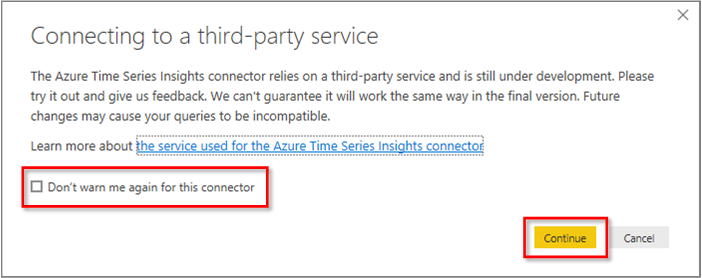
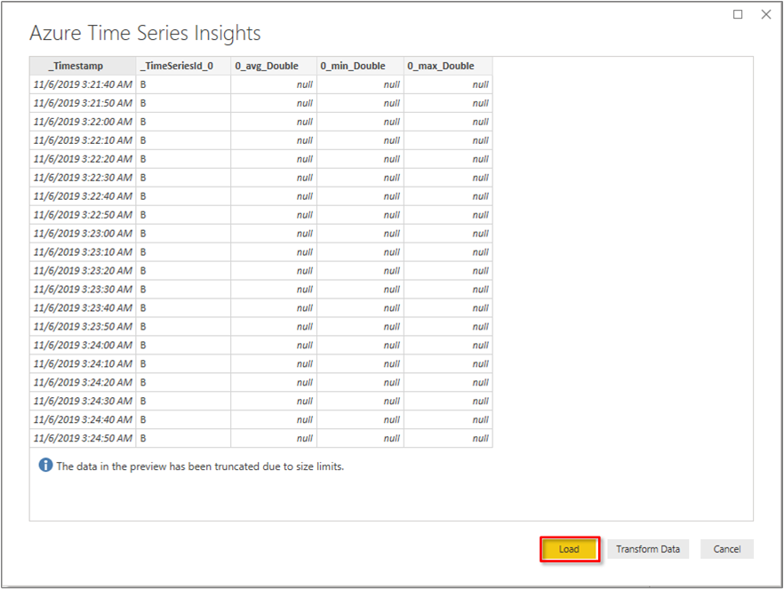

# Visualize data from Time Series Insights in Power BI

Azure Time Series Insights is a platform for storing, managing, querying, and visualizing time-series data in the cloud. [Power BI](https://powerbi.microsoft.com) is a business analytics tool with rich visualization capabilities that allows you to share insights and results across your organization. Both services can now be integrated to get the best of both Time Series Insights' inherent visualization capabilities as well as Power BI's.

You'll learn how to:

* Connect Time Series Insights to Power BI using the cloud connector
* Create visuals with your data in Power BI
* Publish the report to Power BI and share with the rest of your organization

By the end, you'll be able to visualize time-series data through Azure Time Series Insights and enhance it with the strong data correlation, visual editing, and easy sharing capabilities of Power BI.

> [!NOTE]
> The Power BI Connector is available in both Azure Time Series Insights General Availability and Preview.

Make sure to sign up for a [free Azure subscription](https://azure.microsoft.com/free/) if you don't already have one.

## Prerequisites

* Create a [Power BI](https://powerbi.microsoft.com/) account or verify your Power BI access
* Download and install [Power BI Desktop](https://powerbi.microsoft.com/downloads/)
* Have or create an [Azure Time Series Insights GA instance](time-series-insights-get-started.md) or [Azure Time Series Insights Preview instance](time-series-insights-update-how-to-manage.md)

## Connect data from Time Series Insights to Power BI

There are three primary methods to use the Time Series Insights connector to access your Time Series Insights data in Power BI.

* Export a view in [Time Series Insights Explorer to Power BI](#export-data-into-power-bi-desktop):

    1. Open Time Series Insights Explorer                      
    1. Export data as a query or as raw data                           
    1. Open Power BI Desktop
    1. Load from Custom Query

* Export CSV data from [Time Series Insights Explorer to Power BI](#export-csv-data-into-cloud-power-bi):
    
    1. Open Time Series Insights Explorer                      
    1. Select and export data as a CSV file                                 
    1. Open Power BI in Azure Cloud
    1. Import the CSV file as a dataset in a workspace of your choice

* Open [Power BI Desktop and load from a Saved Query](#load-previously-saved-queries-in-power-bi-desktop):

    1. Open Power BI Desktop
    1. Import from previously save queries

### Export data into Power BI desktop

This option is recommended if you want to explore your data using [Time Series Insights GA Explorer](time-series-quickstart.md) or [Time Series Insights Preview Explorer](time-series-insights-update-quickstart.md), then quickly export your view to Power BI afterwards. To get started:

1. Open the GA or Preview Time Series Insights Explorer and curate your data.
1. Once you have created a view you are satisfied with, navigate to the **More Actions** dropdown menu and click on **Connect to Power BI**. 

    

1. Set your parameters inside this tab:

   1. Specify a relative timeframe to view. If you are happy with your existing view, leave this as **Existing timeframe**. 
   1. Choose between **Aggregated Events** and **Raw Events** level data. 
   
       > [!NOTE]
       > You can always aggregate your data later in Power BI, but you cannot revert to raw data after aggregation. There is a 100-K event count limit for Raw Event level data.

   1. **Optional**: If you do not want to export metadata information, uncheck the **Join instance fields** box 

       

   1. If you have not configured your Time Series Insights instance for warm store, you will receive a warning.

       

       > [!TIP]
       > You may configure your existing instance for warm store in the Azure portal.

1. Select **Copy to Clipboard**. This will copy the query directly to your clipboard. 
1. Now, launch Power BI Desktop.
1. In Power BI Desktop on the **Home** tab, select **Get Data** in the upper left corner, then **More...**.

    

1. Navigate to the **Azure** tab, click **Azure Time Series Insights (Beta)**, then **Connect**.

    
    
1. A message dialogue box will display asking for permission to connect to third-party resources. Select **continue**.

    

1. In the dropdown menu under **Data Source**, choose **Create custom query**. Paste from your clipboard into the optional **Custom Query (optional)** field below, then press **OK**.

      

1. The data table will now load. Press **Load** to load into Power BI.

      

If you have completed these steps, skip ahead to the next section: [Create a report with visuals](#power-bi-desktop).

### Export CSV data into cloud Power BI

Azure Time Series Insights supports full data export capabilities through common data formats like CSV and JSON. You also have the ability to select specific time interval data to import into Power BI using Azure Cloud. 

1. In Time Series Explorer, select the **More Options** icon, then **Download as CSV**. 

    

1. **Alternatively**, select a time interval, then right-click to **Explore Events**. 

    

    Save the chosen time interval by selecting **Download as CSV**.

1. Save your file to your desktop. You will use this below.

1. Sign in to Power BI and select your **My Workspaces**. Select **+Create**.

    

1. Choose **Get Data** then **Files** > **Get** > **Local File**. Choose the file you saved previously.

    

Learn more about [supported file formats](https://docs.microsoft.com/power-bi/service-comma-separated-value-files) and operations in Power BI cloud.

Continue to [Create a report with visuals](#power-bi-cloud).

### Load previously saved queries in Power BI desktop

This workflow is best if you want to access your data only from the Power BI Desktop tool without going into Time Series Insights Explorer. There must be a previously saved query in your environment. To save a query in Time Series Insights Explorer, curate your data and select **Save View**.  

1. In Power BI Desktop on the **Home** tab, select **Get Data** in the upper left corner, then **More**.

     

1. Navigate to the **Azure** tab, click **Azure Time Series Insights (Beta)**, then **Connect**.

    

1. In the dropdown menu under **Data Source**, choose **Import saved query**, then press **OK**.

    

1. From the list of saved queries, click the box(es) for the query(s) you wish to select.

    

1. The data table will now load. Press **Load** to load into Power BI.

## Create a report with visuals

Now that you have imported the data into Power BI, it’s time to build a report with visuals.

### Power BI desktop

1. On the left side of the window, make sure you have selected the **Report** view.

    

1. In the **Visualizations** column, select your visual of choice. For example, select **Clustered column chart**. This will add a blank line chart to your canvas.  

    

1. In the **Fields** list, select **Timestamp** and drag it to the **Axis** field to display items along the X-axis.  
1. Again, in the **Fields** list, select **TimeSeriesId** and drag it to the **Values** field to display items along the Y-axis.
1. To add another chart to your canvas, click anywhere on the canvas outside the line chart and repeat this process.

Once you have created your report, you can publish it to Power BI Reporting Services.

### Power BI cloud

You can now create charts and graphs after importing your CSV data into Power BI cloud.

1. Your file data will then appear under **Datasets**. Click the dataset to load your data into a chart.

1.  Select the chart type, any values to display, and sort the axis.

    

## Advanced editing

If you have already loaded a dataset in Power BI but would like to modify the query (such as the date/time or Environment ID parameters), you can do this via Power BI’s Advanced Editor functionality. Refer to the [Power BI documentation](https://docs.microsoft.com/power-bi/desktop-query-overview) to learn more.

As an overview:

1. In Power BI Desktop, select **Edit Queries**.
1. Press **Advanced Editor**.
1. Modify the JSON payload as desired.
1. Select **Done** and then **Close & Apply** within the **Power Query Editor Window**.

You should see the desired changes applied.  

## Next Steps

* Read about [Power BI connector concepts](https://docs.microsoft.com/power-bi/desktop-query-overview) for Azure Time Series Insights.

* Learn more about [Power BI desktop](https://docs.microsoft.com/power-bi/desktop-query-overview).

* See [Time Series Insights GA Explorer](https://docs.microsoft.com/azure/time-series-insights/time-series-quickstart) and [Time Series Insights Preview Explorer](https://docs.microsoft.com/azure/time-series-insights/time-series-insights-update-quickstart).